# YARO — Diagramas de Arquitectura para Validación

**Versión 1.0 · Mayo 2026**
**Audiencia:** Arquitecto técnico (validación) · CTO · Tech Lead

> Este documento extrae los **15 diagramas más importantes** de `specs/arquitectura.md` para validación con un arquitecto externo. Cada diagrama tiene contexto, decisiones tomadas, alternativas descartadas y preguntas pendientes para input del arquitecto.

---

## 📋 Cómo usar este documento

1. **Leer cada diagrama** y revisar la sección "Decisiones tomadas"
2. **Comentar las "Preguntas para el arquitecto"** de cada sección
3. **Marcar con ✅ / ⚠️ / ❌** cada decisión arquitectónica
4. **Sugerir alternativas** donde se considere mejorable
5. **Aprobar / Rechazar / Refinar** decisiones críticas (marcadas con ⭐)

---

## Tabla de contenidos

1. [Vista 1 — Contexto del sistema (C4 Nivel 1)](#vista-1)
2. [Vista 2 — Contenedores (C4 Nivel 2)](#vista-2)
3. [Vista 3 — Bounded Contexts (DDD)](#vista-3)
4. [Vista 4 — Modelo de datos (Schema F1 — 47 tablas)](#vista-4)
5. [Vista 5 — Multi-tenancy y aislamiento (P3 — 4 capas de defensa)](#vista-5)
6. [Vista 6 — Pipeline DIAN fire-and-forget](#vista-6)
7. [Vista 7 — Modo offline + sincronización](#vista-7)
8. [Vista 8 — Plataforma de Agentes IA (6 agentes)](#vista-8)
9. [Vista 9 — Despliegue AWS (red + servicios)](#vista-9)
10. [Vista 10 — Escalamiento F1 → F4](#vista-10)
11. [Vista 11 — Seguridad (7 capas + Google OAuth)](#vista-11)
12. [Vista 12 — Observabilidad y SLOs](#vista-12)
13. [Vista 13 — CI/CD pipeline](#vista-13)
14. [Vista 14 — Sistema de Autorizaciones configurable](#vista-14)
15. [Vista 15 — Resumen ejecutivo en una imagen](#vista-15)

---

<a name="vista-1"></a>

## Vista 1 — Contexto del sistema (C4 Nivel 1)

### Quiénes interactúan con YARO

```mermaid
flowchart TB
    subgraph TENANT["👥 Usuarios del tenant (restaurante)"]
        VAL["Valentina<br/>Dueña / Socia"]
        AN["Andrés<br/>Admin de sede"]
        CAR["Carolina<br/>Contadora externa"]
        CJ["Cajero · Mesero<br/>Cocina · Jefe CDP"]
    end

    subgraph YARO_TEAM["🏢 Equipo YARO"]
        PA["Platform Admin"]
        SUP["Support Engineer"]
    end

    YARO((("🎯 YARO<br/>Sistema operativo<br/>de restaurantes")))

    subgraph EXTERNAL["🌐 Sistemas externos"]
        FAC["Facture.co<br/>(operador DIAN habilitado)"]
        DIAN["DIAN<br/>(MUISCA)"]
        RAD["RADIAN<br/>(buzón FE proveedores)"]
        ANT["Anthropic API<br/>Claude Sonnet + Haiku"]
        GOOG["Google OAuth<br/>(login colaboradores)"]
        SES["AWS SES<br/>(emails)"]
        SMS["SMS Provider<br/>Twilio"]
        BANK["Bancos<br/>extracto CSV (F2+)"]
        PAY["Pasarela de pago<br/>(suscripción)"]
    end

    VAL -.usa.-> YARO
    AN -.usa.-> YARO
    CAR -.usa.-> YARO
    CJ -.usa.-> YARO
    PA -.opera.-> YARO
    SUP -.opera.-> YARO

    YARO -->|"fire-and-forget XML"| FAC
    FAC -->|"firma XAdES-BES + transmite"| DIAN
    DIAN -->|"CUFE + ACK"| FAC
    FAC -->|"CUFE"| YARO
    YARO <-->|"polling FE proveedores"| RAD
    YARO <-->|"capas 1 + judge eval"| ANT
    YARO <-->|"OAuth"| GOOG
    YARO -->|"transactional"| SES
    YARO -->|"cobranza FR-15"| SMS
    YARO <--|"CSV import"|-- BANK
    YARO <-->|"webhook + REST"| PAY

    style YARO fill:#f7fd9c,color:#1a1916
    style TENANT fill:#3d9970,color:#ffffff
    style YARO_TEAM fill:#2471a3,color:#ffffff
    style EXTERNAL fill:#534AB7,color:#ffffff
```

### Decisiones tomadas

| Decisión | Justificación |
|---|---|
| ✅ Operador DIAN: **Facture.co** (no propio) | Habilitarse como operador = 3-6 meses + costos. Facture.co cubre con menor TCO |
| ✅ LLM: **Anthropic Claude** (Sonnet capa IA + Haiku judge eval) | Estabilidad API + opt-in de no entrenar con nuestra data + UI clara |
| ✅ Auth colaboradores: **Google OAuth** | 80% colombianos con email tienen Gmail; reduce password fatigue |
| ✅ Email: **AWS SES**, SMS: **Twilio** | SES más económico que SendGrid; Twilio confiable LATAM |
| ⚠️ Pasarela de pago: **TBD** (Wompi / Mercado Pago) | Decisión postergada a inicio F1 |

### ⭐ Preguntas para el arquitecto

1. **Facture.co como single point of failure**: ¿qué nivel de redundancia necesitamos? ¿Plan B con Carvajal/Cadena en F2 backlog tiene sentido?
2. **Anthropic API lock-in**: ¿qué nivel de abstracción recomiendas para que cambio a OpenAI/Gemini sea barato en F3?
3. **Google OAuth para colaboradores**: ¿hay riesgo de que un restaurante quiera Microsoft o Apple OAuth desde F1?
4. **Cliente mexicano futuro**: ¿debería YARO soportar PAC mexicano desde F2 si vemos demanda?

---

<a name="vista-2"></a>

## Vista 2 — Contenedores (C4 Nivel 2)

### Servicios y tecnologías que componen YARO

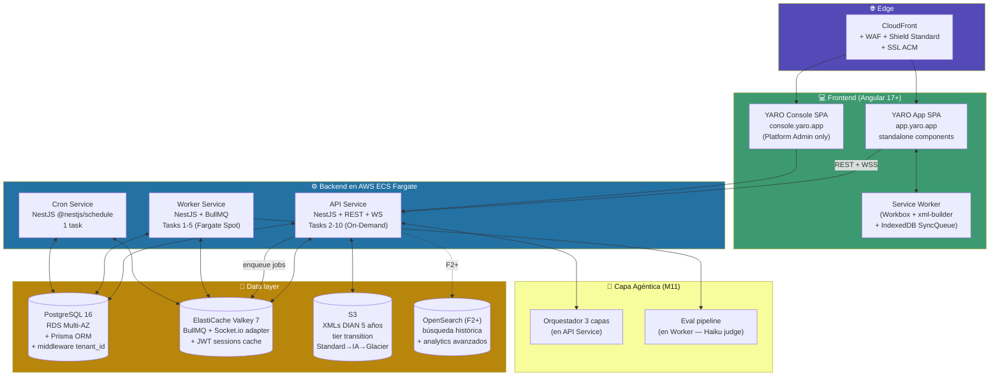

### Decisiones tomadas (ADR-001 a ADR-007)

| Decisión | Alternativa descartada | Por qué |
|---|---|---|
| ⭐ **Monolito modular en NestJS** | Microservicios desde día 1 | Equipo F1 de 5-7 no opera 10 microservicios. DDD prepara migración F3+ |
| ⭐ **3 servicios separados** (API + Worker + Cron) | Servicio único | Aislamiento + Fargate Spot solo Worker (-70% costo) + Cron único evita duplicación |
| ✅ **2 SPAs separadas** (app + console) | SPA única con routing | Aislamiento WAF + bundles + roles + segurity-in-depth |
| ✅ **PostgreSQL 16** (no NoSQL) | DynamoDB, MongoDB | Transacciones ACID críticas para fiscal + multi-tenancy con joins complejos |
| ✅ **ElastiCache Valkey 7** | Redis OSS | Mismo protocolo, AWS managed, Pub/Sub para Socket.io adapter |
| ✅ **us-east-1** F1-F3 | sa-east-1 (São Paulo) | us-east-1 más servicios + menor costo. Latencia 80-120ms Colombia aceptable con Workbox |
| ✅ **OpenSearch en F2+**, no F1 | OpenSearch desde día 1 | F1 con 5 tenants no lo justifica (~$50-100/mes ahorro) |
| ⚠️ **Fargate Spot para Worker** | On-Demand | Hasta 70% más barato. Trade-off: interrupciones (mitigadas con BullMQ retries) |

### ⭐ Preguntas para el arquitecto

1. **Monolito modular hasta F3**: ¿estás de acuerdo o crees que la migración a microservicios debería hacerse antes (F2)?
2. **Fargate Spot para Worker**: ¿el ahorro vale la complejidad operacional? ¿Has visto problemas reales con interrupciones en workloads similares?
3. **PostgreSQL con multi-tenancy lógico**: ¿qué umbral de tenants/volumen recomiendas para considerar sharding o tenant-aislado?
4. **OpenSearch postponed a F2**: ¿hay riesgo de que F1 acumule deuda en búsqueda si lo hacemos así?

---

<a name="vista-3"></a>

## Vista 3 — Bounded Contexts (DDD)

### Organización del dominio en 10 bounded contexts

```mermaid
flowchart TB
    subgraph CORE["🎯 CORE DOMAIN"]
        OPS["📍 Operations<br/>Turno · POS · KDS · Cobro · Arqueo<br/>FRAUDE: ventanas temporales"]
        FIS["📋 Fiscal Compliance<br/>Tiquete (04) · FE (01) · Contingencia (03)<br/>Nota Crédito (91) · DSCE (05) · Nómina electrónica"]
        AI["🤖 AI Agents<br/>6 agentes + orquestador 3 capas<br/>guardrails P5 + eval continua"]
    end

    subgraph SUPPORT["⚙️ SUPPORTING"]
        INV["📦 Inventory<br/>Stock · Mermas · Lotes<br/>+ valor monetario · conteo diario"]
        CAT["📖 Catalog<br/>Productos · Menú · Recetas (F2)<br/>+ mueve_inventario flag"]
        ACC["📊 Accounting<br/>PUC · P&G · Balance<br/>Retenciones cliente + agente"]
        PAY["👤 Payroll<br/>Marcación · Bienestar<br/>Liquidación + ventas colaboradores"]
        REC["🏦 Bank Reconciliation<br/>(F2 asistida / F3 automatizada A3)"]
        CRM["🎁 CRM básico<br/>Clientes FE con Ley 1581 opt-in<br/>(adendum)"]
    end

    subgraph GENERIC["🏛️ GENERIC"]
        ID["🔐 Identity & Tenancy<br/>Tenants · Users · Roles<br/>Subscription FR-15 escalonada"]
        PLAT["🛠️ Platform Admin<br/>YARO Console · Cobranza<br/>Soporte · Auditoría plataforma"]
    end

    OPS -->|"CobroRegistrado"| FIS
    OPS --> INV
    OPS --> CAT
    OPS -->|"Cliente nuevo"| CRM
    FIS <--> AI
    AI --> ACC
    AI --> INV
    INV --> ACC
    OPS --> ACC
    PAY --> ACC
    REC --> ACC
    REC <-- OPS
    PAY <-- OPS
    PAY <-- CRM

    ID -.contexto.-> OPS
    ID -.contexto.-> FIS
    ID -.contexto.-> AI
    PLAT -.observa.-> ID

    style CORE fill:#c0392b,color:#ffffff
    style SUPPORT fill:#534AB7,color:#ffffff
    style GENERIC fill:#2471a3,color:#ffffff
```

### Por qué esta separación importa

- **Core** (Operations + Fiscal + AI Agents): inversión técnica máxima. Tests exhaustivos. Code review por 2 ingenieros.
- **Supporting**: necesarios pero no diferenciadores. Modelos correctos, equipo medio.
- **Generic**: replicable, librerías open source cuando posible.

### Migración futura a microservicios (F3+ si necesario)

Orden recomendado:
1. **AI Service** primero (más independiente)
2. **Fiscal Worker** (transmisiones DIAN)
3. **Reconciliation Worker** (F3)
4. **Country Services** (F4 multi-país)

### ⭐ Preguntas para el arquitecto

1. **CRM como nuevo bounded context** (adendum #3): ¿debería ser independiente o sub-contexto de Identity?
2. **Eventos cross-context**: ¿usar Outbox + EventBridge desde día 1 o esperar hasta F3?
3. **Anti-corruption layers** entre Fiscal ↔ Operations: ¿cómo recomiendas implementarlos (interfaces TypeScript + DTOs vs adapters formales)?

---

<a name="vista-4"></a>

## Vista 4 — Modelo de datos (Schema F1 — 47 tablas)

### Tablas agrupadas por bounded context

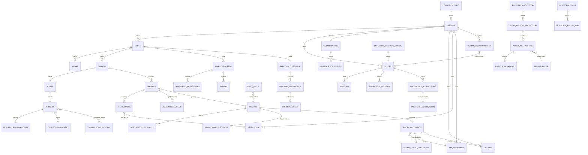

### Resumen por bloque (47 tablas F1)

| Bloque | # Tablas | Tablas clave |
|---|:-:|---|
| **Identity & Tenancy** | 5 | tenants · sedes · users · sessions · subscriptions |
| **Catalog** | 2 | productos · categorias_producto |
| **Operations** | 7 | turnos · cajas · arqueos · mesas · ordenes · items_orden · cobros |
| **Inventory** | 4 | inventario_sede · mermas · inventario_movimientos · conteos_inventario |
| **Fiscal Compliance** | 7 | fiscal_documents · tax_snapshots · failed_fiscal_documents · sync_queue · facturas_proveedor · lineas_factura_proveedor · retenciones_recibidas |
| **CRM** | 1 (clientes extendida) | clientes (+10 campos) |
| **AI Agents** | 3 | agent_interactions · agent_evaluations · tenant_rules |
| **Payroll** | 2 | attendance_records · ventas_colaboradores |
| **Audit & Platform** | 4 | audit_events · platform_users · platform_access_log · empleado_metricas_diarias |
| **Country & Config** | 3 | country_config · denominaciones_efectivo · tipos_gasto |
| **Cash management** | 4 | efectivo_disponible · efectivo_movimientos · consignaciones · arqueo_denominaciones |
| **Descuentos** | 2 | descuentos_aplicados · motivos_descuento |
| **Anti-fraude** | 1 | anulaciones_items |
| **Autorizaciones** | 2 | politicas_autorizacion · solicitudes_autorizacion |
| **Transición** | 1 | comparacion_externa (Toteat) |
| **Total F1** | **47** | |

### Tablas críticas con triggers append-only (P1)

`fiscal_documents` · `audit_events` · `agent_interactions` · `subscription_events` · `platform_access_log` · `efectivo_movimientos` · `inventario_movimientos`

### ⭐ Preguntas para el arquitecto

1. **47 tablas F1 es mucho para 5 ingenieros**: ¿recomiendas consolidación de algunas o está bien la granularidad?
2. **Particionado mensual** en `audit_events` + `agent_interactions` + `platform_access_log` + `efectivo_movimientos`: ¿pg_partman o estrategia custom?
3. **JSONB extensivo** (metodos_pago, modulos_activos, match_pattern): ¿hay riesgo de degradación de queries vs normalización?
4. **IDs UUID v4** en todas las tablas: ¿impacto en índices BTREE? ¿Recomendarías UUID v7 (sortable) en F2+?

---

<a name="vista-5"></a>

## Vista 5 — Multi-tenancy y aislamiento (P3 — 4 capas de defensa)

### 4 capas de defensa independientes

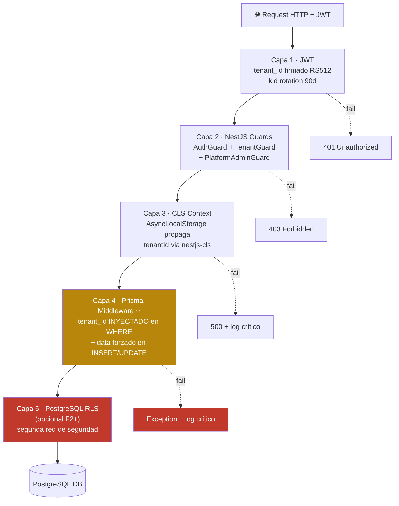

### Bypass auditado para queries de plataforma (CA3)

```typescript
// Patrón para queries cross-tenant del equipo YARO
async function platformQuery<T>(
  options: { platformUserId: string; reason: string; ticketId?: string },
  query: () => Promise<T>
): Promise<T> {
  cls.run({}, async () => {
    cls.set('__platformQuery', true);
    cls.set('platformUserId', options.platformUserId);
    cls.set('__platformReason', options.reason);
    return await query();
    // Middleware loguea automáticamente en platform_access_log
  });
}
```

### Gate CI obligatorio

```yaml
- name: integration-tests-multi-tenancy (P3 GATE CRÍTICO)
  run: pnpm test:integration:multi-tenancy
  # 15+ casos cubren: aislamiento, bypass, inyección, $queryRaw, etc.
  # Falla → PR bloqueado, no puede mergear
```

### Decisiones tomadas

| Decisión | Por qué |
|---|---|
| ⭐ **Shared DB + Shared Schema + tenant_id** | Viable hasta 500-1.000 tenants. Cuando un Enterprise pida aislamiento físico, migración a DB dedicada es factible |
| ✅ **4 capas independientes** | Defense in depth — para fallo total, las 4 deben caer |
| ✅ **CLS sobre AsyncLocalStorage** | Propagación automática vs pasar tenantId en cada función (error-prone) |
| ✅ **Prisma middleware como Single Point of Truth** | Una sola línea de código enforce P3. Tests CI obligatorios |
| ⚠️ **RLS PostgreSQL solo F2+** | Complejidad operativa adicional. En F1, middleware Prisma basta + tests |

### ⭐ Preguntas para el arquitecto

1. **RLS PostgreSQL desde F1**: ¿recomendarías activarlo desde día 1 como segunda red, aunque añada complejidad?
2. **CLS performance**: ¿has visto impacto medible en alta carga?
3. **`__platformQuery` flag en CLS**: ¿es suficientemente seguro o recomiendas mecanismo más estricto (ej. JWT separado para platform admin con scope explícito)?
4. **15+ casos de test aislamiento**: ¿qué otros escenarios adversariales recomiendas agregar?

---

<a name="vista-6"></a>

## Vista 6 — Pipeline DIAN fire-and-forget

### Flujo end-to-end de un cobro hasta CUFE

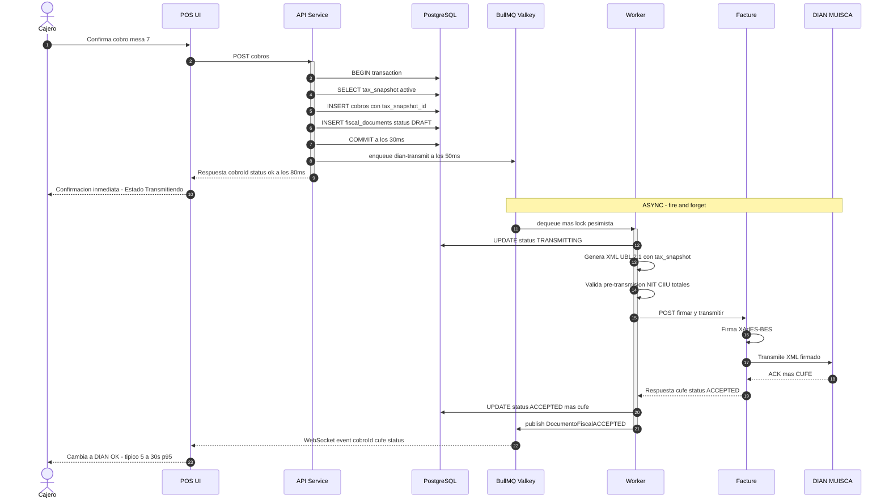

### State machine de fiscal_documents

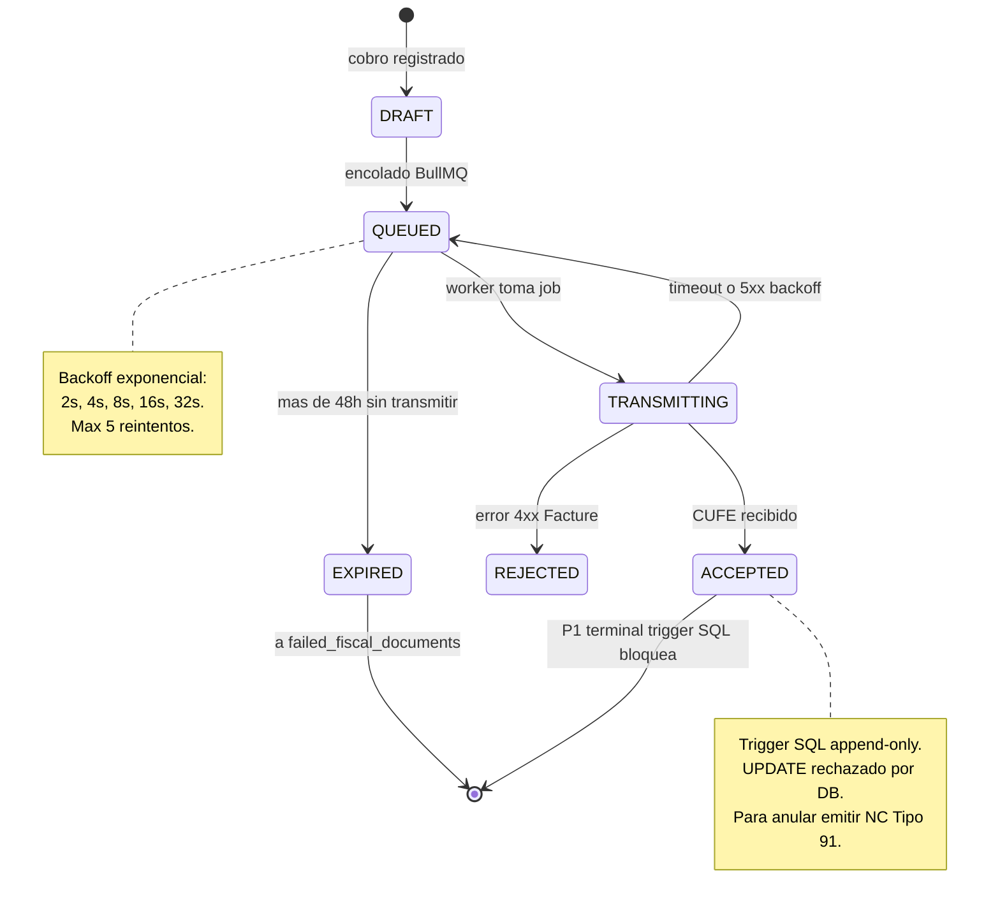

### Decisiones tomadas (ADR-003 + ADR-010)

| Decisión | Justificación |
|---|---|
| ⭐ **Fire-and-forget con BullMQ** | P2 cajero nunca espera < 100ms. Llamada síncrona a Facture mata UX en hora pico (R1) |
| ⭐ **Append-only fiscal con trigger SQL** | P1 inviolable. Para anular: nota crédito Tipo 91. Garantizado a nivel DB, no app |
| ✅ **tax_snapshot referenciado por cobro** (CA7) | Cambios fiscales no afectan retroactivamente. Cobros offline guardan snapshot del momento |
| ✅ **5 reintentos con backoff exponencial** | Cubre 99% errores transientes. Más reintentos = burning compute |
| ✅ **Cron reconciliación cada 15 min** | Detecta huérfanos (DRAFT/QUEUED > 10 min) + EXPIRED → failed_fiscal_documents |
| ✅ **`failed_fiscal_documents` separado** (CA6) | Tiquetes expirados sin transmitir → alerta legal a Carolina + Valentina. NUNCA purgar |

### SLAs internos (CA1)

| Tiempo desde cobro | Estado esperado | Acción si falla |
|---|---|---|
| < 100ms | API responde al cajero | Bug crítico R1 |
| < 5s p50 | DIAN ACCEPTED | Investigar BullMQ |
| < 30s p95 | DIAN ACCEPTED | Alerta Facture lento |
| < 5 min todos | DIAN ACCEPTED | Alerta crítica |
| < 48h | Transmitido obligatorio | Sino: EXPIRED + alerta legal |

### ⭐ Preguntas para el arquitecto

1. **BullMQ vs SQS**: ¿confirmas que BullMQ es mejor opción? (SQS sería más caro y latencia +)
2. **Lock pesimista en Worker**: ¿hay alternativas más performantes (optimistic locking con version field)?
3. **Anexo técnico DIAN cambia 2-3 veces/año**: ¿cómo recomiendas blindar XML builder ante esos cambios?
4. **Facture.co como single dependency**: ¿plan B con operador alternativo es realista en F3?

---

<a name="vista-7"></a>

## Vista 7 — Modo offline + sincronización

### Arquitectura cliente offline-capable

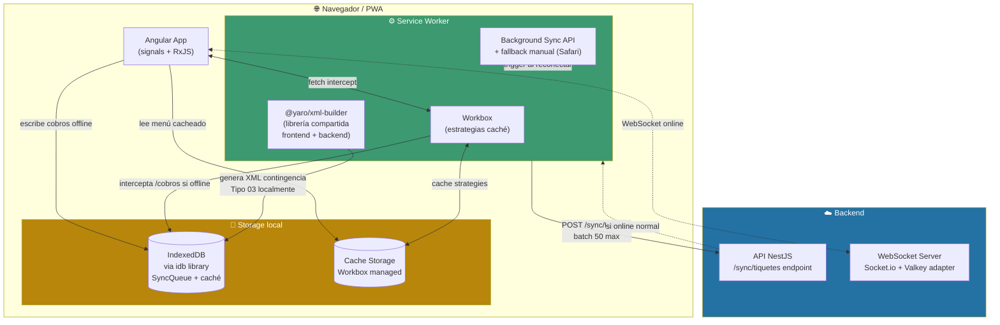

### Estrategias Workbox por tipo de recurso

| Recurso | Estrategia | TTL | Por qué |
|---|---|---|---|
| Menú / productos | CacheFirst | 24h | Cambia poco, cajero necesita offline |
| Configuración tenant + tax snapshot | CacheFirst | 7 días | Cambia raramente, crítico offline |
| Plano mesas / turno activo | NetworkFirst (3s timeout) | 1h | Cambia constantemente |
| Assets (logos, iconos) | StaleWhileRevalidate | — | Sirve rápido + actualiza background |
| /cobros POST | NetworkOnly + fallback offline | — | NUNCA cachear response |
| WebSocket | (no aplica Workbox) | — | Cliente Angular reconecta solo |

### CA2 — Versionado @yaro/xml-builder

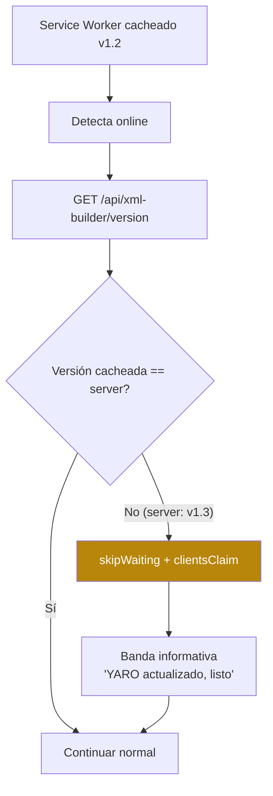

### Decisiones tomadas (ADR-004)

| Decisión | Por qué |
|---|---|
| ⭐ **Workbox sobre Service Worker nativo Angular** | Estrategias por ruta listas, plugins expiración, Background Sync built-in |
| ⭐ **`@yaro/xml-builder` librería compartida frontend/backend** | Sin esto, contingencia offline no funciona (`critica.md §5`) |
| ⭐ **Numeración asignada por backend al sincronizar**, NO en cliente | Evita duplicados con múltiples dispositivos offline |
| ✅ **3 capas detección conectividad** (events + healthcheck + timeout) | navigator.onLine no es confiable |
| ✅ **Background Sync API + fallback manual** | iOS Safari no tiene Background Sync — fallback obligatorio |
| ✅ **Batch sync max 50 tiquetes/request** | Limita tamaño payload + progreso incremental |
| ✅ **Tax snapshot cacheado al inicio del turno** | Performance + consistencia |
| ✅ **Cleanup IndexedDB items procesados > 7 días** | Evita acumulación + cuota quota issues |

### Edge cases cubiertos

| Edge case | Mitigación |
|---|---|
| Dispositivo offline > 24h | Menú/config cache > 48h. Tax snapshot persistente |
| 2 dispositivos tenant offline simultáneos | Numeración asignada por backend al sync |
| Cliente cierra navegador con cola pendiente | IndexedDB persistente, banner ámbar al reabrir |
| Tax snapshot cambió mientras offline | Cobros usan snapshot referenciado (CA7) |
| Cuota IndexedDB excedida | Monitor `storage.estimate()` + cleanup automático |
| Cobro offline rechazado al sync | Emitir Tipo 04 como compensación |
| Service Worker no se actualiza | skipWaiting + validation pre-cola |

### ⭐ Preguntas para el arquitecto

1. **iOS Safari Background Sync no soportado**: ¿recomendarías forzar tablets Android para food trucks o el fallback manual es suficiente?
2. **XSD validation en Service Worker (libxml2-wasm)**: ¿hay riesgos performance/cuota que veas?
3. **IndexedDB en Safari**: ¿hay limitaciones conocidas que podrían afectar US-OFF-009 (cobros 8h offline)?
4. **`@yaro/xml-builder` como librería compartida**: ¿cómo recomiendas el packaging (npm monorepo workspaces vs publicación NPM privada)?

---

<a name="vista-8"></a>

## Vista 8 — Plataforma de Agentes IA (6 agentes)

### Arquitectura general M11

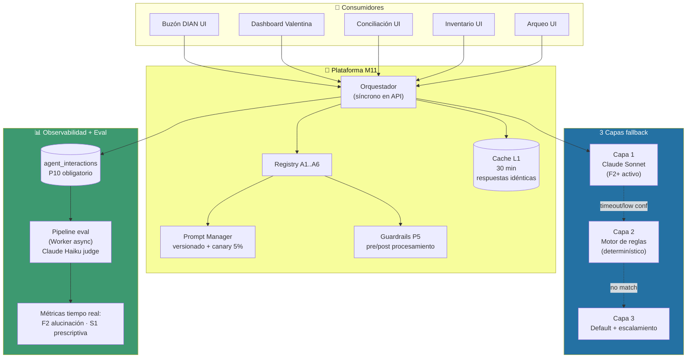

### Los 6 agentes y sus fases

| # | Agente | Capa 1 (IA) | Capa 2 (Reglas) | Capa 3 (Default) | Fase activa |
|---|---|---|---|---|:-:|
| **A1** | Buzón DIAN Clasificador | Claude Sonnet | Motor reglas tenant + base | Default + "Manual" | F1 (C2-C3) → F2 (C1 activa) |
| **A2** | Food Cost & Márgenes | Claude Sonnet | Cálculo determinístico margen | Dashboard estático | F2 |
| **A3** | Conciliación Bancaria | Claude Sonnet matching | Matching exacto valor+fecha | Excepción manual | F3 |
| **A4** | Copiloto del Dueño | Claude Sonnet | Dashboards preconstruidos | "No tengo dato" | F2 (desc) → F3 (conv) |
| **A5** | Predicción de Stock | Claude Sonnet | Promedio móvil ponderado | Alertas estáticas | F3 |
| **A6** | **Arqueo Inteligente** 🆕 | Claude Sonnet patrones | Reglas determinísticas tenant | Reporte estático | F2-F3 |

### Guardrails P5 (no negociables)

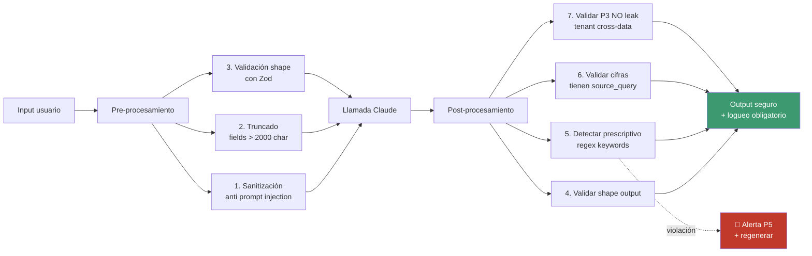

### Optimización de costos — 6 palancas

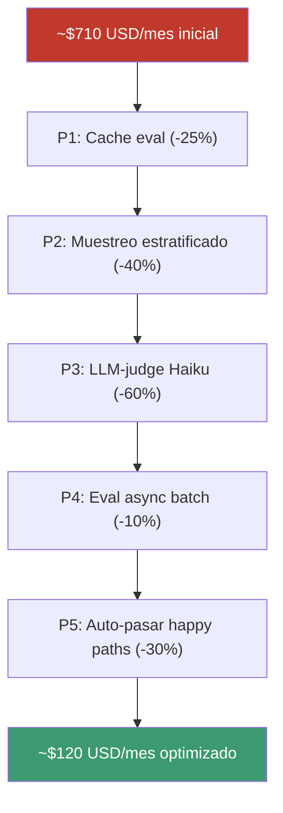

### Decisiones tomadas (ADR-005)

| Decisión | Por qué |
|---|---|
| ⭐ **Plataforma única M11 con 6 agentes** | Reutiliza orquestador + guardrails + eval. Cero replicación |
| ⭐ **F1 sin Claude (solo Capa 2-3)** | Mitigación riesgo. Carolina recibe valor desde día 1 con motor reglas |
| ⭐ **F2 activa Claude Sonnet con canary 5%** | Rollout gradual con feature flags |
| ✅ **Eval con Claude Haiku judge (no Sonnet)** | Ahorro 60% sin perder calidad |
| ✅ **Eval batch overnight via Batch API** | Anthropic Batch API tiene 50% descuento |
| ✅ **Cache L1 hash determinístico inputs** | Facturas idénticas = ahorro masivo |
| ⚠️ **Costo real $70/tenant/mes F2** (no $15 PRD) | Ajuste honesto al target |

### ⭐ Preguntas para el arquitecto

1. **6 agentes diferentes pero plataforma única**: ¿estás de acuerdo o crees que A4 Copiloto debería ser servicio separado por riesgo P5?
2. **Logueo 100% de interacciones**: ¿qué impacto en storage S3 y costo? (proyectamos ~50 GB en F3)
3. **A4 Copiloto puede dar consejos prescriptivos**: ¿qué otros guardrails sugieres más allá del regex post-procesamiento?
4. **Anthropic Batch API**: ¿has visto problemas con SLA o limitaciones?

---

<a name="vista-9"></a>

## Vista 9 — Despliegue AWS (red + servicios)

### Topología de red en us-east-1

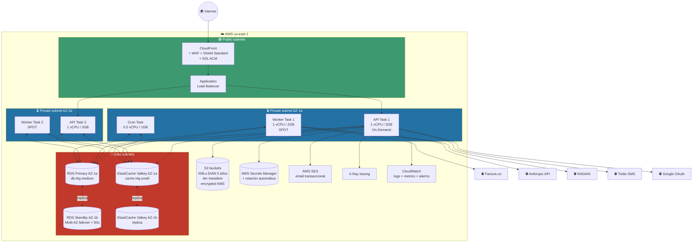

### Costos estimados F1 (~$480/mes AWS)

| Recurso | Configuración F1 | Costo/mes |
|---|---|---|
| **API Service** | 2-10 Fargate On-Demand | ~$80 |
| **Worker Service** | 1-5 Fargate **SPOT** (70% más barato) | ~$25 |
| **Cron Service** | 1 Fargate | ~$15 |
| **RDS PostgreSQL** | db.t4g.medium Multi-AZ + backups | ~$200 |
| **ElastiCache Valkey** | cache.t4g.small × 2 | ~$50 |
| **CloudFront + WAF + Shield Std** | — | ~$30 |
| **S3 + EBS + transit** | tier transition activo | ~$25 |
| **CloudWatch + X-Ray** | observabilidad básica | ~$55 |
| **Total F1 AWS** | | **~$480/mes** |

### Reglas de Security Groups

| Origen | Destino | Puerto | Justificación |
|---|---|---|---|
| Internet | CloudFront | 443 | TLS público |
| CloudFront | ALB | 443 | Tráfico entrante |
| ALB | API tasks | 3000 | Backend |
| API/Worker tasks | RDS | 5432 | PostgreSQL |
| API/Worker/Cron | Valkey | 6379 | ElastiCache |
| API/Worker | Internet egress | 443 | Facture/Anthropic/SES/Google |
| Cualquier otra | — | — | **DENIED** |

### Decisiones tomadas (ADR-008)

| Decisión | Por qué |
|---|---|
| ⭐ **us-east-1 hasta F4** | Latencia 80-120ms Colombia aceptable con Workbox cache. Más servicios + menor costo |
| ✅ **Multi-AZ desde F1** | R1 mitigation. Failover < 60s automático |
| ✅ **VPC privada para datos** | RDS/Valkey nunca expuestos a internet |
| ✅ **NAT Gateway en lugar de NAT instance** | Managed, sin parches manuales |
| ✅ **Secrets Manager + rotación 90d JWT keys** | NUNCA env vars hardcoded |

### ⭐ Preguntas para el arquitecto

1. **us-east-1 vs sa-east-1**: ¿realmente la latencia ~80-120ms se compensa con Workbox o deberíamos considerar São Paulo desde F1?
2. **NAT Gateway costoso (~$45/mes/AZ)**: ¿VPC Endpoints para ECR/S3/SES reduciría costo significativamente?
3. **db.t4g.medium Multi-AZ ~$200/mes**: ¿es suficiente para F1 con 5 tenants? ¿Cuándo recomendarías upgrade?
4. **CloudFront + WAF + Shield Standard ~$30/mes**: ¿Shield Advanced ($3K/mes) cuándo se justifica?

---

<a name="vista-10"></a>

## Vista 10 — Escalamiento F1 → F4

### Evolución de la arquitectura por fase

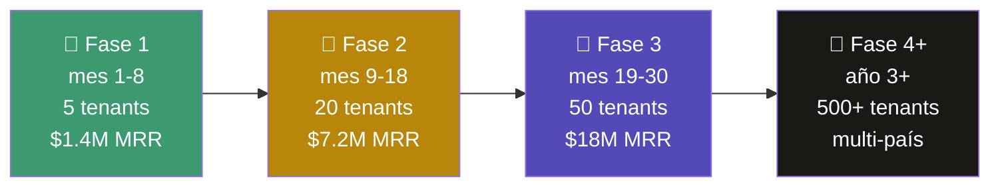

### Escalamiento RDS PostgreSQL

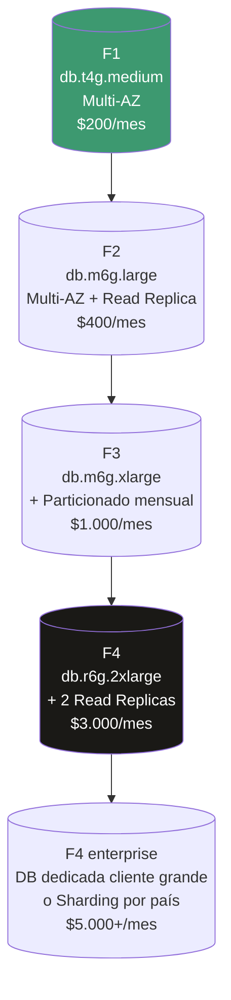

### Triggers de escalamiento (basados en métricas, no calendario)

| Componente | Métrica gatillo | Umbral | Acción |
|---|---|---|---|
| API tasks | CPU promedio 5 min | > 70% | Auto-scaling agrega task |
| Worker | Cola BullMQ size | > 50 jobs | Auto-scaling Spot agrega task |
| RDS | CPU sostenido | > 80% durante 1h | Upgrade instancia + read replica |
| ElastiCache | Memory used | > 80% | Upgrade |
| **Tenant individual** | Transacciones/día | **> 100K (no por ventas en pesos)** | Evaluar DB dedicada |

### Aclaración crítica sobre "sharding"

> Cliente típico ICP-A (911 Hot Burger) con **$200M COP/mes/sede** = ~1.5 cobros/min hora pico = **~6.700 transacciones/mes**. Esto es **20.000× menos** que el umbral de saturación de RDS. **No requiere sharding ni DB dedicada.**

### Migración a microservicios (F3+ si necesario)

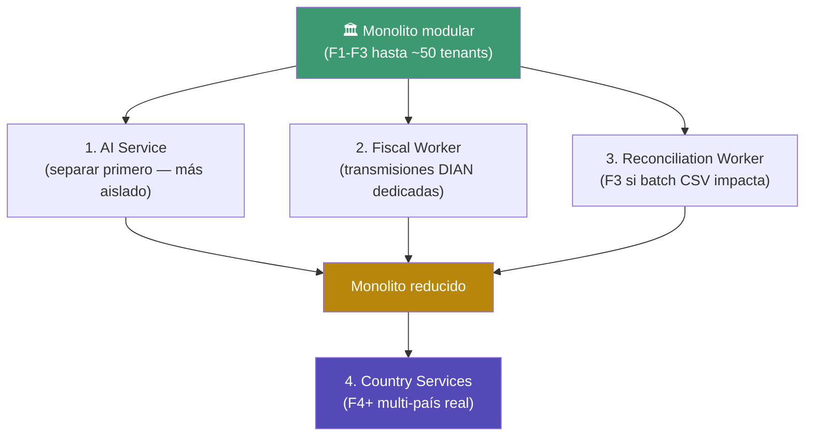

### Costo por tenant a escala (debe BAJAR con crecimiento)

| Fase | Infra/tenant/mes | IA/tenant/mes | Total/tenant/mes |
|---|---|---|---|
| F1 (5 tenants) | $96 | $0 | **$96** |
| F2 (20 tenants) | $75 | $50 | **$125** |
| F3 (50 tenants) | $80 | $25 | **$105** |
| F4 (500 tenants) | $60 | $15 | **$75** |

### ⭐ Preguntas para el arquitecto

1. **Microservicios en F3 mes 24**: ¿es momento correcto o muy tarde/temprano?
2. **DB dedicada para cliente > 100K transacciones/día**: ¿esto es realista para Enterprise futuro?
3. **Multi-país en F3**: ¿Perú (SUNAT) → Ecuador (SRI) → México (SAT) es orden correcto?
4. **OpenSearch ROI**: ¿en qué fase realmente se justifica el costo y complejidad?

---

<a name="vista-11"></a>

## Vista 11 — Seguridad (7 capas + Google OAuth)

### Defense in depth en 7 capas

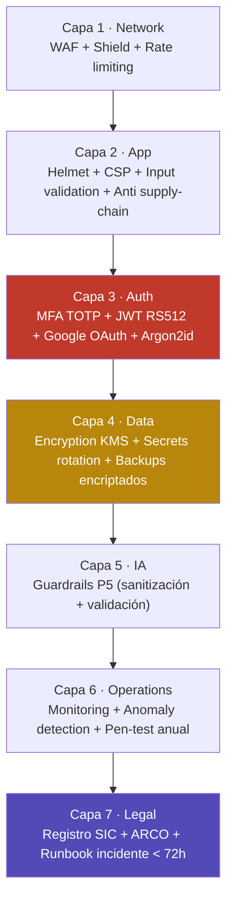

### Modelo de autenticación híbrido

| Tipo de usuario | Login | MFA |
|---|---|---|
| **Platform Admin (equipo YARO)** | Email + password + MFA TOTP | **Obligatorio** ⭐ |
| **Support Engineer** | Email + password + MFA TOTP | **Obligatorio** |
| **Superadmin del tenant (Valentina)** | Email + password ó Google | Opcional F1, obligatorio F2 |
| **Admin de sede (Andrés)** | Email + password ó Google | Opcional |
| **Cajero / Mesero / Cocina / CDP** | **Google OAuth recomendado** o PIN local | No requerido |
| **Contador externo (Carolina)** | Email + password ó Google | Recomendado |

### Flujo Google OAuth (colaboradores)

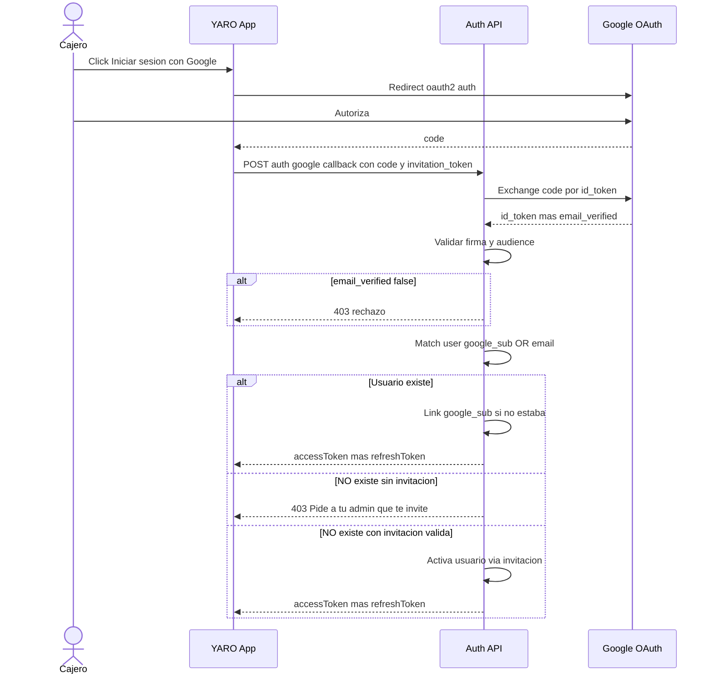

### 7 Quick Wins de Hardening F1

| # | Acción | Esfuerzo | Riesgo mitigado |
|---|---|---|---|
| 1 | MFA obligatorio Platform Admin | 1 sem | R2 (catastrófico) |
| 2 | AWS WAF + OWASP Top 10 + rate limiting | 1 sem | R8 |
| 3 | Dependabot + Snyk + npm audit como gate CI | 3 días | R8 supply chain |
| 4 | Registro ante SIC + política privacidad | 2 sem | Ley 1581 |
| 5 | Runbook seguridad + simulacro Q1 | 1 sem | R2, R8 |
| 6 | Lockout 5 intentos fallidos | 2 días | R8 credential stuffing |
| 7 | Backups encriptados + restore-test mensual | 1 sem | R1 |

### Runbook incidente CRITICAL (Ley 1581 < 72h)

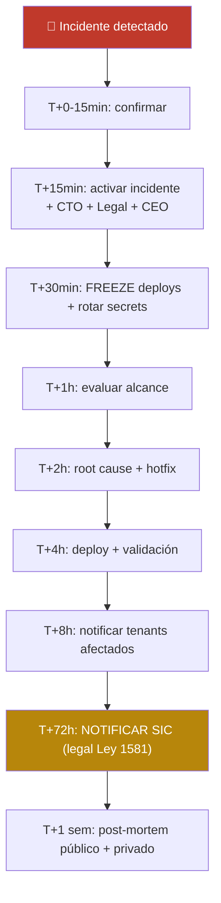

### ⭐ Preguntas para el arquitecto

1. **MFA obligatorio Platform Admin**: ¿TOTP es suficiente o necesitamos WebAuthn/passkeys desde F1?
2. **Google OAuth para colaboradores**: ¿riesgos que veas que no estoy considerando?
3. **CSP sin `unsafe-inline` en Angular F2**: ¿estrategia recomendada (nonces vs hashes)?
4. **Pen-testing externo anual** ($5-8K USD): ¿hay firmas LATAM que recomiendes?
5. **Runbook < 72h SIC**: ¿qué simulacros realistas sugieres?

---

<a name="vista-12"></a>

## Vista 12 — Observabilidad y SLOs

### 4 pilares de observabilidad

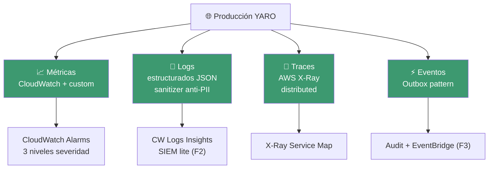

### SLOs principales

| SLI | SLO | Error budget mensual |
|---|---|---|
| `/cobros` latencia p95 | < 100 ms | 5% del tiempo |
| `/cobros` availability | 99.5% | 3.6 horas/mes |
| DIAN transmisión exitosa | ≥ 99% | 1% en 30d |
| Sync offline → DIAN | ≥ 98% | 2% en 30d |
| KDS WebSocket p95 | < 200 ms | 5% |
| **Tenant isolation incidents** | **0** | **No tolerancia** |
| F2 alucinación A4 | < 2% | Eval continua |
| **S1 prescriptivas A4** | **< 0.5%** | Eval continua estricta |

### Error budget — auto-feature freeze

```mermaid
flowchart LR
    A["Budget consumido<br/>0-50%"] --> NORMAL["Operación normal<br/>+ feature work"]
    B["50-80%"] --> CAUTION["Revisión deploys<br/>pair review obligatorio"]
    C["80-100%"] --> FREEZE["🚨 FEATURE FREEZE<br/>solo reliability"]
    D["> 100%"] --> EMERGENCY["Incident mode<br/>post-mortem + ajuste SLOs"]

    style NORMAL fill:#3d9970,color:#ffffff
    style FREEZE fill:#c0392b,color:#ffffff
```

### 5 dashboards principales

```mermaid
flowchart LR
    D1["🛠️ Sistema<br/>CPU/RAM, RDS, error rate"]
    D2["📊 SLOs<br/>latencias, DIAN, error budget"]
    D3["💼 Negocio<br/>NS, tenants, MRR, churn"]
    D4["🤖 Agentes IA<br/>F2, S1, costo, drift"]
    D5["🛡️ Seguridad<br/>tests aislamiento, WAF, MFA"]

    style D1 fill:#2471a3,color:#ffffff
    style D2 fill:#3d9970,color:#ffffff
    style D3 fill:#f7fd9c,color:#1a1916
    style D4 fill:#534AB7,color:#ffffff
    style D5 fill:#c0392b,color:#ffffff
```

### Costos observabilidad

| Fase | CloudWatch | X-Ray | Total |
|---|---|---|---|
| F1 | ~$55/mes | $0 (free tier 1M traces/mes) | **~$55/mes** |
| F2 | ~$120/mes | ~$30/mes | **~$225/mes** |
| F3 | ~$300/mes | ~$100/mes | **~$580/mes** |

Migración a Datadog/New Relic solo si CloudWatch no escala (F3+).

### ⭐ Preguntas para el arquitecto

1. **CloudWatch nativo hasta F3**: ¿es realista o recomendarías Datadog desde F2 por mejor UX?
2. **OpenTelemetry desde F1**: ¿vale la inversión o esperar a F2/F3?
3. **Sanitizer anti-PII en logs**: ¿qué librería recomiendas? (estoy considerando regex custom)
4. **Outbox pattern para eventos**: ¿hay implementación NestJS que recomiendes?

---

<a name="vista-13"></a>

## Vista 13 — CI/CD pipeline

### Flujo de deploy

```mermaid
flowchart LR
    DEV["💻 Dev local<br/>Docker Compose"]
    PR["🌿 Pull Request"]
    CI["⚙️ CI Pipeline<br/>todos los gates"]
    MERGE["✅ Merge to main"]
    STG["🟡 Staging<br/>auto-deploy"]
    PROMO["Promote production<br/>(manual + MFA)"]
    PROD["🟢 Production"]
    ROLL["⏪ Rollback < 5min"]

    DEV --> PR
    PR -->|"PR open"| CI
    CI -->|"all checks ✅"| MERGE
    MERGE -->|"auto"| STG
    STG -->|"validación + smoke"| PROMO
    PROMO -->|"rolling deploy"| PROD
    PROD -.failure.-> ROLL
    ROLL --> PROD

    style CI fill:#3d9970,color:#ffffff
    style PROD fill:#c0392b,color:#ffffff
    style ROLL fill:#1a1916,color:#ffffff
```

### Gates obligatorios CI (PR no puede mergear si fallan)

| Gate | Qué valida | Tiempo |
|---|---|---|
| Lint + Format | ESLint + Prettier | < 1 min |
| Custom ESLint YARO | no-raw-query-tenant-id · no-direct-prisma · no-platform-query-no-reason | < 1 min |
| Unit tests + coverage | ≥ 70% F1 / ≥ 80% F2 | 3-5 min |
| **Integration tests multi-tenant** ⭐ | 15+ casos P3 aislamiento | 5 min |
| Security audit | Snyk + npm audit high+critical | 2 min |
| **xml-builder version check** ⭐ | CA2 — fe/be/sw consistentes | < 1 min |
| Schema migration safety | expand-contract + APPROVED_BY si fiscal | < 1 min |
| E2E smoke tests | Playwright crítico | 5 min |
| Build | Docker multi-stage | 3 min |
| **Total CI** | | **15-20 min** |

### Ambientes

| Ambiente | Infra | Datos | Acceso |
|---|---|---|---|
| **dev** | Docker Compose local | Sintéticos | Developers |
| **staging** | AWS reducido single-AZ | Snapshot prod anonimizado semanal | Devs + QA + Valentina |
| **production** | AWS Multi-AZ completo | Reales | Solo Platform Admins con MFA |

### Disaster Recovery

| Métrica | Target |
|---|---|
| **RPO** (pérdida máxima) | < 5 minutos |
| **RTO** (tiempo a restaurar) | < 1 hora |

| Escenario | Estrategia | RTO |
|---|---|---|
| Fallo task Fargate | Auto-scaling crea nueva | < 2 min |
| Fallo AZ | Multi-AZ failover automático | < 5 min |
| Corrupción RDS | Point-in-time restore | < 1 hora |
| Borrado tabla | PITR + replay migración | < 2 horas |
| Pérdida región (F3+) | Cross-region replica | < 4 horas |

### ⭐ Preguntas para el arquitecto

1. **15-20 min CI por PR**: ¿es aceptable o recomiendas paralelización agresiva?
2. **Tests aislamiento en CI con BD real (testcontainers)**: ¿hay alternativas más rápidas (mocks)?
3. **Rollback < 5 min**: ¿es realista con ECS rolling deployment o necesitamos blue-green real?
4. **Sync prod → staging anonimizado semanal**: ¿algún riesgo legal Habeas Data que veas?

---

<a name="vista-14"></a>

## Vista 14 — Sistema de Autorizaciones configurable

### Flujo real-time end-to-end

```mermaid
sequenceDiagram
    autonumber
    actor M as Mesera Juliana
    actor A as Admin Andres
    participant POS as POS app
    participant API as API
    participant DB as PostgreSQL
    participant WS as WebSocket
    participant ADMIN as App Admin
    participant PUSH as Push PWA

    M->>POS: Solicita eliminar item producto hace 23 min
    POS->>API: POST ordenes items eliminar
    API->>DB: Lee politicas_autorizacion del tenant
    API->>API: Valida ventana 5min a 1h - politica requiere auth
    API->>DB: INSERT solicitudes_autorizacion estado PENDIENTE
    API->>WS: Publica autorizacion_solicitada canal sede admins
    API->>PUSH: Send web push a admins activos
    API-->>POS: Respuesta solicitudId estado PENDIENTE expiraEn
    POS-->>M: Esperando autorizacion del admin

    par Notificaciones paralelas
        WS-->>ADMIN: Real-time event y modal popup
        PUSH-->>ADMIN: Notification push
    end

    ADMIN-->>A: Modal con detalles - Juliana quiere eliminar hamburguesa
    A-->>ADMIN: Revisa la solicitud

    alt Andres aprueba en 30s
        A->>ADMIN: Tap Aprobar
        ADMIN->>API: POST autorizaciones decidir
        API->>DB: UPDATE estado AUTORIZADA y ejecuta eliminacion
        API->>WS: Publica autorizacion_decidida
        WS-->>POS: Notificacion real-time
        POS-->>M: Aprobado por Andres
    else Andres rechaza
        A->>ADMIN: Tap Rechazar mas motivo
        ADMIN->>API: POST autorizaciones decidir
        API->>WS: Publica autorizacion_decidida
        WS-->>POS: Notificacion
        POS-->>M: Rechazado con motivo
    else Timeout 90s
        API->>API: Cron detecta timeout
        API->>WS: Escala a Valentina segundo nivel
        Note over API: Si Valentina tampoco responde 60s aplica politica tenant BLOQUEAR FLAG_ROJO o AUTO
    end

    Note over DB: Audit completo en audit_events y solicitudes_autorizacion
```

### Presets configurables por tenant

| Preset | Cuándo usarlo | Comportamiento típico |
|---|---|---|
| 🟢 **Confiable** | Equipo alta confianza, dueño siempre presente | Anulaciones < $30K auto · Solo bloquea > 1h |
| 🟡 **Estándar** (default) | Mayoría — balance control/operación | 0-5 min libre · 5min-1h admin · >1h bloqueado |
| 🟠 **Estricto** | Equipo turnover alto, dueño no presente | Toda anulación > 5 min admin · Todo descuento admin |
| 🔴 **Máximo Control** | Post-incidente fraude o equipo nuevo | Toda modificación + comentario · Valentina aprueba > $100K |
| ⚙️ **Personalizado** | Configuración granular por operación | Por cada uno de los 10 tipos |

### 10 tipos de operación auditables

`ANULACION_ITEM` · `DESCUENTO` · `TRANSFERENCIA_MESA` · `ANULACION_ORDEN_COMPLETA` · `CAMBIO_METODO_PAGO_POST_COBRO` · `PROPINA_AJUSTE` · `REIMPRESION_FACTURA` · `PRECIO_PUNTUAL` · `CIERRE_FORZADO_MESA` · `VENTA_COLABORADOR_ALTA`

### Costo técnico: cero adicional

Reutiliza infra ya en F1:
- ✅ Socket.io WebSocket (ya construido para KDS)
- ✅ ElastiCache Valkey Pub/Sub adapter
- ✅ Push notifications PWA (ya en backlog)

Solo agrega: 2 tablas + 3 endpoints REST + 2 eventos WebSocket + modal UI.

### ⭐ Preguntas para el arquitecto

1. **Push PWA + WebSocket modal simultáneo**: ¿overhead aceptable o redundante?
2. **Timeout 90s + escalamiento**: ¿estos plazos son realistas? ¿Más cortos serían mejor?
3. **`accion_post_timeout` configurable**: ¿cómo evitar que un tenant elija "PERMITIR_AUTO" y exponga fraude?
4. **WebSocket reconnection**: ¿estrategia para que cajera no pierda notificación si pierde conexión momentáneamente?

---

<a name="vista-15"></a>

## Vista 15 — Resumen ejecutivo en una imagen

### YARO en un diagrama (para imprimir y validar)

```mermaid
flowchart TB
    subgraph USERS["👥 Usuarios"]
        VAL["Valentina<br/>Dueña"]
        AN["Andrés<br/>Admin"]
        CAR["Carolina<br/>Contadora"]
        CJ["Cajero/Mesera/<br/>Cocina"]
    end

    subgraph CLIENT["💻 Frontend"]
        APP["YARO App<br/>(Angular 17 + Workbox)"]
        SW["Service Worker<br/>+ xml-builder<br/>+ IndexedDB"]
    end

    subgraph EDGE["🌐 Edge"]
        CF["CloudFront + WAF<br/>+ Shield"]
    end

    subgraph BACKEND["⚙️ Backend AWS Fargate"]
        API["API NestJS<br/>2-10 tasks"]
        WORKER["Worker BullMQ<br/>SPOT 1-5 tasks"]
        CRON["Cron Service<br/>1 task"]
    end

    subgraph DATA["💾 Datos"]
        RDS[("PostgreSQL<br/>47 tablas F1<br/>Multi-AZ")]
        VKEY[("Valkey<br/>BullMQ + WS")]
        S3[("S3 XMLs DIAN<br/>5 años")]
    end

    subgraph AI["🤖 6 Agentes IA"]
        A1["A1 Buzón DIAN"]
        A2["A2 Food Cost"]
        A3["A3 Conciliación"]
        A4["A4 Copiloto"]
        A5["A5 Stock"]
        A6["A6 Arqueo 🆕"]
    end

    subgraph EXT["🌍 Externos"]
        FAC["Facture.co<br/>(DIAN)"]
        ANT["Anthropic<br/>(Sonnet + Haiku)"]
        GOOG["Google<br/>OAuth"]
        SMS["Twilio<br/>SMS"]
        BANK["Bancos<br/>CSV (F2+)"]
    end

    USERS --> CF
    CF --> APP
    APP <--> SW
    APP --> API
    API <--> RDS
    API <--> VKEY
    API <--> S3
    API <--> AI
    API --> WORKER
    WORKER --> FAC
    WORKER --> ANT
    CRON --> RDS
    API --> GOOG
    API --> SMS
    WORKER --> BANK

    style USERS fill:#3d9970,color:#ffffff
    style CLIENT fill:#f7fd9c,color:#1a1916
    style EDGE fill:#534AB7,color:#ffffff
    style BACKEND fill:#2471a3,color:#ffffff
    style DATA fill:#b7860b,color:#ffffff
    style AI fill:#c0392b,color:#ffffff
    style EXT fill:#1a1916,color:#ffffff
```

### Métricas clave para el arquitecto

| Aspecto | Valor F1 (mes 8) | Valor F3 (mes 30) |
|---|---|---|
| Tenants activos | 5 | 50 |
| MRR | $1.4M COP | $18M COP |
| Costo infra/tenant/mes | $96 | $80 |
| Costo IA/tenant/mes | $0 (F1 sin Claude) | $25 |
| Latencia p95 /cobros | < 100 ms | < 100 ms |
| Disponibilidad fiscal | ≥ 99.5% | ≥ 99.5% |
| Tasa DIAN exitosa | ≥ 99% | ≥ 99% |
| Equipo técnico | 5-7 | 20-30 |
| Stories totales F1 | ~360 (~1.440 SP) | — |

---

## ✅ Checklist de validación con arquitecto

### Decisiones críticas a validar

- [ ] **Monolito modular vs microservicios** (ADR-001) — Vista 2
- [ ] **Shared DB multi-tenancy con 4 capas defensa** (ADR-002) — Vista 5
- [ ] **Fire-and-forget DIAN con BullMQ** (ADR-003) — Vista 6
- [ ] **Workbox + IndexedDB + xml-builder compartido** (ADR-004) — Vista 7
- [ ] **Plataforma agentes IA con 3 capas fallback** (ADR-005) — Vista 8
- [ ] **MFA Platform Admin + Google OAuth colaboradores** (ADR-006) — Vista 11
- [ ] **CloudWatch nativo hasta F3** (ADR-007) — Vista 12
- [ ] **Terraform + GitHub Actions** (ADR-008) — Vista 13
- [ ] **Schema único + activación por endpoints** (ADR-009) — Vista 3
- [ ] **Append-only fiscal con trigger SQL** (ADR-010) — Vista 6

### Áreas que el arquitecto debe profundizar

- [ ] Plan de migración a microservicios (cuándo y cómo)
- [ ] Estrategia multi-país concreta (CO → PE → EC → MX)
- [ ] DR + cross-region replica (cuándo se justifica)
- [ ] SOC2 / ISO 27001 (cuándo iniciar)
- [ ] Pen-testing externo (recomendaciones de firmas)
- [ ] Hardware mínimo soportado en cliente (tablets, impresoras térmicas)

### Decisiones técnicas pendientes (input del arquitecto requerido)

| # | Decisión pendiente | Vista |
|---|---|---|
| 1 | Pasarela de pago (Wompi vs Mercado Pago) | Vista 1 |
| 2 | RLS PostgreSQL desde F1 o F2+ | Vista 5 |
| 3 | Plan B operador FE alternativo a Facture | Vista 6 |
| 4 | Migración a Datadog desde F2 o F3+ | Vista 12 |
| 5 | OpenTelemetry desde día 1 vs después | Vista 12 |
| 6 | sa-east-1 (São Paulo) vs us-east-1 para latencia CO | Vista 9 |
| 7 | Estrategia anti prompt-injection avanzada | Vista 8 |
| 8 | UUID v7 (sortable) en F2+ | Vista 4 |

---

## 📋 Documentos complementarios para el arquitecto

| Documento | Líneas | Para qué |
|---|---|---|
| `specs/arquitectura.md` | 1.925 | Detalle completo de A1-A13 + ADRs |
| `specs/prd.md` | 1.405 | Requisitos del producto + 10 principios no negociables |
| `specs/backlog.md` | 1.728 | Stories ejecutables + sprint planning S1-S8 |
| `specs/arquitectura-diagrama.md` | (este doc) | 15 diagramas para validación |

---

*YARO Arquitectura — Diagramas para validación · v1.0 · Mayo 2026*
*Audiencia: Arquitecto técnico externo · CTO · Tech Lead*
*Documento fuente: `specs/arquitectura.md` (1.925 líneas)*
