# Arquitectura Técnica — YARO

### Sistema operativo de los restaurantes colombianos
**Versión 1.0 (consolidado co-creación iterativa) · Mayo 2026**

> Documento técnico generado en sesión de co-creación entre la fundadora y un Staff Software Architect + AI/Agent Systems Engineer, construido segmento por segmento sobre `specs/prd.md` y los documentos base (`overview.md`, `icp.md`, `mercado.md`, `critica.md`, `pvb.md`).

---

## Tabla de contenidos

0. [Paso 0 — Análisis de Conflictos de Implementación](#paso-0)
1. [A1 — Arquitectura de Alto Nivel (C4 Nivel 1+2)](#a1)
2. [A2 — Modelo de Dominio (DDD)](#a2)
3. [A3 — Modelo de Datos (Schema Prisma)](#a3)
4. [A4 — Multi-tenancy y Aislamiento (P3)](#a4)
5. [A5 — Pipeline DIAN Fire-and-Forget](#a5)
6. [A6 — Modo Offline + Sincronización](#a6)
7. [A7 — Plataforma de Agentes IA](#a7)
8. [A8 — Seguridad y Hardening (+ Google OAuth)](#a8)
9. [A9 — Observabilidad y SLOs](#a9)
10. [A10 — Despliegue + CI/CD](#a10)
11. [A11 — Estrategia de Escalamiento](#a11)
12. [A12 — ADRs (Architecture Decision Records)](#a12)
13. [A13 — Plan Técnico 30/60/90](#a13)
14. [Apéndices](#apendices)

---

<a name="paso-0"></a>

## Paso 0 — Análisis de Conflictos de Implementación

Antes de empezar el diseño técnico se identificaron 10 conflictos materiales entre el PRD y la realidad de implementación.

### Conflictos resueltos

| # | Conflicto | Decisión |
|---|---|---|
| **CA1** | Latencia operativa < 100ms vs garantía DIAN ≥ 99% | SLA interno: p50 < 5s, p95 < 30s desde cobro a ACCEPTED; alerta si > 5 min, escalada si > 30 min |
| **CA2** | `@yaro/xml-builder` compartido frontend/backend — versionado | Forzar Service Worker update al reconectar + validation pre-cola en backend |
| **CA3** | Middleware Prisma forzado vs queries cross-tenant legítimas | Flag explícito `__platformQuery: true` con `PlatformAdminGuard` obligatorio + audit log automático en `platform_access_log` |
| **CA4** | `tipoOperacion` activa módulos — ¿UI o schema? | **Schema único + activación por endpoints/UI**. Tablas siempre existen vacías. Permite migrar entre formatos sin downtime |
| **CA5** | Schema por fases (14 → +13 → +4) | Schema único en RDS, migraciones aplican a todos. Diferenciación F1/F2/F3 es por features activos por plan |
| **CA6** | Tiquetes contingencia expirados (> 48h sin transmitir) | **Nunca purgar** — guardar en `failed_fiscal_documents` con alerta legal a Mariana + Carolina |
| **CA7** | `country_config` con valores fiscales dinámicos | Cada cobro guarda `tax_snapshot_id` referenciando snapshot al momento del cobro — cambios fiscales no afectan retroactivamente |
| **CA8** | S3 retención 5 años XMLs | **Tier transition automático**: Standard (90d) → Standard-IA (1a) → Glacier Deep Archive (> 1a) |
| **CA9** | Dataset eval IA — per-tenant vs global | **Híbrido con anonimización**: dataset global anonimizado + reglas per-tenant |
| **CA10** | Cron de bloqueo FR-15 con regla horaria | **Adaptativa basada en turno abierto activo** — si hay `turno.estado=ABIERTO` en cualquier sede del tenant, no bloquea |

### Vacíos técnicos pendientes (TBDs)

| # | Vacío | Tratamiento |
|---|---|---|
| **VA1** | Búsqueda y filtros complejos sobre históricos | OpenSearch como índice secundario en Fase 2 |
| **VA2** | Multi-instancia WebSocket KDS durante rolling deploys | Reconexión automática + sticky sessions 30s |
| **VA3** | Estrategia impresión física CDP | WebUSB ESC/POS en Fase 2 |
| **VA4** | Validación cálculos nómina | Librería externa o revisión legal — Fase 2 |
| **VA5** | Hardware mínimo soportado (tablets cajero) | Definir en SLA, validar con 911 |
| **VA6** | A/B testing de prompts agentes | Sistema simple de versionado con asignación % de tráfico |

---

<a name="a1"></a>

## A1 — Arquitectura de Alto Nivel (C4 Nivel 1 + 2)

### A1.1 Contexto del sistema (C4 Nivel 1)

```mermaid
flowchart TB
    subgraph USUARIOS["👥 Usuarios del tenant"]
        M["Mariana<br/>(Dueña)"]
        AN["Andrés<br/>(Admin)"]
        CA["Carolina<br/>(Contadora externa)"]
        CJ["Cajero / Mesero<br/>/ Cocina / CDP"]
    end

    subgraph EQUIPO["🏢 Equipo YARO"]
        PA["Platform Admin"]
        SP["Support Engineer"]
    end

    YARO((("YARO<br/>Sistema operativo<br/>de restaurantes")))

    subgraph EXT["🌐 Sistemas externos"]
        FAC["Facture.co<br/>Operador DIAN habilitado"]
        DIAN["DIAN<br/>(MUISCA)"]
        RAD["RADIAN<br/>(buzón FE proveedores)"]
        ANT["Anthropic API<br/>(Claude Sonnet + Haiku)"]
        SES["AWS SES<br/>(email)"]
        SMS["SMS Provider<br/>(Twilio)"]
        BANK["Bancos<br/>(CSV import F2+)"]
        PAY["Pasarela de pago<br/>(suscripción YARO)"]
        GOOG["Google OAuth"]
    end

    M -.usa.-> YARO
    AN -.usa.-> YARO
    CA -.usa.-> YARO
    CJ -.usa.-> YARO
    PA -.opera.-> YARO
    SP -.opera.-> YARO

    YARO -->|fire-and-forget| FAC
    FAC -->|firma + transmite| DIAN
    DIAN -->|CUFE| FAC
    FAC -->|CUFE| YARO
    YARO <-->|FE proveedores| RAD
    YARO <-->|capas IA y judge| ANT
    YARO -->|email| SES
    YARO -->|SMS cobranza| SMS
    YARO <--|CSV| BANK
    YARO -->|cobro| PAY
    YARO <-->|login| GOOG

    style YARO fill:#f7fd9c,color:#1a1916
```

### A1.2 Contenedores (C4 Nivel 2)

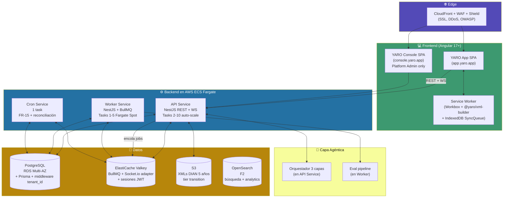

### A1.3 Inventario de contenedores

| # | Contenedor | Tecnología | Escala F1 |
|---|---|---|---|
| C1 | YARO App SPA | Angular 17+ standalone, Signals | CloudFront global |
| C2 | YARO Console SPA | Angular 17+ | CloudFront separado |
| C3 | Service Worker | Workbox + JS puro | Por dispositivo |
| C4 | API Service | NestJS + Prisma | 2–10 Fargate tasks |
| C5 | Worker Service | NestJS + BullMQ | 1–5 Fargate **Spot** |
| C6 | Cron Service | NestJS @nestjs/schedule | 1 Fargate task |
| C7 | PostgreSQL RDS | PostgreSQL 16 Multi-AZ + KMS | db.t4g.medium F1 |
| C8 | ElastiCache Valkey | Valkey 7 + replicación | cache.t4g.small F1 |
| C9 | S3 buckets | S3 + KMS + versionado | Pay-per-use |
| C10 | OpenSearch (F2) | OpenSearch 2.x | t3.small F2 |

### A1.4 Topología de red (AWS us-east-1)

- **Public subnets:** CloudFront + ALB
- **Private subnets AZ-1 y AZ-2:** API/Worker/Cron tasks
- **Data subnets:** RDS Multi-AZ + ElastiCache
- **Encrypted at rest:** todos los datos (KMS)
- **TLS 1.2+** obligatorio en todo tráfico

### Decisiones del segmento

| Decisión | Por qué |
|---|---|
| Monolito modular en NestJS | Equipo F1 de 5-7 personas. DDD prepara microservicios para F3+ |
| API + Worker + Cron en 3 servicios | Aislamiento + Fargate Spot solo Worker (ahorro) + Cron único |
| 2 SPAs separadas (app + console) | Aislamiento WAF + bundles + roles |
| us-east-1 hasta F4 | Latencia ~80-120ms Colombia, aceptable con Workbox cache |
| OpenSearch postergado a F2 | F1 con < 5 tenants no lo justifica |

---

<a name="a2"></a>

## A2 — Modelo de Dominio (DDD)

### A2.1 Mapa de bounded contexts

```mermaid
flowchart TB
    subgraph CORE["🎯 CORE DOMAIN"]
        OPS["📍 Operations<br/>Turno · POS · KDS · Cobro · Arqueo"]
        FIS["📋 Fiscal Compliance<br/>Tiquete · FE · Contingencia · Nómina"]
        AI["🤖 AI Agents<br/>Orquestador 3 capas + 5 agentes"]
    end

    subgraph SUPPORT["⚙️ SUPPORTING"]
        INV["📦 Inventory"]
        CAT["📖 Catalog"]
        ACC["📊 Accounting"]
        PAY["👤 Payroll"]
        REC["🏦 Bank Reconciliation"]
    end

    subgraph GENERIC["🏛️ GENERIC"]
        ID["🔐 Identity & Tenancy"]
        PLAT["🛠️ Platform Admin"]
    end

    OPS -->|CobroRegistrado| FIS
    OPS --> INV
    OPS --> CAT
    FIS <--> AI
    AI --> ACC
    INV --> ACC
    OPS --> ACC
    PAY --> ACC
    REC --> ACC
    REC <-- OPS
    PAY <-- OPS

    style CORE fill:#c0392b,color:#ffffff
    style SUPPORT fill:#534AB7,color:#ffffff
    style GENERIC fill:#2471a3,color:#ffffff
```

### A2.2 Los 10 bounded contexts

#### Operations (CORE)
**Agregados:** `Turno`, `Caja`, `Arqueo`, `Mesa`, `Orden`, `Cobro`

**Eventos publicados:** `TurnoAbierto`, `TurnoCerrado`, `CobroRegistrado` (crítico), `OrdenCancelada`, `DescuentoAplicado`, `ArqueoConDescuadre`, `LoteDataáfonoCapturado`

**Invariantes:** Cobro sin Turno abierto = rechazado. Cada Cobro captura `taxSnapshot` (CA7). Propinas excluidas de fiscales (P1 + regla contador).

#### Fiscal Compliance (CORE)
**Agregados:** `FiscalDocument` (append-only P1), `TaxSnapshot`, `FacturaProveedor`, `FailedFiscalDocument`

**Eventos:** `TiquetePOSGenerado`, `FacturaElectronicaEmitida`, `DocumentoFiscalTransmitiendo`, `DocumentoFiscalACCEPTED`, `DocumentoFiscalREJECTED`, `DocumentoFiscalEXPIRADO`, `FacturaProveedorRecibida`, `FacturaClasificada`, `FacturaAprobadaPorAdmin`, `FacturaEscaladaAContador`, `ConfiguracionFiscalCambiada`

**Invariantes:** `fiscal_documents` NUNCA se actualizan post-`TRANSMITTING/ACCEPTED` (trigger SQL). Para anular FE → Nota Crédito Tipo 91. Tax snapshot inmutable referenciado por cada documento.

#### AI Agents (CORE)
**Agregados:** `AgentInteraction`, `AgentEvaluation`, `TenantRule`, `EvalDataset`, `EvalCase`

**Orquestador 3 capas:** Claude Sonnet → Motor de reglas determinístico → Default. Timeout < 3s en Capa 1.

**Invariantes:** P5 toda salida loggeada (no opcional). P10 retención mínima 2 años. CA9 dataset global con anonimización.

#### Inventory (SUPPORTING)
**Agregados:** `InventarioSede`, `Merma`, `Lote` (F2), `Traslado` (F2)

#### Catalog (SUPPORTING)
**Agregados:** `Producto`, `Menú`, `Receta` (F2), `Modificador`

#### Accounting (SUPPORTING)
**Agregados:** `CuentaPUC`, `AsientoContable`, `GastoFijo`, `Retencion` (F2)

**Reglas:** Impoconsumo 8% SIEMPRE en cuenta 2408 separada del IVA. Propinas NUNCA generan asiento.

#### Payroll (SUPPORTING)
**Agregados:** `Empleado`, `AttendanceRecord` (F1), `Liquidacion` (F2)

#### Bank Reconciliation (F2/F3)
**Agregados F2:** `ReporteConciliacion`. **Agregados F3:** `ExtractoBancario`, `ItemReconciliacion`.

#### Identity & Tenancy (GENERIC)
**Agregados:** `Tenant`, `User`, `Subscription`, `SubscriptionEvent`

**Invariantes:** `Tenant.tipoOperacion` set en onboarding. `User.mfaEnabled` obligatorio para `PLATFORM_ADMIN`. `Subscription.estado` solo cambia por cron `subscription-evaluator`.

#### Platform Admin (GENERIC)
**Agregados:** `PlatformUser`, `PlatformAccessLog` (CA3), `CobranzaTicket`

### A2.3 Diagrama de secuencia: viaje de un cobro

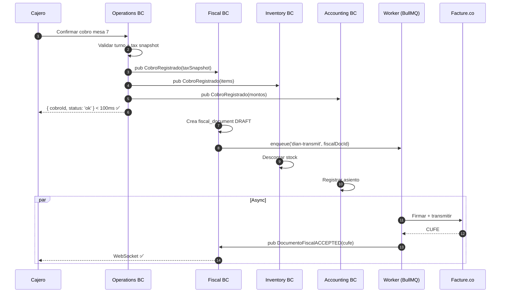

### A2.4 Lenguaje ubicuo (glosario)

`Tenant` · `Sede` · `Turno` · `Caja` · `Arqueo` · `Mesa` · `Orden` · `Cobro` · `Tiquete POS` (Tipo 04) · `FE` (Tipo 01) · `Contingencia` (Tipo 03) · `CUFE` · `CUDE` · `Tax Snapshot` · `Lote` · `Traslado` · `Merma` · `Receta` · `PUC` · `Impoconsumo` · `Régimen tributario` · `Marcación` · `Bienestar` · `Agente` (A1-A5) · `Capa` (1=IA, 2=Reglas, 3=Default) · `Regla del tenant` · `Eval continua` · `tipoOperacion` · `Subscription status`

---

<a name="a3"></a>

## A3 — Modelo de Datos (Schema Prisma)

### A3.1 Inventario de tablas F1 (28 tablas)

> **Honestidad arquitectónica:** el PRD §3 dice 14 tablas F1. Nuestras decisiones del Paso 0 requieren ~28. Lo formalizamos.

| BC | # | Tablas |
|---|---|---|
| Identity & Tenancy | 5 | `tenants` · `sedes` · `users` · `sessions` · `subscriptions` |
| Catalog | 2 | `productos` · `categorias_producto` |
| Operations | 7 | `turnos` · `cajas` · `arqueos` · `mesas` · `ordenes` · `items_orden` · `cobros` |
| Inventory | 2 | `inventario_sede` · `mermas` |
| Fiscal Compliance | 5 | `fiscal_documents` · `tax_snapshots` · `failed_fiscal_documents` · `sync_queue` · `facturas_proveedor` |
| Customers | 1 | `clientes` |
| AI Agents | 3 | `agent_interactions` · `agent_evaluations` · `tenant_rules` |
| Payroll | 1 | `attendance_records` |
| Audit & Platform | 3 | `audit_events` · `platform_users` · `platform_access_log` |
| Country config | 1 | `country_config` |

### A3.2 Tablas críticas

#### `tenants`

```sql
CREATE TABLE tenants (
  id                    UUID PRIMARY KEY DEFAULT gen_random_uuid(),
  razon_social          TEXT NOT NULL,
  nit                   TEXT NOT NULL UNIQUE,
  digito_verificacion   CHAR(1) NOT NULL,
  regimen_tributario    regimen_tributario_enum NOT NULL,
  tipo_operacion        tipo_operacion_enum NOT NULL,
  plan                  plan_yaro_enum NOT NULL DEFAULT 'STARTER',
  dian_activado         BOOLEAN NOT NULL DEFAULT FALSE,
  fecha_activacion_dian TIMESTAMPTZ,
  country_code          CHAR(2) NOT NULL DEFAULT 'CO',
  modulos_activos       JSONB NOT NULL DEFAULT '{}',
  created_at            TIMESTAMPTZ NOT NULL DEFAULT now(),
  updated_at            TIMESTAMPTZ NOT NULL DEFAULT now()
);

CREATE TYPE tipo_operacion_enum AS ENUM
  ('RESTAURANTE', 'DARK_KITCHEN', 'FOOD_TRUCK', 'BAR', 'CADENA_CDP');
CREATE TYPE regimen_tributario_enum AS ENUM
  ('ORDINARIO', 'SIMPLE', 'PERSONA_NATURAL_NO_OBLIGADA', 'NO_DEFINIDO');
CREATE TYPE plan_yaro_enum AS ENUM ('STARTER', 'PRO', 'MULTI', 'ENTERPRISE');
```

#### `fiscal_documents` — append-only inviolable (P1)

```sql
CREATE TABLE fiscal_documents (
  id                  UUID PRIMARY KEY DEFAULT gen_random_uuid(),
  tenant_id           UUID NOT NULL REFERENCES tenants(id),
  sede_id             UUID NOT NULL REFERENCES sedes(id),
  cobro_id            UUID REFERENCES cobros(id),
  tipo                tipo_fiscal_enum NOT NULL,
  estado              estado_fiscal_enum NOT NULL DEFAULT 'DRAFT',
  numero              TEXT NOT NULL,
  prefijo             TEXT NOT NULL,
  cufe                TEXT UNIQUE,
  cude                TEXT UNIQUE,
  xml_s3_key          TEXT NOT NULL,
  payload             JSONB NOT NULL,
  tax_snapshot_id     UUID NOT NULL REFERENCES tax_snapshots(id),
  related_doc_id      UUID REFERENCES fiscal_documents(id),
  indicador_contingencia BOOLEAN NOT NULL DEFAULT FALSE,
  created_at          TIMESTAMPTZ NOT NULL DEFAULT now(),
  transmitted_at      TIMESTAMPTZ,
  accepted_at         TIMESTAMPTZ,
  expires_at          TIMESTAMPTZ,
  created_by          UUID NOT NULL REFERENCES users(id)
  -- NO updated_at. NO deleted_at. NUNCA. (P1)
);

-- TRIGGER ABSOLUTO P1
CREATE OR REPLACE FUNCTION fiscal_documents_block_update()
RETURNS TRIGGER AS $$
BEGIN
  IF OLD.estado IN ('TRANSMITTING', 'ACCEPTED') THEN
    IF NEW.estado NOT IN ('REJECTED', 'EXPIRED') OR OLD.cufe IS NOT NULL THEN
      RAISE EXCEPTION 'fiscal_documents inmutables. Para anular: emitir nota crédito.';
    END IF;
  END IF;
  RETURN NEW;
END;
$$ LANGUAGE plpgsql;

CREATE TRIGGER fiscal_documents_immutability
BEFORE UPDATE ON fiscal_documents
FOR EACH ROW EXECUTE FUNCTION fiscal_documents_block_update();
```

#### `tax_snapshots` (CA7)

```sql
CREATE TABLE tax_snapshots (
  id                    UUID PRIMARY KEY DEFAULT gen_random_uuid(),
  tenant_id             UUID NOT NULL REFERENCES tenants(id),
  capturado_at          TIMESTAMPTZ NOT NULL DEFAULT now(),
  impoconsumo_tasa      DECIMAL(5,4) NOT NULL,
  impoconsumo_activo    BOOLEAN NOT NULL,
  iva_tasa              DECIMAL(5,4) NOT NULL,
  regimen               regimen_tributario_enum NOT NULL,
  obligado_fe           BOOLEAN NOT NULL,
  prefijo_numeracion    TEXT NOT NULL,
  hash_config           TEXT NOT NULL,
  active                BOOLEAN NOT NULL DEFAULT TRUE,
  superseded_at         TIMESTAMPTZ
);

CREATE UNIQUE INDEX uq_tax_snapshots_active_per_tenant
  ON tax_snapshots(tenant_id) WHERE active = TRUE;
```

#### `failed_fiscal_documents` (CA6)

```sql
CREATE TABLE failed_fiscal_documents (
  id                  UUID PRIMARY KEY DEFAULT gen_random_uuid(),
  tenant_id           UUID NOT NULL REFERENCES tenants(id),
  fiscal_document_id  UUID NOT NULL REFERENCES fiscal_documents(id),
  razon_falla         TEXT NOT NULL,
  estado_legal        estado_legal_enum NOT NULL DEFAULT 'PENDIENTE_REGULARIZAR',
  alertado_a          UUID[] NOT NULL,
  notas_internas      TEXT,
  expirado_at         TIMESTAMPTZ NOT NULL,
  regularizado_at     TIMESTAMPTZ,
  regularizado_por    UUID REFERENCES users(id),
  created_at          TIMESTAMPTZ NOT NULL DEFAULT now()
);
```

#### `subscriptions` + `subscription_events` (FR-15)

```sql
CREATE TABLE subscriptions (
  id                    UUID PRIMARY KEY DEFAULT gen_random_uuid(),
  tenant_id             UUID NOT NULL UNIQUE REFERENCES tenants(id),
  estado                estado_suscripcion_enum NOT NULL DEFAULT 'ACTIVE',
  next_billing_date     DATE NOT NULL,
  overdue_since_at      TIMESTAMPTZ,
  current_level         INT NOT NULL DEFAULT 0,
  gracia_dias           INT NOT NULL DEFAULT 2,
  override_until        TIMESTAMPTZ,
  override_reason       TEXT,
  payment_provider_id   TEXT,
  created_at            TIMESTAMPTZ NOT NULL DEFAULT now()
);

CREATE TABLE subscription_events (
  id                  UUID PRIMARY KEY DEFAULT gen_random_uuid(),
  subscription_id     UUID NOT NULL REFERENCES subscriptions(id),
  tipo                TEXT NOT NULL,
  estado_anterior     estado_suscripcion_enum,
  estado_nuevo        estado_suscripcion_enum,
  razon               TEXT,
  ejecutado_por       TEXT,
  ocurrido_at         TIMESTAMPTZ NOT NULL DEFAULT now(),
  metadata            JSONB
);
```

#### `agent_interactions` + `agent_evaluations` + `tenant_rules` (M11)

```sql
CREATE TABLE agent_interactions (
  id              UUID PRIMARY KEY DEFAULT gen_random_uuid(),
  tenant_id       UUID NOT NULL REFERENCES tenants(id),
  agent_id        agent_enum NOT NULL,
  prompt_version  TEXT NOT NULL,
  model_version   TEXT,
  input           JSONB NOT NULL,
  output          JSONB,
  capa_usada      capa_enum NOT NULL,
  confianza       DECIMAL(4,3),
  latency_ms      INT,
  tokens_cost_usd DECIMAL(8,5),
  human_feedback  JSONB,
  user_id         UUID REFERENCES users(id),
  resource_type   TEXT,
  resource_id     UUID,
  created_at      TIMESTAMPTZ NOT NULL DEFAULT now()
);

CREATE TYPE agent_enum AS ENUM ('A1_BUZON', 'A2_FOOD_COST', 'A3_CONCILIACION', 'A4_COPILOTO', 'A5_STOCK');
CREATE TYPE capa_enum AS ENUM ('C1_IA', 'C2_REGLA', 'C3_DEFAULT');

-- Particionado mensual
```

### A3.3 Decisiones de modelado transversales

| Decisión | Detalle |
|---|---|
| **IDs UUID v4** | Generables offline (Workbox + SyncQueue) + portables |
| **Money como BIGINT enteros COP** | Evita bug de redondeo (`critica.md §2`) |
| **`tenant_id` NOT NULL en toda tabla operativa** | Excepciones: `country_config`, `platform_users`, `platform_access_log` |
| **Soft delete restringido** | Solo donde tiene sentido. Datos transaccionales nunca delete |
| **JSONB para extensibilidad** | `modulos_activos`, `payload`, `metodos_pago`, etc. |
| **Particionado mensual** | `audit_events`, `agent_interactions`, `agent_evaluations`, `platform_access_log` |
| **Naming snake_case** | Tablas/columnas DB · ENUMs `_enum` · Prisma auto-map a camelCase |

### A3.4 Política de migraciones expand-contract

> **Prohibido** en producción: `ALTER TABLE ... ADD COLUMN x NOT NULL` sin DEFAULT.

```sql
-- Patrón obligatorio
-- 1. EXPAND
ALTER TABLE cobros ADD COLUMN nuevo_campo TEXT;
-- 2. MIGRATE en background batches
UPDATE cobros SET nuevo_campo = ... WHERE nuevo_campo IS NULL LIMIT 10000;
-- 3. CONTRACT
ALTER TABLE cobros ALTER COLUMN nuevo_campo SET NOT NULL;
```

Reglas operativas: NUNCA migración en hora pico (11–15h / 18–22h CO). Test en staging con dataset realista. Aprobación de 2 ingenieros para `fiscal_documents` o `tenants`.

---

<a name="a4"></a>

## A4 — Multi-tenancy y Aislamiento (P3)

### A4.1 Modelo elegido

**Shared DB + Shared Schema + `tenant_id` por fila** + 4 capas de defensa. Viable hasta 500-1.000 tenants.

### A4.2 Las 4 capas de defensa

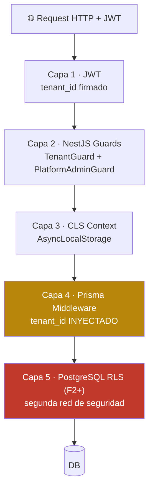

### A4.3 Capa 4: Prisma Middleware (la más crítica)

```typescript
prisma.$use(async (params, next) => {
  const tenantId = cls.get('tenantId');
  const platformBypass = cls.get('__platformQuery');

  const PLATFORM_TABLES = ['country_config', 'platform_users', 'platform_access_log'];

  if (PLATFORM_TABLES.includes(params.model)) return next(params);

  if (!tenantId && !platformBypass) {
    throw new ForbiddenException('Operación sin contexto de tenant. Bug crítico.');
  }

  if (platformBypass) {
    await logPlatformAccess(...);  // CA3
    return next(params);
  }

  // Inyectar tenant_id en where + data
  injectTenantId(params, tenantId);
  return next(params);
});
```

### A4.4 CA3 — Bypass auditado para queries de plataforma

```typescript
async function platformQuery<T>(
  options: { platformUserId: string; reason: string; ticketId?: string },
  query: () => Promise<T>
): Promise<T> {
  cls.run({}, async () => {
    cls.set('__platformQuery', true);
    cls.set('platformUserId', options.platformUserId);
    cls.set('__platformReason', options.reason);
    return await query();  // middleware loguea automáticamente
  });
}
```

### A4.5 Tests de aislamiento (gate de merge)

```typescript
describe('Multi-tenancy Aislamiento (P3)', () => {
  it('tenant A solo ve sus cobros, no los de tenant B', async () => { ... });
  it('query sin tenantId lanza excepción', async () => { ... });
  it('crear cobro siempre lleva tenantId del contexto', async () => { ... });
  it('inyección tenant_id en where no funciona — middleware sobreescribe', async () => { ... });
});
```

ESLint custom rules: `no-raw-query-without-tenant-id`, `no-direct-prisma-client`, `no-platform-query-without-reason`.

### A4.6 Failure modes

| Failure | Detección | Mitigación |
|---|---|---|
| `new PrismaClient()` directo | ESLint + tests CI | Bloquear PR |
| Tabla nueva sin `tenant_id` | Test CI | Bloquear PR |
| Endpoint sin Guard | Test CI | Bloquear PR |
| Cron olvida `__platformQuery=true` | Middleware exception | Cron falla, alerta |

### A4.7 Runbook de incidente cross-tenant

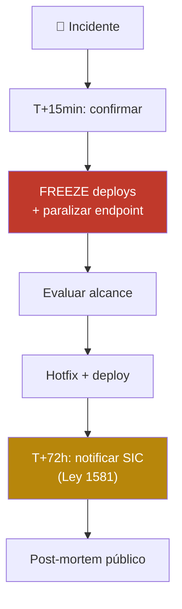

---

<a name="a5"></a>

## A5 — Pipeline DIAN Fire-and-Forget

### A5.1 Visión general

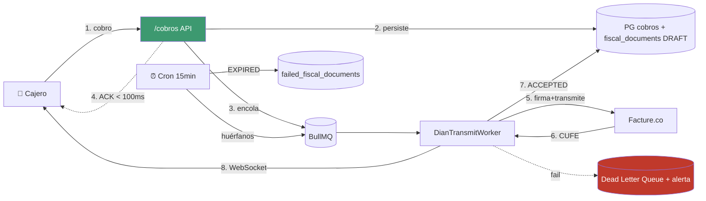

### A5.2 State machine de `fiscal_document`

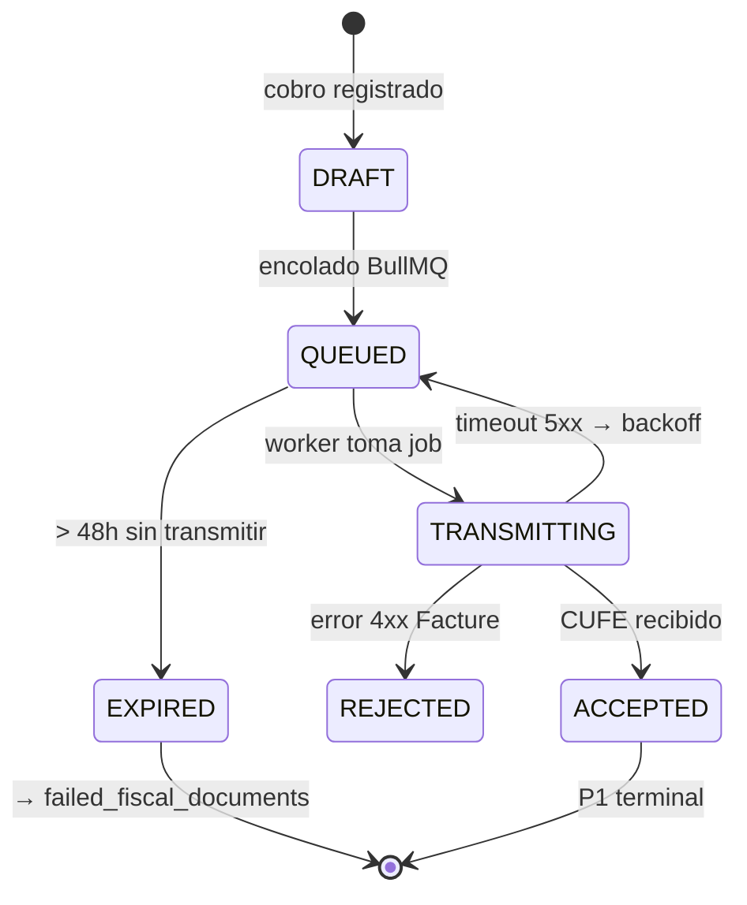

### A5.3 Configuración BullMQ

```typescript
export const dianQueueConfig = {
  defaultJobOptions: {
    attempts: 5,
    backoff: { type: 'exponential', delay: 2000 },  // 2s, 4s, 8s, 16s, 32s
    removeOnComplete: { age: 24 * 3600 },
    removeOnFail: false,  // NUNCA — van a DLQ
  },
};

export enum DianJobPriority {
  FE_VENTA = 1,
  CONTINGENCIA = 2,
  TIQUETE_POS = 3,
  NOTA_CREDITO = 4,
  NOMINA = 5,
}
```

### A5.4 Idempotencia (multi-capa)

1. `jobId: 'transmit-{fiscalDocId}'` — BullMQ rechaza duplicados
2. Lock pesimista `FOR UPDATE` en worker
3. State machine — `ACCEPTED` es terminal
4. Constraint único `(tenant_id, prefijo, numero)`
5. Trigger SQL append-only

### A5.5 Cron reconciliación cada 15 min

```typescript
@Cron('*/15 * * * *')
async reconciliarPendientes() {
  await this.platformQuery(
    { platformUserId: 'system-cron', reason: 'fiscal-reconciliation' },
    async () => {
      // 1. Huérfanos (> 10 min en DRAFT/QUEUED) → re-encolar
      // 2. Próximos a expirar (< 6h) → alerta proactiva
      // 3. EXPIRED → mover a failed_fiscal_documents + alerta legal
    }
  );
}
```

### A5.6 CA1 — SLA interno

| Tiempo desde cobro | Estado esperado | Acción si falla |
|---|---|---|
| < 100 ms | API responde al cajero | Bug crítico R1 |
| < 5 s | ACCEPTED p50 | Investigar carga BullMQ |
| < 30 s | ACCEPTED p95 | Alerta — Facture lento |
| < 5 min | ACCEPTED todos | Alerta crítica |
| < 30 min | ACCEPTED o investigación | Escalar a CTO |
| < 48 h | Transmitido sí o sí | Sino → EXPIRED + alerta legal |

### A5.7 CA2 — Versionado `@yaro/xml-builder`

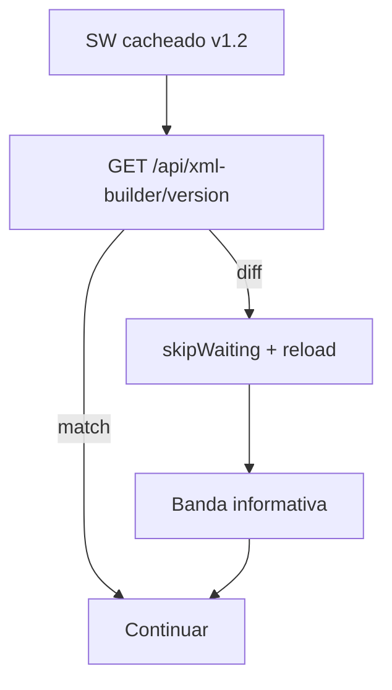

Backend valida `clientXmlBuilderVersion` al sincronizar — si < `MIN_SUPPORTED_VERSION` → rechaza con `OUTDATED_CLIENT`.

### A5.8 Manejo de Facture.co caído

| Escenario | Acción |
|---|---|
| Timeout > 30s | BullMQ backoff, vuelve a QUEUED |
| 500/502/503 | BullMQ backoff |
| 4xx no recuperable (NIT inválido) | → REJECTED, alerta admin |
| Caído > 1 hora | Buffer hasta 48h contingencia |
| Caído > 24h | Plan B operador alternativo (F2 backlog) |

Health check cada 5 min.

---

<a name="a6"></a>

## A6 — Modo Offline + Sincronización

### A6.1 Arquitectura cliente

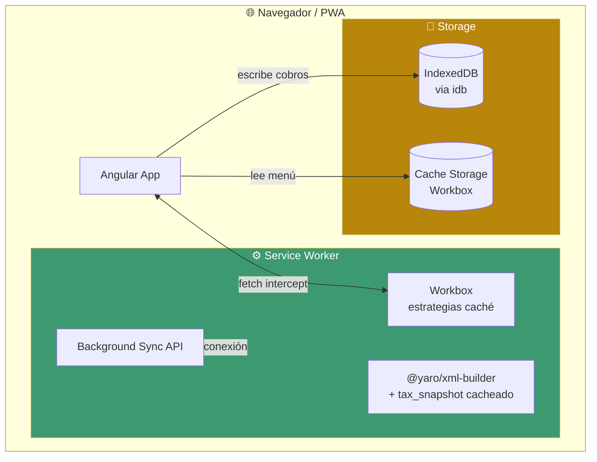

### A6.2 Estrategias Workbox

| Recurso | Estrategia | TTL |
|---|---|---|
| Menú / productos | CacheFirst | 24h |
| Configuración del tenant | CacheFirst | 7 días |
| Tax snapshot del tenant | CacheFirst | 7 días |
| Plano de mesas / turno activo | NetworkFirst (3s timeout) | 1h |
| Assets (logos, iconos) | StaleWhileRevalidate | — |
| `/cobros` POST | NetworkOnly + fallback offline | — |
| `/dian/transmisiones` | NetworkOnly | — |

### A6.3 IndexedDB schema (cliente)

```typescript
interface YaroDB extends DBSchema {
  syncQueue: { key: string; value: SyncQueueItem; indexes: {...} };
  fiscalDocumentsLocal: { ... };
  taxSnapshotCache: { ... };
  attendanceQueue: { ... };
  kdsEventQueue: { ... };
  metadata: { ... };
}

interface SyncQueueItem {
  id: string;  // UUID generado localmente
  tenantId: string;
  payloadType: 'COBRO' | 'MARCACION' | 'EVENTO_KDS';
  payload: Record<string, any>;
  cobrado_at: string;  // ISO timestamp REAL del cobro
  expires_at: string;  // cobrado_at + 48h
  taxSnapshotId: string;
  xmlContingencia?: string;
  estado: 'PENDIENTE' | 'SINCRONIZANDO' | 'PROCESADO' | 'ERROR';
  intentos: number;
}
```

### A6.4 Detección offline híbrida

```typescript
@Injectable()
export class ConnectionDetector {
  private status = signal<'online' | 'offline' | 'degraded'>('online');

  constructor() {
    window.addEventListener('online', () => this.checkRealConnection());
    window.addEventListener('offline', () => this.status.set('offline'));
    interval(30_000).subscribe(() => this.checkRealConnection());
  }

  private async checkRealConnection() {
    try {
      const start = Date.now();
      await this.http.get('/health/ping').toPromise();
      const latency = Date.now() - start;
      this.status.set(latency > 3000 ? 'degraded' : 'online');
    } catch {
      this.status.set(navigator.onLine ? 'degraded' : 'offline');
    }
  }
}
```

### A6.5 Sincronización al reconectar

```typescript
self.addEventListener('sync', async (event) => {
  if (event.tag === 'yaro-sync-queue') {
    event.waitUntil(syncPendingItems());
  }
});

async function syncPendingItems() {
  // 1. Validar versión xml-builder (CA2)
  // 2. Obtener items PENDIENTE en orden FIFO
  // 3. Filtrar no expirados
  // 4. Batch upload (máx 50 por request)
  // 5. Marcar PROCESADO o ERROR según respuesta
}
```

### A6.6 Edge cases del modo offline

| EC | Mitigación |
|---|---|
| **Dispositivo offline > 24h** | Menú/config cacheados > 48h. Tax snapshot al inicio del turno |
| **Dos dispositivos del tenant offline simultáneamente** | Numeración asignada por backend al sincronizar. Inventario: descuento al sync |
| **Cliente cierra navegador con cola pendiente** | IndexedDB persistente. Al reabrir, banner ámbar + sync |
| **Tax snapshot cambió offline** | Cobros offline usan snapshot referenciado siempre (CA7) |
| **Cuota IndexedDB excedida** | Monitor `storage.estimate()` + cleanup automático |
| **Cobro offline rechazado al sincronizar** | Cliente físico ya recibió → emitir Tipo 04 como compensación |
| **Service Worker no se actualiza** | skipWaiting + clientsClaim + validation pre-cola |
| **Falsa detección de offline (red lenta)** | Estado `degraded` distinto de `offline` |

### A6.7 UI offline

| Estado | Banner | CTA |
|---|---|---|
| `online` | — | — |
| `degraded` | "Conexión lenta" amarillo | Reintentar |
| `offline` | "📴 Modo offline · N en cola" ámbar | Ver detalles |
| `próximo a vencer` | "⚠️ N llevan 36h sin sync (vence en 12h)" rojo | Buscar conexión |
| `sincronizando` | "🔄 Sincronizando N cobros..." | — |
| `tiquete expirado` | "⚠️ Cobro de fecha expiró — Carolina notificada" | Ver detalles |

### A6.8 Restricciones técnicas

- Service Workers solo en HTTPS (excepto localhost)
- Background Sync API no soportado en Safari → fallback manual con interval
- IndexedDB cuota dinámica Chrome → monitor + cleanup
- Service Worker scope = `/` para cubrir toda la app

---

<a name="a7"></a>

## A7 — Plataforma de Agentes IA

### A7.1 Arquitectura

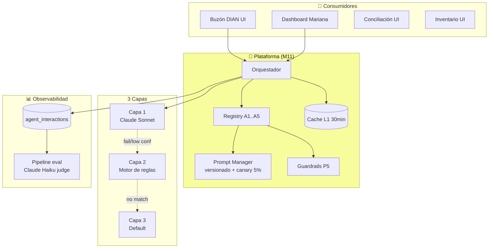

### A7.2 Los 5 agentes

| # | Agente | Fase | Capa 1 | Capa 2 | Capa 3 |
|---|---|---|---|---|---|
| A1 | Buzón DIAN Clasificador | F1 cap.2-3, F2 cap.1+IA | Claude Sonnet | Motor de reglas del tenant + base | Default + flag manual |
| A2 | Food Cost & Márgenes | F2 | Claude Sonnet (análisis recetas) | Cálculo determinístico de margen | Dashboard estático |
| A3 | Conciliación Bancaria | F3 | Claude Sonnet matching difuso | Matching exacto | Excepción |
| A4 | Copiloto del Dueño | F2 desc, F3 conv | Claude Sonnet | Dashboards preconstruidos | "No tengo el dato" |
| A5 | Predicción Stock | F3 | Claude Sonnet sugerencias | Promedio móvil ponderado | Alertas estáticas |

### A7.3 Orquestador 3 capas (interface)

```typescript
async invoke<TInput, TOutput>(
  agentId: AgentEnum,
  input: TInput,
  options?: InvokeOptions,
): Promise<AgentResponse<TOutput>> {
  const interactionId = randomUUID();

  // 1. Logueo obligatorio ANTES de invocar (P10)
  await prisma.agentInteraction.create({ ... });

  // 2. Pre-procesamiento + sanitización
  const sanitizedInput = await guardrails.sanitizeInput(agentId, input);

  // 3. Cache check (palanca 1)
  const cached = await cache.get(agentId, sanitizedInput);
  if (cached) return cached;

  // 4. Capa 1: Claude Sonnet con timeout 3s
  try {
    const c1 = await Promise.race([callCapa1(...), timeout(3000)]);
    if (c1.confianza >= config.umbralConfianzaC1) {
      const validated = await guardrails.validateOutput(agentId, c1.output);
      await updateInteraction(interactionId, { capaUsada: 'C1_IA', ... });
      return { capa: 'C1_IA', output: validated };
    }
  } catch { /* cae a Capa 2 */ }

  // 5. Capa 2: Motor de reglas
  const c2 = await ruleEngine.evaluate(agentId, tenantId, sanitizedInput);
  if (c2.matched) {
    await updateInteraction(interactionId, { capaUsada: 'C2_REGLA', ... });
    return { capa: 'C2_REGLA', output: c2.output };
  }

  // 6. Capa 3: Default
  return { capa: 'C3_DEFAULT', output: registry.getDefault(agentId), needsManual: true };
}
```

### A7.4 Motor de reglas — reglas base sector restaurantero

```typescript
export const RULES_BASE_RESTAURANTES_CO = [
  { agentId: 'A1_BUZON', keywords: ['carne', 'res', 'cerdo', 'pollo'], action: { cuentaPUC: '1430', subcuenta: '143005' } },
  { agentId: 'A1_BUZON', keywords: ['verdura', 'lechuga', 'tomate'], action: { cuentaPUC: '1430', subcuenta: '143010' } },
  { agentId: 'A1_BUZON', keywords: ['gas', 'propano'], action: { cuentaPUC: '5220', subcuenta: '522005' } },
  { agentId: 'A1_BUZON', keywords: ['epm', 'energía eléctrica'], action: { cuentaPUC: '5220', subcuenta: '522010' } },
  { agentId: 'A1_BUZON', keywords: ['arriendo'], action: { cuentaPUC: '5205', subcuenta: '520505' } },
  { agentId: 'A1_BUZON', keywords: ['contador', 'honorarios contables'], action: { cuentaPUC: '5110', subcuenta: '511005' } },
  // ... 12+ reglas base
];
```

### A7.5 Guardrails P5

**Pre-procesamiento:**
- Detección prompt injection (patterns regex)
- Escapado de contenido sospechoso
- Truncado de campos largos (anti DoS por costo)
- Validación shape con Zod

**Post-procesamiento (A4 Copiloto):**
- Detección palabras prescriptivas (`deberías`, `debes hacer`, etc.) → P5 violation alert
- Validación cifras tienen `source_query` o `source_url` → F1 = 100%
- Validación NO incluye `tenantId` distinto → P3 cross-leak alert

### A7.6 Eval continua (4 fases QA)

| Fase | Cuándo | Cómo |
|---|---|---|
| **A — Pre-launch** | Antes del primer deploy | Dataset completo, gate aprobación |
| **B — Canary** | Primeros 14 días | 100% logueo + 100% eval + 20% revisión humana |
| **C — Producción estable** | Día 14+ | Muestreo 50/agente/semana, revisión humana 10% |
| **D — Re-evaluación** | Post-cambio significativo | Repetir Fase A con dataset ampliado |

### A7.7 Optimización de costos — 6 palancas

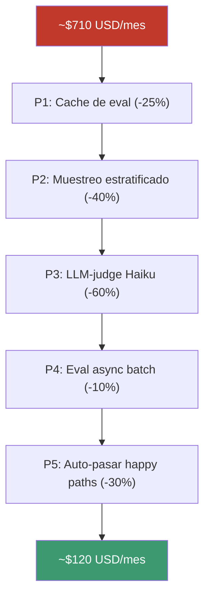

### A7.8 Costo realista por tenant

> El target del PRD S5 < $15 USD/tenant/mes es optimista. Cálculo realista da **~$70 USD/tenant/mes en F2**, optimizable a **$25 en F3 estable** con tenant rules maduras.

### A7.9 Red-teaming (quarterly)

| Ataque | Probabilidad | Impacto | Agentes |
|---|---|---|---|
| Prompt injection en factura | Alta | Alto | A1 |
| Pregunta prescriptiva disfrazada | Media | Alto | A4 |
| Jailbreak típico | Media | Medio | Todos |
| Inducción de alucinación | Media | Alto | A4 |
| Extracción cross-tenant via agente | Baja | **Catastrófico (P3)** | Todos |
| DoS por costo | Media | Medio | Todos |

---

<a name="a8"></a>

## A8 — Seguridad y Hardening + Google OAuth

### A8.1 Defense in depth — 7 capas

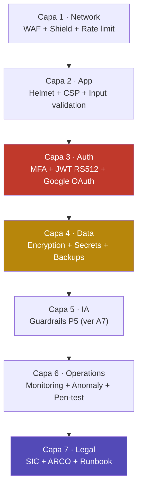

### A8.2 Capa Network — AWS WAF

**Reglas activas:**
- AWSManagedRulesCommonRuleSet (OWASP Top 10)
- AWSManagedRulesSQLiRuleSet
- AWSManagedRulesAmazonIpReputationList
- Rate limit `/auth/login`: 5/min/IP
- Rate limit `/cobros`: 200/min/tenant
- Rate limit `/ia/*`: 50/min/tenant
- Geo-blocking: Latam allowlist

### A8.3 Capa App

- Helmet.js con CSP estricto (sin `unsafe-inline` en F2+)
- CSRF double-submit cookie
- Validación inputs con `class-validator` + Zod
- Dependabot + Snyk + npm audit como gate CI
- Lockfile integrity verificado

### A8.4 Capa Auth — Modelo híbrido

| Tipo de usuario | Login | MFA |
|---|---|---|
| Platform Admin (equipo YARO) | Email + password + MFA TOTP | **Obligatorio** |
| Support Engineer (equipo YARO) | Email + password + MFA TOTP | **Obligatorio** |
| Superadmin del tenant (Mariana) | Email + password ó Google | Opcional F1, obligatorio F2 |
| Admin de sede (Andrés) | Email + password ó Google | Opcional |
| Cajero / Mesero / Cocina / CDP | **Google OAuth** recomendado o PIN local | No requerido |
| Contador externo (Carolina) | Email + password ó Google | Recomendado |

### A8.5 Google OAuth — flujo

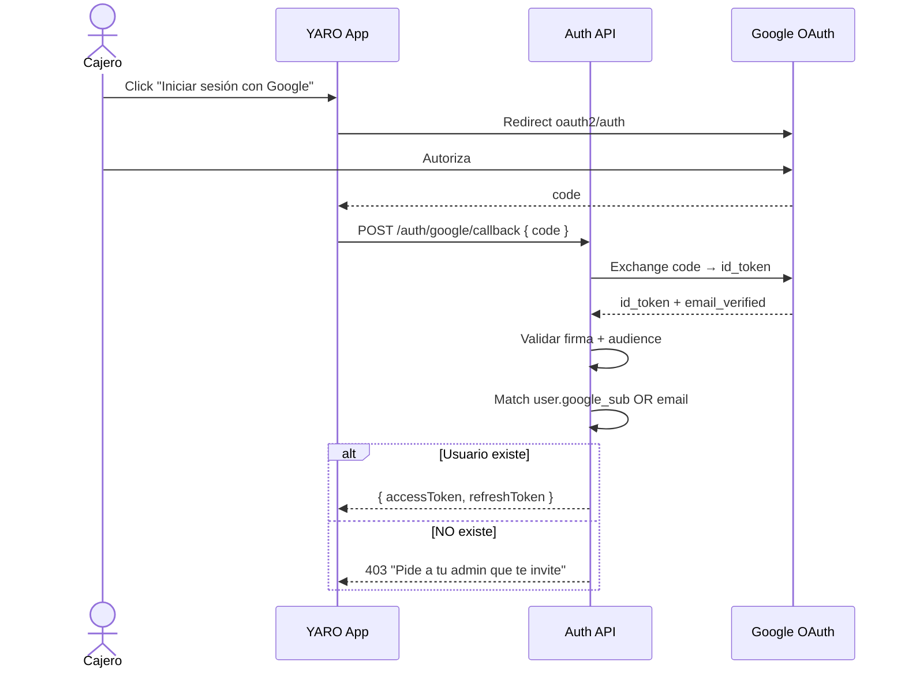

Schema extendido: `users.google_sub UNIQUE`, `users.auth_method ENUM ('PASSWORD' | 'GOOGLE_OAUTH' | 'BOTH')`, tabla `user_invitations`.

### A8.6 Capa Data

- **Encryption at rest:** RDS + ElastiCache + S3 + EBS con AWS KMS
- **Encryption in transit:** TLS 1.2+ en todo tráfico
- **Secrets Manager:** estructura `/yaro/{env}/...` + cache 5min
- **Rotación:** DB password 30d, JWT keys 90d, Facture trimestral
- **Backups:** RDS PITR 7d + daily 30d + weekly 1y + restore-test mensual

### A8.7 Quick wins de Fase 1 (priorizados)

| # | Acción | Esfuerzo |
|---|---|---|
| 1 | MFA obligatorio Platform Admin | 1 sem |
| 2 | AWS WAF + OWASP Top 10 + rate limiting | 1 sem |
| 3 | Dependabot + Snyk + audit gate CI | 3 días |
| 4 | Registro SIC + política privacidad | 2 sem |
| 5 | Runbook seguridad + encargado de datos | 1 sem |
| 6 | Lockout 5 intentos fallidos | 2 días |
| 7 | Backups encriptados + restore-test mensual | 1 sem |

### A8.8 Compliance Ley 1581

| Documento | Audiencia |
|---|---|
| Política de privacidad | Pública footer |
| Aviso de tratamiento | Cliente onboarding |
| Acuerdo tratamiento datos | Firma cliente |
| Cláusula subprocesadores | Anexo contrato (AWS, Facture, Anthropic) |
| Procedimiento ARCO | Equipo soporte |
| Plan respuesta a brechas | Equipo seguridad |
| Notificación SIC < 72h | Runbook activo |

### A8.9 Runbook de incidente CRITICAL

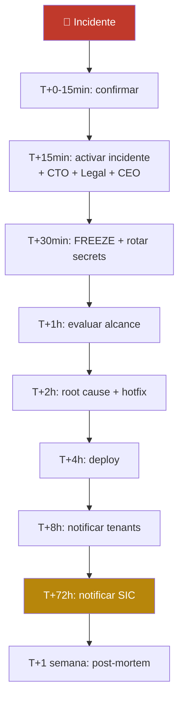

Simulacros trimestrales (Q1 brecha, Q2 API key, Q3 DDoS, Q4 phishing).

---

<a name="a9"></a>

## A9 — Observabilidad y SLOs

### A9.1 Los 4 pilares

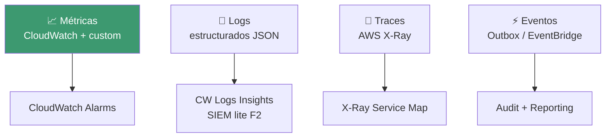

### A9.2 SLOs

| SLI | SLO | Error budget mensual |
|---|---|---|
| `/cobros` latency p95 | < 100 ms | 5% del tiempo |
| `/cobros` availability | 99.5% | 3.6 horas/mes |
| DIAN transmission success | ≥ 99% | 1% en 30d |
| Sync offline → DIAN | ≥ 98% | 2% en 30d |
| KDS WebSocket p95 | < 200 ms | 5% |
| Multi-tenant isolation | **0** incidentes | No tolerancia |
| F2 alucinación A4 | < 2% | Eval continua |
| S1 prescriptivas A4 | < 0.5% | Eval continua |
| Documentos EXPIRED | 0 | No tolerancia |

### A9.3 Error budgets — comportamiento

| Consumido | Acción |
|---|---|
| 0-50% | Operación normal + feature work |
| 50-80% | Revisión de cada deploy + pair review |
| 80-100% | **FEATURE FREEZE** + priorizar reliability |
| > 100% | Incident mode + post-mortem + ajuste SLOs |

### A9.4 Logs estructurados

```typescript
{
  timestamp, level, service, traceId, spanId,
  tenantId, userId, platformUserId,
  endpoint, duration, statusCode,
  message, metadata
}
```

Retención: operacional 30d, audit 1 año, fiscal 5 años, agentes IA 2 años, platform access 5 años.

**Anti-PII automático:** sanitizer rechaza fields `password`, `token`, `mfaCode`, `apiKey`, `cardNumber`.

### A9.5 Alertas — 3 niveles

| Nivel | Ejemplos | Canal |
|---|---|---|
| **Info** | Deploy completado | Slack |
| **Warning** | Error rate > 0.5%, RDS CPU > 70% | Slack + email |
| **Critical** | Error rate > 1%, Tenant isolation, DLQ > 5, Doc EXPIRED | **Page on-call** |

Escalamiento: On-call (5min) → Backup (10min) → Lead (15min) → CEO.

### A9.6 Dashboards (5)

1. **Sistema** (técnico) — CPU/RAM, RDS, Valkey, BullMQ, error rate
2. **SLOs** (mensual) — latencia, DIAN, sync offline, error budget
3. **Negocio** (NS + KPIs) — % Operación YARO, tenants activos, MRR
4. **Agentes IA** (semanal) — F2, S1, costo, flags
5. **Seguridad** — Tests aislamiento, failed logins, WAF blocks, MFA

### A9.7 Health endpoint

```typescript
GET /health → {
  status: 'ok' | 'degraded',
  timestamp, version,
  checks: { db, cache, bullmq, dian, ai },
  offlineQueue: { count, oldest }
}
```

### A9.8 Costo

| Fase | CloudWatch | X-Ray | Total |
|---|---|---|---|
| F1 | ~$55/mes | $0 (free tier) | **~$55/mes** |
| F2 | ~$120/mes | ~$30/mes | **~$225/mes** |
| F3 | ~$300/mes | ~$100/mes | **~$580/mes** |

Migración a Datadog/New Relic solo si CloudWatch no escala en F3+.

---

<a name="a10"></a>

## A10 — Despliegue + CI/CD

### A10.1 Flujo de deploy

```mermaid
flowchart LR
    DEV["💻 Dev local"] --> PR["🌿 Pull Request"]
    PR -->|"PR open"| CI["⚙️ CI Pipeline"]
    CI -->|"all checks ✅"| MERGE["Merge to main"]
    MERGE -->|"auto"| STG["🟡 Staging"]
    STG -->|"validación + smoke"| PROMO["Promote manual<br/>(con MFA)"]
    PROMO -->|"rolling deploy"| PROD["🟢 Production"]
    PROD -.failure.-> ROLL["⏪ Rollback < 5 min"]

    style CI fill:#3d9970,color:#ffffff
    style PROD fill:#c0392b,color:#ffffff
```

### A10.2 Principios

1. Deploy frecuente y pequeño (target 1-3/día F1)
2. Cero downtime (rolling + circuit breaker)
3. Reversible (rollback automático si smoke falla)
4. Trazable (commit + PR + tickets)
5. Feature flags > deploys
6. No deploys en hora pico (11-15h / 18-22h CO)
7. Disciplina automática, no buena voluntad

### A10.3 Terraform — recursos prod F1

| Servicio | Config | Costo/mes |
|---|---|---|
| API Service | 2-10 tasks · 1 vCPU/2GB · On-Demand | ~$80 |
| Worker Service | 1-5 tasks · 1 vCPU/2GB · **Spot** | ~$25 |
| Cron Service | 1 task · 0.5 vCPU/1GB | ~$15 |
| RDS PostgreSQL Multi-AZ | db.t4g.medium | ~$200 |
| ElastiCache Valkey | cache.t4g.small × 2 | ~$50 |
| CloudFront + WAF | — | ~$30 |
| S3 + transit | — | ~$25 |
| Observabilidad | CloudWatch | ~$55 |
| **Total F1 prod** | | **~$480/mes** |

### A10.4 GitHub Actions — pipelines

**PR checks (gate de merge):**
- lint-and-format
- custom-eslint-rules (YARO multi-tenancy, P5)
- unit-tests + coverage ≥ 70%
- **integration-tests-multi-tenancy** (P3 — gate crítico)
- security-audit (Snyk + npm audit)
- **xml-builder-version-check** (CA2)
- schema-migration-safety (expand-contract)
- e2e-smoke (Playwright)
- build

**Deploy staging (auto al merge a main).**

**Promote production (manual + MFA):**
- Check ventana pico no aplica
- Verify staging healthy
- Verify SLOs últimas 24h
- Rolling deploy con circuit breaker
- Smoke tests post-deploy
- Verify SLOs post-deploy (5 min)
- Tag commit + crear release note

**Rollback (manual workflow):** restaura task definition previa < 5 min.

### A10.5 Migraciones expand-contract enforced en CI

```yaml
- name: Detect dangerous migrations
  run: |
    if grep -E "ALTER TABLE \w+ ADD COLUMN \w+ \w+ NOT NULL" $FILES; then
      if ! grep -E "DEFAULT" $FILES; then
        exit 1  # Bloquear PR
      fi
    fi
    if grep -E "fiscal_documents" $FILES; then
      if ! grep -q "# APPROVED_BY: " $FILES; then
        exit 1  # Cambio fiscal requiere approval explícito
      fi
    fi
```

### A10.6 Feature flags (DB-based en F1)

```sql
CREATE TABLE feature_flags (
  name TEXT NOT NULL UNIQUE,
  enabled BOOLEAN NOT NULL DEFAULT FALSE,
  rollout_percentage INT NOT NULL DEFAULT 0,
  enabled_for_tenants UUID[] DEFAULT '{}',
  disabled_for_tenants UUID[] DEFAULT '{}',
  ...
);
```

Flags vivos típicos: `a1_buzon_con_claude`, `a4_copiloto_descriptivo`, `notifications_push_pwa`, `google_oauth`, `subscription_l3_block`.

### A10.7 Smoke tests post-deploy

```bash
# Tests obligatorios después de cada deploy
1. /health responde OK
2. Login de usuario test funciona
3. Multi-tenancy aislamiento (cuenta esperada)
4. Abrir turno + emitir tiquete sandbox → CUFE recibido
5. Cleanup
```

### A10.8 Disaster Recovery

| Métrica | Target |
|---|---|
| **RPO** (pérdida máxima) | < 5 minutos |
| **RTO** (tiempo a restaurar) | < 1 hora |

Estrategias: Multi-AZ (failover < 5min), PITR 7d, daily snapshots 30d retention, weekly 1y, yearly 5y archive.

---

<a name="a11"></a>

## A11 — Estrategia de Escalamiento

### A11.1 Volumen por fase

| Métrica | F1 (5) | F2 (20) | F3 (50) | F4 (500) |
|---|---|---|---|---|
| Cobros/día | ~600 | ~3.000 | ~10.000 | ~120.000 |
| Cobros/hora pico | ~150 | ~750 | ~2.500 | ~30.000 |
| Storage RDS | ~1 GB | ~10 GB | ~50 GB | ~500 GB |
| Storage S3 XMLs | ~50 MB | ~1 GB | ~10 GB | ~150 GB |
| WebSocket simultáneas | ~30 | ~120 | ~400 | ~5.000 |

### A11.2 Triggers de escalamiento

| Componente | Gatillo | Acción |
|---|---|---|
| API tasks | CPU > 70% | Auto-scaling agrega task |
| Worker | Cola BullMQ > 50 | Auto-scaling Spot |
| RDS CPU | > 80% sostenido 1h | Upgrade + considerar read replica |
| RDS Storage | > 75% | Auto-scaling (con approval) |
| ElastiCache memory | > 80% | Upgrade |
| Anthropic cost | > $80/tenant/mes | Activar palancas adicionales (A7) |
| **Tenant individual** | **> 100K transacciones/día** | Evaluar DB dedicada (no por monto en pesos) |

> **Aclaración:** Sharding NO se justifica por ventas en pesos. Un cliente con $200M COP/mes/sede genera ~1.5 cobros/min en hora pico — sin saturación. La arquitectura aguanta clientes con 30 sedes × $1.000M COP/mes.

### A11.3 RDS scaling progresivo

| Fase | Config | Notas |
|---|---|---|
| F1 | db.t4g.medium Multi-AZ | ~$200/mes |
| F2 | db.m6g.large Multi-AZ + Read Replica | ~$400/mes |
| F3 | db.m6g.xlarge + Read Replica + Particionado mensual | ~$1.000/mes |
| F4 | db.r6g.2xlarge + 2 Read Replicas | ~$3.000/mes |

### A11.4 Migración a microservicios (F3+ si necesario)

Orden recomendado: **AI Service** primero (más independiente) → **Fiscal Worker** → **Reconciliation Worker** → **Country Services** (F4+ multi-país).

Estrategia: Strangler fig pattern + feature flag + database separation al final.

**Decisión: NO migrar antes de F3 mes 24.**

### A11.5 Multi-país (F3+)

```sql
CREATE TABLE country_config (
  code CHAR(2) PRIMARY KEY,
  name TEXT, currency CHAR(3), language TEXT,
  tax_authority TEXT, tax_authority_operator TEXT,
  default_tax_config JSONB,
  tax_id_format TEXT, uvt_value INT,
  active BOOLEAN, notes TEXT
);

INSERT INTO country_config VALUES
  ('CO', 'Colombia', 'COP', 'es-CO', 'DIAN', 'Facture.co', ..., TRUE),
  ('PE', 'Perú', 'PEN', 'es-PE', 'SUNAT', 'Pendiente F3', ..., FALSE),
  ('EC', 'Ecuador', 'USD', 'es-EC', 'SRI', 'Pendiente F3', ..., FALSE),
  ('MX', 'México', 'MXN', 'es-MX', 'SAT', 'Pendiente F3+', ..., FALSE);
```

Esfuerzo por país: Perú 3-4 meses, Ecuador 2-3 meses, México 5-6 meses.

### A11.6 Equipo

| Fase | Personas | Estructura |
|---|---|---|
| F1 | 5-7 | Todos hands-on |
| F2 | 10-15 | Squad Operación + Squad Producto + Squad AI + DevOps + PM/QA/CS |
| F3 | 20-30 | Squad por bounded context |
| F4+ | 50+ | Squads por país + horizontales |

### A11.7 Costo por tenant a escala

| Fase | Infra/tenant/mes | IA/tenant/mes | Total |
|---|---|---|---|
| F1 (5 tenants) | $96 | $0 | **$96** |
| F2 (20 tenants) | $75 | $50 | **$125** |
| F3 (50 tenants) | $80 | $25 | **$105** |
| F4 (500 tenants) | $60 | $15 | **$75** |

**Economía de escala: costo/tenant baja con crecimiento.**

---

<a name="a12"></a>

## A12 — ADRs (Architecture Decision Records)

### Resumen de los 10 ADRs principales

| ADR | Decisión | Categoría | Reversibilidad |
|---|---|---|---|
| **ADR-001** | Monolito modular en NestJS para F1-F3 | Estructura | Media |
| **ADR-002** | Multi-tenancy Shared DB + tenant_id + 4 capas defensa | Crítica P3 | Difícil |
| **ADR-003** | Fire-and-forget DIAN con BullMQ | Crítica P2 | Difícil |
| **ADR-004** | Modo offline con Workbox + xml-builder compartido | Crítica P4 | Difícil |
| **ADR-005** | Plataforma de Agentes IA con orquestador 3 capas | Core diferencial | Media |
| **ADR-006** | MFA Platform Admin + Google OAuth tenant users | Seguridad | Fácil |
| **ADR-007** | CloudWatch nativo F1-F3 (no Datadog) | Operativa | Fácil |
| **ADR-008** | Terraform + GitHub Actions | Operativa | Media |
| **ADR-009** | Schema único + endpoints por tipoOperacion (CA4) | Estructura | Difícil |
| **ADR-010** | Append-only fiscal + failed_fiscal_documents (P1) | Legal + P1 | No reversible |

### Detalle ADR-002 (ejemplo de formato)

```
# ADR-002: Multi-tenancy Shared DB + Shared Schema con tenant_id

Status: Accepted
Date: 2026-06-01
Deciders: CTO, Security Lead

## Context
YARO es multi-tenant B2B. P3 (aislamiento absoluto) catastrófico si se rompe.
Necesitamos modelo que escale a 500+ tenants sin costo prohibitivo.

## Decision
Shared DB, Shared Schema, separación por tenant_id en cada fila, con 4 capas
de defensa (JWT → Guards → CLS → Prisma middleware) + RLS opcional en F2+.
Bypass auditado para queries de plataforma (CA3).

## Alternatives Considered
- DB por tenant: costo lineal con tenants, inviable < 500 tenants
- Schema por tenant: práctico hasta ~100, complica migraciones
- Sin middleware (solo guards aplicación): una línea olvidada filtra datos
- PostgreSQL RLS único: requiere context per query, overhead operativo

## Consequences
- ✅ Costo lineal con uso, no con número de tenants
- ✅ Una migración aplica a todos
- ✅ Tests aislamiento automatizados son gate de merge (R10 mitigation)
- ⚠️ Una query mal escrita potencialmente expone cross-tenant — 4 capas mitigan
- ⚠️ Tenant grande puede saturar recursos compartidos — mitigado con upgrade
- 🔄 Migración a DB dedicada para Enterprise factible en F4+

## References
- Segmento A4 — Multi-tenancy completo
- ADR-006 depende de este
```

### ADRs futuros pendientes

| Tema | Cuándo se decide |
|---|---|
| Activación de Claude Sonnet (F2) | Mes 9 |
| Read replica RDS | Cuando p95 > 100ms |
| OpenSearch búsqueda histórica | Cuando Carolina pida búsquedas complejas |
| Operador FE alternativo a Facture | Evaluación trimestral |
| Migración a microservicios | Cuando BC satura recursos |
| Multi-país Perú primero | Mes 18 |
| AWS Shield Advanced | Si MRR justifica |
| Cross-region replication | Data residency Brasil/Argentina |
| SOC2 Type II audit | Si Enterprise lo exige |

---

<a name="a13"></a>

## A13 — Plan Técnico 30/60/90

> **Diferencia con PRD §13**: este es el plan técnico (tickets ejecutables), no de negocio.

### A13.1 Vista panorámica

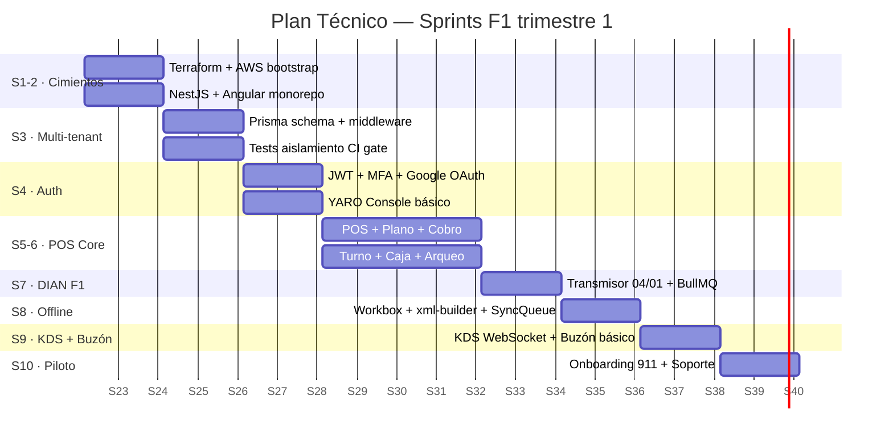

### A13.2 Días 1-30 — Cimientos técnicos

**Sprint 1 (38 SP):**
- YR-001 Monorepo (pnpm workspaces)
- YR-002 Terraform IaC base (VPC + ECS + IAM)
- YR-003 Terraform RDS + KMS + Secrets Manager
- YR-004 GitHub Actions PR checks
- YR-005 Branch protection rules
- YR-006 Docker Compose dev local
- YR-007 NestJS skeleton + ClsModule + logging
- YR-008 Angular 17 + ESLint + tokens.scss

**Sprint 2 (60 SP):**
- YR-010 Schema Prisma F1 (14 tablas core)
- YR-011 Schema Prisma F1 extendido (+ 14 tablas)
- YR-012 **Prisma middleware multi-tenant** (ADR-002)
- YR-013 **Tests aislamiento CI gate**
- YR-014 ESLint custom rules
- YR-015 AWS WAF + OWASP + rate limiting
- YR-016 Dependabot + Snyk gates
- YR-017 Secrets Manager setup
- YR-018 Backups + restore-test
- YR-019 Runbook seguridad + Encargado de Datos

**Checkpoint Día 30 — criterios:**
- ✅ Tests aislamiento 100% CI
- ✅ MFA Platform Admin funcional
- ✅ AWS WAF activo (test SQL injection bloqueado)
- ✅ Schema desplegado en staging
- ✅ Trigger fiscal_documents append-only activo
- ✅ ESLint detecta violaciones

### A13.3 Días 31-60 — Operación core + DIAN F1

**Sprint 3 (60 SP):**
- YR-020 JWT RS512 + rotación 90d
- YR-021 Auth flow email/password + Argon2id
- YR-022 **MFA TOTP**
- YR-023 **Google OAuth** + invitaciones
- YR-024 Wizard onboarding + tipoOperacion
- YR-025 YARO Console MVP
- YR-026 Cron subscription evaluator (FR-15)
- YR-027 POS plano mesas (RESTAURANTE)
- YR-028 POS plano barra (BAR) + food truck
- YR-029 API REST POS

**Sprint 4 (111 SP — algunos pasan a S5):**
- YR-030 **POST /cobros fire-and-forget < 100ms**
- YR-031 Worker Service Fargate Spot + BullMQ
- YR-032 **DianTransmitWorker** (13 SP — crítico)
- YR-033 Validación pre-transmisión
- YR-034 Cron reconciliación 15min
- YR-035 Panel transmisiones DIAN
- YR-036 **`@yaro/xml-builder`** (13 SP — crítico)
- YR-037 Workbox setup
- YR-038 IndexedDB SyncQueue
- YR-039 **Cobro offline** (13 SP — crítico)
- YR-040 Endpoint `/sync/tiquetes`
- YR-041 Turno + Caja + Arqueo
- YR-042 KDS WebSocket
- YR-043 Inventario básico + mermas
- YR-044 Marcación + bienestar

**Checkpoint Día 60 — Alpha interno técnico:**
- ✅ Cobro fire-and-forget p95 < 100ms
- ✅ Tiquete sandbox Facture devuelve CUFE
- ✅ Modo offline sincroniza < 30s al reconectar
- ✅ Contingencia con timestamp real
- ✅ KDS WebSocket < 200ms
- ✅ Cero documentos rechazados por XML
- ✅ Smoke test post-deploy pasa

### A13.4 Días 61-90 — Beta piloto + eval infra

**Sprint 5 (57 SP):**
- YR-050 Dashboard Mariana
- YR-051 Dashboard Andrés
- YR-052 Dashboard Carolina
- YR-053 Notificaciones push PWA
- YR-054 **Buzón DIAN básico** (recepción RADIAN)
- YR-055 UI Buzón
- YR-056 **Motor de reglas pre-cargadas**
- YR-057 Endpoint `/ia/sugerir-puc` (Capa 2 + 3)
- YR-058 Tablas agent_interactions activas
- YR-059 Tickets pendientes S4

**Sprint 6 (73 SP):**
- YR-060 **Migración asistida 911 Hot Burger** (13 SP)
- YR-061 Capacitación in-situ
- YR-062 Soporte presencial primer turno
- YR-063 Soporte remoto 24/7 primeras 2 semanas
- YR-064 Dashboards CloudWatch
- YR-065 Alertas críticas Nivel 3
- YR-066 X-Ray traces activos
- YR-067 **Red-team session pre-launch**
- YR-068 **Dataset inicial A1** (100 facturas con Carolina)
- YR-069 Pipeline eval continua infra
- YR-070 ADRs en `docs/adr/`

**Checkpoint Día 90 — Beta exitoso:**
- ✅ Q1 latencia p95 `/cobros` < 100ms (tráfico real)
- ✅ Q3 ≥ 99% DIAN exitosa (~600 tiquetes)
- ✅ Q4 ≥ 98% sync offline → DIAN
- ✅ Q5 < 200ms KDS WebSocket
- ✅ Q6 = 0 cobros perdidos
- ✅ Q7 = 0 incidentes acceso cruzado
- ✅ Q10 arqueo < 12 min promedio
- ✅ ≥ 40% facturas auto-clasificadas (motor reglas)
- ✅ Cobertura tests ≥ 70%

### A13.5 ADRs a validar por checkpoint

| Día | ADRs a validar |
|---|---|
| 30 | ADR-001 (monolito), ADR-002 (multi-tenant), ADR-008 (Terraform + GH Actions) |
| 60 | ADR-003 (fire-and-forget), ADR-004 (offline + xml-builder), ADR-009 (schema único), ADR-010 (append-only) |
| 90 | ADR-005 (plataforma agentes infra), ADR-006 (Google OAuth), ADR-007 (CloudWatch) |

### A13.6 Estimación de capacidad

| Capacidad estimada | Scope F1 T1 | Buffer |
|---|---|---|
| 4-5 eng × 6 sprints × 30 SP = ~360 SP | ~340 SP | ~20 SP (6%) |

**Plan ejecutable pero tight.** Si Sprint 1 o 2 quedan sobre-plan, mover scope a meses 4-8.

### A13.7 Documentos a producir

| Doc | Día | Propósito |
|---|---|---|
| `docs/adr/` | 1→90 | 10 ADRs versionados |
| `docs/CONTRIBUTING.md` | 30 v1 | Reglas absolutas |
| `docs/RUNBOOK.md` | 30 v1 | Procedimientos incidentes técnicos |
| `docs/SECURITY-RUNBOOK.md` | 30 | Runbook seguridad |
| `docs/ARCHITECTURE.md` | 90 | Resumen A1-A13 |
| `docs/ONBOARDING.md` | 60 | Setup nuevo ingeniero < 1 día |
| `docs/API.md` | 60 (gen), 90 (refinado) | OpenAPI spec |
| `docs/DEPLOY.md` | 30 | Playbook A10 |

### A13.8 Backlog meses 4-8 (vista ampliada)

| Mes | Foco |
|---|---|
| 4 | Sede La Ceja activa + iteración piloto + estabilización |
| 5 | Cliente 2 (referido) + optimización motor de reglas |
| 6 | Checkpoint estratégico + spike técnico Claude Sonnet F2 |
| 7 | Cliente 4 + load testing + chaos engineering |
| 8 | Cliente 5 + cierre F1 + lanzamiento F2 (Claude activo) |

---

<a name="apendices"></a>

## Apéndices

### Trazabilidad a otros documentos

| Documento | Cómo se relaciona |
|---|---|
| `specs/prd.md` | Source of truth de requisitos. Toda decisión técnica responde a un FR/NFR/Principio |
| `docs/overview.md` | Contexto HORECA Colombia que justifica decisiones específicas (DIAN, impoconsumo, offline) |
| `docs/critica.md` | Riesgos técnicos detallados. Cada riesgo del PRD §12 tiene mitigación arquitectónica |
| `docs/pvb.md` | Visión de producto. MOAT de datos + capa agéntica reflejados en A2 + A7 |
| `docs/icp.md` | 3 perfiles (Mariana, Andrés, Carolina) modelados en A2 BC Identity & Tenancy |

### Stack técnico final consolidado

**Backend:**
- NestJS (Node.js 22) + TypeScript estricto
- PostgreSQL 16 (RDS Multi-AZ) + Prisma ORM + middleware tenant_id
- BullMQ sobre ElastiCache Valkey 7
- AWS ECS Fargate (On-Demand API, Spot Worker)
- Anthropic API (Claude Sonnet + Haiku)

**Frontend:**
- Angular 17+ standalone components
- Signals + RxJS
- Workbox + idb (IndexedDB)
- `@yaro/ui` librería propia
- `@yaro/xml-builder` librería compartida frontend/backend
- AWS S3 + CloudFront

**Infraestructura:**
- AWS us-east-1 (F1-F3)
- Terraform IaC modular
- GitHub Actions CI/CD
- AWS WAF + Shield Standard
- AWS SES + Twilio SMS
- Facture.co (operador DIAN habilitado)
- Google OAuth (tenant users login)

**Observabilidad:**
- CloudWatch Metrics + Logs + Alarms
- AWS X-Ray distributed tracing
- Outbox pattern para eventos de dominio

### Glosario técnico

| Término | Definición |
|---|---|
| **Bounded Context** | Límite explícito dentro del modelo de dominio (DDD) |
| **Saga pattern** | Patrón para mantener consistencia eventual entre bounded contexts |
| **Outbox pattern** | Garantía de publicación de eventos con dual-write seguro |
| **Fire-and-forget** | Patrón donde el cliente no espera la operación async |
| **State machine** | Modelo formal de transiciones permitidas entre estados |
| **CLS (AsyncLocalStorage)** | Mecanismo Node.js para propagar contexto sin pasar parámetros |
| **RLS (Row-Level Security)** | Mecanismo PostgreSQL para filtrado a nivel de fila |
| **Expand-Contract** | Patrón de migración DB en 3 fases sin downtime |
| **Strangler Fig** | Patrón de migración gradual reemplazando partes del legacy |
| **Circuit Breaker** | Patrón que evita cascading failures en sistemas distribuidos |
| **Defense in Depth** | Múltiples capas independientes de seguridad |
| **LLM-as-judge** | Usar un LLM (Haiku) para evaluar outputs de otro (Sonnet) |
| **Canary deploy** | Despliegue gradual a % del tráfico para validar antes de 100% |
| **Append-only** | Modelo de datos donde solo se permite insertar, no actualizar ni eliminar |

### Mapa de relaciones críticas

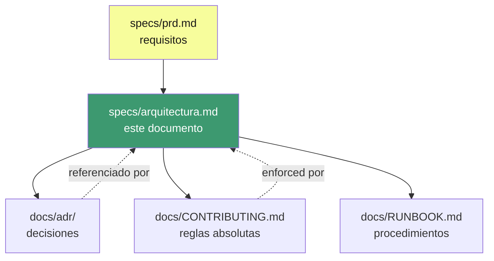

---

## Cambios técnicos vs PRD original (`prd yaro prueba.md` v3.0)

1. **28 tablas F1** (no 14) — decisiones del Paso 0 requieren más infraestructura
2. **Costo IA real**: $70/tenant/mes en F2, no $15 como decía el PRD
3. **`@yaro/xml-builder`** como librería compartida frontend/backend (no solo backend)
4. **Tax snapshot referenciado por cobro** (CA7 — protege contra cambios fiscales retroactivos)
5. **`failed_fiscal_documents`** como destino de tiquetes expirados (CA6)
6. **`platform_access_log`** + `__platformQuery` flag para CA3
7. **Subscription evaluator adaptativo** (CA10) basado en turno abierto, no horario fijo
8. **Multi-formato D4** desde F1 (no solo restaurante con mesa)
9. **Google OAuth** para colaboradores del tenant (no estaba en PRD)
10. **4 capas de defensa multi-tenant** (no solo middleware)
11. **17 acciones de hardening priorizadas en 3 fases**
12. **41 SLOs + error budgets** con feature freeze automático
13. **10 ADRs formalizados** con alternativas descartadas
14. **Plan técnico 30/60/90** con tickets, story points, owners, y trazabilidad a ADRs

---

*YARO Arquitectura · v1.0 consolidado · Mayo 2026*
*Co-creada entre la fundadora-operadora (911 Hot Burger) y un Staff Software Architect + AI/Agent Systems Engineer.*
*Documento base: `specs/prd.md`, `docs/overview.md`, `docs/icp.md`, `docs/mercado.md`, `docs/critica.md`, `docs/pvb.md`.*
*Output guardado en: `specs/arquitectura.md`.*
