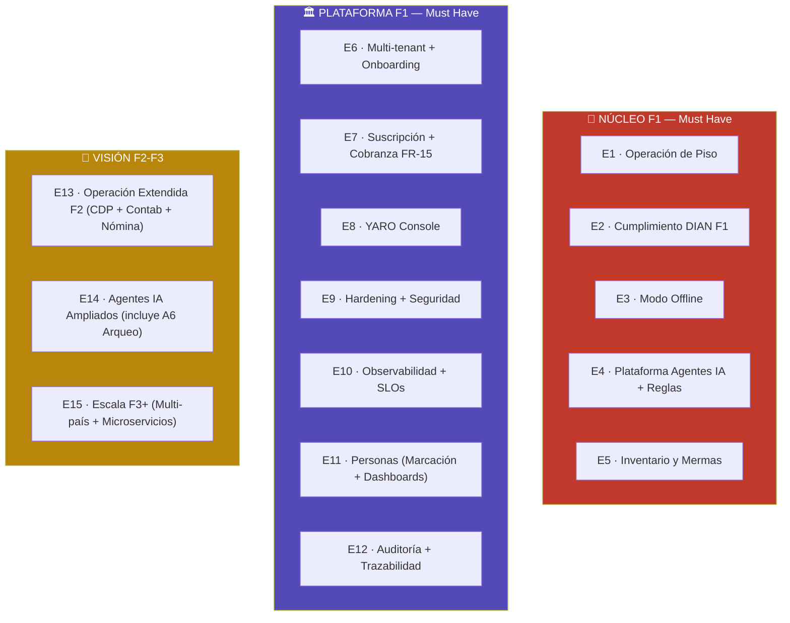
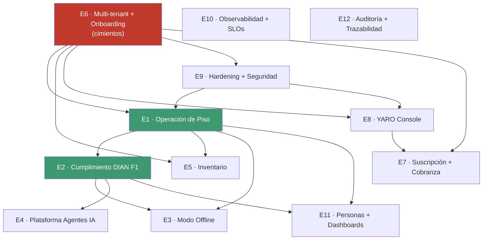
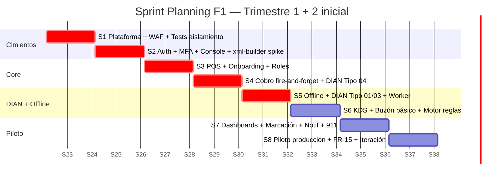
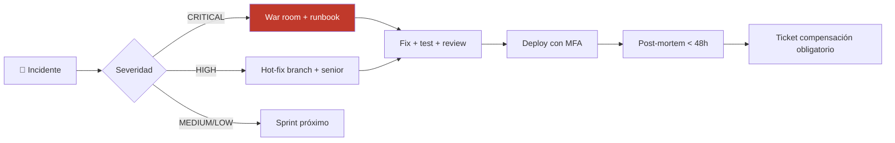
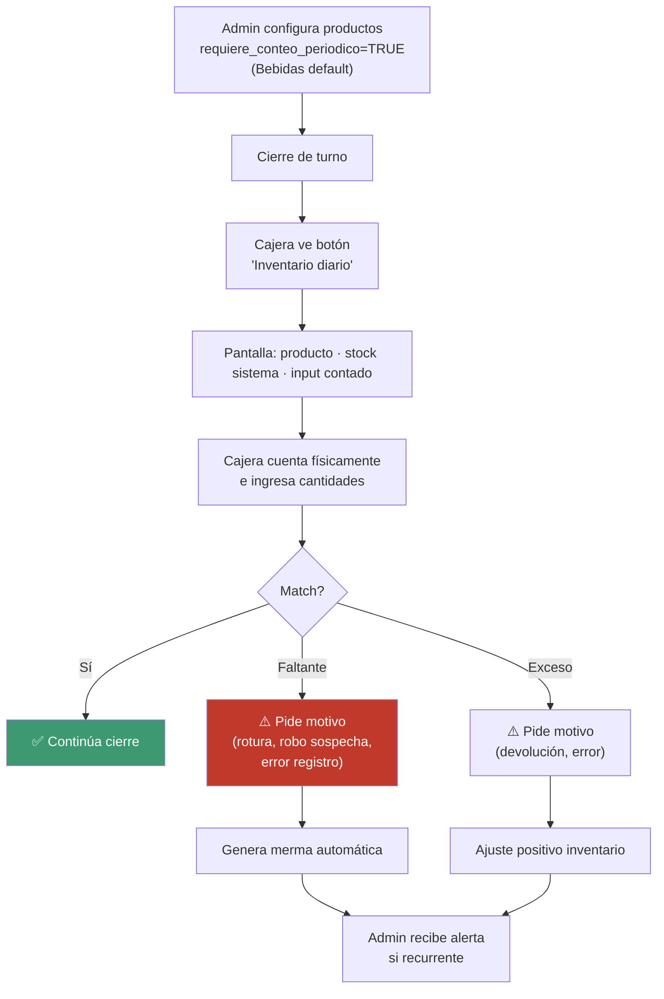

# Backlog Ejecutable — YARO

### Sistema operativo de los restaurantes colombianos
**Versión 1.0 (consolidado co-creación iterativa) · Mayo 2026**

> Documento de backlog generado en sesión de co-creación entre la fundadora (Valentina, 911 Hot Burger) y un Product Engineering Lead + Agile Coach. Construido segmento por segmento sobre `specs/prd.md`, `specs/arquitectura.md` y los documentos base.

---

## Tabla de contenidos

0. [Paso 0 — Conflictos de priorización resueltos](#paso-0)
1. [B1 — Estrategia de Backlog + Frameworks](#b1)
2. [B2 — Mapa de 15 Épicas](#b2)
3. [B3 — Definition of Ready + Definition of Done](#b3)
4. [B4 — Épicas E1-E3 (Operación Core + DIAN F1 + Offline)](#b4)
5. [B5 — Épicas E4-E5 (Agentes IA + Inventario)](#b5)
6. [B6 — Épicas E6-E8 (Multi-tenant + Cobranza + Console)](#b6)
7. [B7 — Épicas E9-E12 (Hardening + Observabilidad + Personas + Auditoría)](#b7)
8. [B8 — Backlog Técnico + DevOps](#b8)
9. [B9 — Plan Detallado Sprints F1 (S1-S8)](#b9)
10. [B10 — Backlog Fase 2](#b10)
11. [B11 — Backlog Fase 3 + Agente A6 Arqueo Inteligente](#b11)
12. [B12 — Procesos del Equipo + Ceremonias + Métricas](#b12)
13. [Adendum — Arqueo Extendido (basado en Excel real 911)](#adendum-arqueo)
14. [Apéndices](#apendices)

---

<a name="paso-0"></a>

## Paso 0 — Conflictos de priorización resueltos

Antes de empezar B1 se identificaron 8 conflictos materiales entre PRD + Arquitectura que afectan la priorización del backlog. Las 4 decisiones clave:

| # | Conflicto | Decisión |
|---|---|---|
| **CB1** | Orden de implementación Must Have | **Orden técnico de A13**: cimientos → core → DIAN → piloto |
| **CB2** | Granularidad de historias | **Historias atómicas 1-8 SP** (cada flujo UX = 1 historia) |
| **CB3** | Tratamiento principios P1-P10 | **Criterios de aceptación transversales** (no tickets propios) |
| **CB7** | Foco piloto 911 vs ICP-A genérico | **70% ICP-A genérico + 30% específico 911** balanceado |

Conflictos pendientes resueltos en segmentos respectivos:
- **CB4** (hardening) → épica E9 dedicada
- **CB5** (multi-formato) → AC por formato en cada historia
- **CB6** (5 agentes en F1) → solo A1 motor reglas; A2-A6 son F2-F3
- **CB8** (métrica de Done) → KPI asociado en DoD

---

<a name="b1"></a>

## B1 — Estrategia de Backlog + Frameworks de Priorización

### Jerarquía de elementos

| Nivel | Cantidad F1 | Ejemplo |
|---|---|---|
| **Épica** | 15 | E4 "Cumplimiento DIAN F1" |
| **Feature** | 60-80 | F4.2 "Transmisión Tiquete POS Tipo 04" |
| **User Story** | ~280 | US-DIAN-013 "Cajero recibe CUFE en pantalla" |
| **Task técnica** | ~51 | T-INFRA-007 "AWS WAF + OWASP" |

### Frameworks de priorización

| Framework | Cuándo se usa |
|---|---|
| **MoSCoW** (heredado PRD §8) | Filtro inicial — qué entra a Fase 1 |
| **RICE** (Reach × Impact × Confidence / Effort) | Priorización dentro del Must Have para user stories |
| **WSJF** (Weighted Shortest Job First) | Priorización de tasks técnicas (hardening, observabilidad) |

### Velocidad estimada

| Variable | Valor |
|---|---|
| Equipo F1 | 5 ingenieros |
| SP útiles por ingeniero / sprint (2 sem) | 12-15 SP |
| Velocity por sprint | **50-65 SP** |
| Velocity F1 trimestre 1 (6 sprints) | ~360 SP |
| Velocity F1 total (16 sprints) | 800-1.040 SP |

### Story points (Fibonacci modificado)

| SP | T-shirt | Tiempo | Características |
|---|---|---|---|
| 1 | XS | < 2 horas | CRUD trivial |
| 2 | XS | 2-4 horas | Endpoint simple |
| 3 | S | 4-8 horas | UI con interactividad básica |
| 5 | M | 1-2 días | Feature BE+FE+tests |
| 8 | L | 2-4 días | Múltiples módulos |
| 13 | XL | 1 semana+ | **Romper antes de meter al sprint** |

### Ceremonias

| Ceremonia | Frecuencia | Duración |
|---|---|---|
| Daily Standup | Diaria 9am | 15 min |
| Sprint Planning | Quincenal lunes | 2h |
| Sprint Review + Demo | Quincenal viernes | 1h |
| Sprint Retro | Post-review | 1h |
| Backlog Grooming | Semanal miércoles | 1h |
| Tech Sync | Semanal martes | 30 min |

### Tooling

- **Linear** ($8/user/mes × 5 = $40/mes) — UX moderna, integración GitHub nativa
- Cada PR linkea a ticket Linear (gate CI)
- Labels obligatorios: tipo · categoría · módulo · persona · principio · fase · riesgo

### Trazabilidad obligatoria (5 preguntas por historia)

1. ¿A qué FR/NFR/Principio del PRD responde?
2. ¿En qué segmento/ADR de arquitectura está diseñado?
3. ¿Qué KPI del PRD §10 mueve?
4. ¿Qué riesgo del PRD §12 mitiga (si aplica)?
5. ¿Qué persona/perfil es el beneficiario?

### Anti-patterns prohibidos

❌ Historias > 13 SP · Spike sin output · Bug sin reproducción · Task técnica sin métrica · Historia sin persona · Historia que viola principio · Refactor sin justificación · Historia sin AC medibles · Dependencias de 5+ historias previas · Carry-over > 30%

### Métricas del proceso

| Métrica | Target |
|---|---|
| Velocity por sprint | 50-65 SP |
| Sprint completion rate | ≥ 85% |
| Lead time (idea → producción) | < 4 semanas |
| Cycle time (in-progress → done) | < 5 días |
| Bug escape rate | < 5% |
| Carry-over % | < 15% |
| DoR rejection rate | 10-20% (saludable) |

---

<a name="b2"></a>

## B2 — Mapa de 15 Épicas



### Tabla resumen

| # | Épica | Módulos PRD | Fase | # Stories | SP | Personas |
|---|---|---|:-:|:-:|:-:|---|
| **E1** | Operación de Piso | M1, M2, M3 | F1 | ~50 | ~180 | Cajero · Andrés · Cocina |
| **E2** | Cumplimiento DIAN F1 | M5, M6 | F1 | ~30 | ~120 | Carolina · Andrés |
| **E3** | Modo Offline | A6 transversal | F1 | ~22 | ~95 | Cajero · Andrés |
| **E4** | Plataforma Agentes IA + Reglas | M11 F1 | F1 | ~15 | ~60 | Andrés · Carolina (futuro) |
| **E5** | Inventario y Mermas | M4 | F1 | ~18 | ~55 | Andrés · Jefe Cocina |
| **E6** | Multi-tenant + Onboarding | M14 | F1 | ~25 | ~110 | Equipo YARO · Valentina |
| **E7** | Suscripción + Cobranza FR-15 | M14+M15 | F1 | ~15 | ~60 | Equipo YARO · Valentina |
| **E8** | YARO Console | M15 | F1 | ~20 | ~80 | Platform Admin · Support |
| **E9** | Hardening + Seguridad | A8 transversal | F1 | ~20 | ~85 | Equipo YARO |
| **E10** | Observabilidad + SLOs | A9 transversal | F1 | ~15 | ~65 | Equipo YARO |
| **E11** | Personas (Marcación + Dashboards) | M12+M13 | F1 | ~25 | ~90 | Todos |
| **E12** | Auditoría + Trazabilidad | M16 | F1 | ~12 | ~50 | Transversal |
| **E13** | Operación Extendida F2 | M7+M8+M9 | F2 | ~33 | ~280 | Jefe CDP · Carolina · Valentina |
| **E14** | Agentes IA Ampliados | M11 F2+, M10, A6 | F2-F3 | ~50 | ~280 | Carolina · Valentina · Andrés |
| **E15** | Escala F3+ | Multi-país, microservicios | F3 | ~40 | ~250 | Todos |
| **Total F1 Must** | | | | **~267** | **~1.050 SP** | |
| **Total F2-F3** | | | | **~123** | **~810 SP** | |

### Mapa de dependencias críticas F1



---

<a name="b3"></a>

## B3 — Definition of Ready + Definition of Done

### DoR — User Story estándar (checklist obligatorio antes de sprint)

**Contenido mínimo:**
- [ ] Formato "Como [persona] quiero [capacidad] para [beneficio]"
- [ ] Persona del PRD §3 identificada
- [ ] 2-7 criterios de aceptación binarios y medibles
- [ ] No hay AC tipo "X funciona bien" sin métrica

**Trazabilidad (5 preguntas):**
- [ ] FR/NFR/Principio del PRD
- [ ] Segmento/ADR de arquitectura
- [ ] KPI del PRD §10
- [ ] Riesgo del PRD §12 (si aplica)
- [ ] Beneficiario claro

**Principios aplicables (CB3):**
- [ ] Si toca módulo crítico → AC para P1, P2, P3
- [ ] Si toca UI → AC para P7, P9
- [ ] Si toca IA → AC para P5
- [ ] Si genera operaciones críticas → AC para P10

**Multi-formato:**
- [ ] Comportamiento por `tipoOperacion` (RESTAURANTE/BAR/FOOD_TRUCK/DARK_KITCHEN/CADENA_CDP)

**Estimación y testabilidad:**
- [ ] SP entre 1 y 8 (si > 8 → romper)
- [ ] Equipo entiende cómo construir
- [ ] Dependencias resueltas
- [ ] Testabilidad confirmada (unit / integration / E2E)
- [ ] Mockups/wireframes disponibles (si UI)

### DoD — User Story estándar (checklist obligatorio para Done)

**Funcionalidad:**
- [ ] Todos los AC cumplidos
- [ ] AC transversales de principios cumplidos
- [ ] Multi-formato validado en formatos aplicables

**Calidad de código:**
- [ ] Code review aprobado por 1 (o 2 para módulos críticos M5/M6/M11/M14)
- [ ] CI 100% verde
- [ ] Cobertura ≥ 70% F1 (≥ 80% F2)
- [ ] Sin warnings nuevos en lint

**Tests:**
- [ ] Unit tests pasando
- [ ] Integration tests si toca BD o externos
- [ ] E2E si tiene flujo de usuario completo
- [ ] Tests aislamiento multi-tenant si toca tabla con tenant_id

**Despliegue:**
- [ ] Mergeada a main (auto deploy staging)
- [ ] Smoke test post-deploy pasa
- [ ] PR linkeado a ticket Linear actualizado
- [ ] Migración DB (si aplica) sigue expand-contract
- [ ] No deploy en hora pico si tiene migración

### DoD ESPECIAL — historias críticas

**Fiscal Documents (P1):**
- Trigger SQL append-only validado
- Test que `UPDATE` post-ACCEPTED falla
- Test E2E sandbox Facture
- Validación pre-transmisión completa
- `tax_snapshot_id` referenciado correctamente
- Cálculos en enteros COP con `Math.floor`
- **Approval explícito CTO en PR**

**Multi-tenancy (P3):**
- Test de aislamiento específico escrito y pasando
- Tabla nueva con `tenant_id NOT NULL` + índice
- ESLint custom rules NO bloquean
- $queryRaw incluye `WHERE tenant_id` explícito
- **Code review por 2 ingenieros**
- Verificado en staging con 2 tenants

**Agentes IA (P5):**
- Logueo en `agent_interactions` obligatorio
- Guardrails P5: verificable + no prescriptiva
- Dataset eval actualizado si nuevo caso edge
- Prompt versionado en S3
- Canary 5% antes de 100%

**Schema Migration:**
- Sigue patrón expand-contract
- CI gate `schema-migration-safety` pasa
- Probada en RDS copy de staging
- Tiempo ejecución estimado < 5 seg
- Rollback documentado

**Seguridad:**
- Pen-test interno: pasa escenario adversarial relevante
- Logs de seguridad emitidos
- Si toca secrets: rotación documentada
- **Code review por Security Lead o CTO**

### Quality gates automatizados en CI

- Lint + Format
- Custom ESLint rules YARO (multi-tenancy, P5)
- Unit tests + coverage ≥ 70%
- **Integration tests multi-tenancy (gate crítico P3)**
- Security audit (Snyk + npm audit)
- **xml-builder version check (CA2)**
- Schema migration safety
- E2E smoke tests (Playwright)
- Build OK

---

<a name="b4"></a>

## B4 — Épicas E1-E3 (Operación Core + DIAN F1 + Offline)

> **103 user stories · ~395 SP** — corazón funcional de Fase 1.

### E1 · Operación de Piso (50 stories · ~180 SP)

| Feature | # Stories | SP |
|---|:-:|:-:|
| F1.1 Apertura y cierre de turno | 5 | 18 |
| F1.2 Caja con base y arqueo | 4 | 17 |
| F1.3 POS plano de mesas (RESTAURANTE) | 8 | 32 |
| F1.4 POS vista barra (BAR) | 3 | 9 |
| F1.5 POS lista pedidos (FOOD_TRUCK + DARK_KITCHEN) | 3 | 8 |
| F1.6 Operación de orden | 5 | 17 |
| F1.7 Pre-cuenta | 2 | 6 |
| F1.8 Cobro multi-método | 6 | 30 |
| F1.9 KDS WebSocket | 6 | 22 |
| F1.10 Anulación con Nota Crédito | 3 | 13 |
| F1.11 Configuración soporte | 5 | 14 |

**Historia clave ⭐ US-COBRO-001** — Cajero cobra mesa con tiquete DIAN en < 100ms (8 SP)
- Cobertura: P1, P2, P3, P4, P10
- Multi-formato: 4 tipos (RESTAURANTE/BAR/FOOD_TRUCK/DARK_KITCHEN)
- Riesgo mitigado: R1 (POS falla hora pico)

### E2 · Cumplimiento DIAN F1 (31 stories · ~120 SP)

| Feature | # Stories | SP |
|---|:-:|:-:|
| F2.1 Tiquete POS Tipo 04 | 4 | 21 |
| F2.2 FE Venta Tipo 01 | 3 | 12 |
| F2.3 Contingencia Tipo 03 | 2 | 13 |
| F2.4 Integración Facture.co | 2 | 8 |
| F2.5 State machine fiscal_documents | 3 | 11 |
| F2.6 Panel de transmisiones | 3 | 11 |
| F2.7 Cron reconciliación 15min | 2 | 8 |
| F2.8 Validación pre-transmisión | 2 | 6 |
| F2.9 Buzón DIAN recepción RADIAN | 3 | 13 |
| F2.10 UI Buzón clasificación manual | 3 | 11 |
| F2.11 failed_fiscal_documents | 2 | 6 |
| F2.12 Tax snapshot | 2 | 7 |

**Historia clave ⭐ US-DIAN-001** — Sistema genera XML UBL 2.1 Tiquete Tipo 04 (8 SP, approval CTO obligatorio)

### E3 · Modo Offline y Sincronización (22 stories · ~95 SP)

| Feature | # Stories | SP |
|---|:-:|:-:|
| F3.1 Service Worker setup | 2 | 8 |
| F3.2 Workbox estrategias | 4 | 13 |
| F3.3 IndexedDB SyncQueue | 2 | 8 |
| F3.4 @yaro/xml-builder compartido | 2 | 13 |
| F3.5 Cobro offline | 3 | 13 |
| F3.6 Detección híbrida conectividad | 1 | 5 |
| F3.7 Background Sync | 1 | 3 |
| F3.8 Endpoint /sync/tiquetes | 2 | 8 |
| F3.9 Tax snapshot cache | 1 | 3 |
| F3.10 UI offline | 2 | 6 |
| F3.11 Cleanup automático | 1 | 5 |
| F3.12 Tests offline | 1 | 5 |

**Historia clave ⭐ US-OFF-009** — Builder genera XML contingencia en Service Worker (8 SP, requiere spike previo T-SPIKE-002)

### Cobertura de principios E1+E2+E3

| Principio | # stories | % |
|---|:-:|---|
| P1 Integridad fiscal | 18 | 17.5% |
| P2 Cajero nunca espera | 12 | 11.7% |
| P3 Aislamiento multi-tenant | 6 | 5.8% |
| P4 Offline-first | 24 | 23.3% |
| P7 Lenguaje del usuario | 17 | 16.5% |
| P9 Alertas accionables | 12 | 11.7% |
| P10 Trazabilidad | 41 | 39.8% |

---

<a name="b5"></a>

## B5 — Épicas E4-E5 (Agentes IA + Inventario)

> **33 stories · ~115 SP**

### E4 · Plataforma de Agentes IA + Motor de Reglas (15 stories · ~60 SP)

> **F1 sin Claude** — solo Capa 2 (motor de reglas) + Capa 3 (default). Claude Sonnet activa en F2 mes 9.

| Feature | Stories clave | SP |
|---|---|:-:|
| F4.1 Orquestador 3 capas (placeholder F1) | US-AI-001 a 003 | 13 |
| F4.2 Motor de reglas determinístico | US-AI-004 carga 12+ reglas base sector restaurantero · US-AI-005/006/007 | 17 |
| F4.3 Persistencia (`agent_interactions` etc.) | US-AI-008/009/010 | 13 |
| F4.4 Endpoint /ia/sugerir-puc | US-AI-011 | 5 |
| F4.5 Eval continua infraestructura | US-AI-012/013 | 7 |
| F4.6 Dataset Carolina | US-AI-014 (100 facturas etiquetadas) · US-AI-015 (importación) | 5 |

### E5 · Inventario y Mermas (18 stories · ~55 SP)

| Feature | Stories clave | SP |
|---|---|:-:|
| F5.1 CRUD inventario | US-INV-001/002/003 | 9 |
| F5.2 Stock mínimo y alertas | US-INV-004/005 (botón "Solicitar al CDP") /006 | 11 |
| F5.3 Descuento automático | US-INV-007 (suscriptor CobroRegistrado) / 008 | 8 |
| F5.4 Mermas | US-MERMA-001 (causa obligatoria) /002/003/004 | 14 |
| F5.5 Histórico y vistas | US-INV-009/010/011 | 8 |
| F5.6 Preparación lotes F2 | US-INV-012 (código de barras) /013 | 4 |
| F5.7 Reportes | US-INV-014 (export CSV) | 3 |

---

<a name="b6"></a>

## B6 — Épicas E6-E8 (Multi-tenant + Cobranza + Console)

> **60 stories · ~250 SP** — cimientos de la plataforma F1.

### E6 · Multi-tenant + Configurabilidad + Onboarding (25 stories · ~110 SP)

| Feature | Stories clave | SP |
|---|---|:-:|
| F6.1 Schema Prisma F1 | US-TENANT-001 (37 tablas con adendums) | 8 |
| F6.2 Multi-tenant middleware | **US-TENANT-002 ⭐** · 003 · 004 | 16 |
| F6.3 platformQuery + audit log | US-TENANT-005 (CA3) | 5 |
| F6.4 Wizard onboarding | US-ONBOARD-001 a 004 (Paso 0: tipoOperacion + "decido después" DIAN) | 19 |
| F6.5 Configuración fiscal | US-TENANT-006/007 (tax_snapshot) /008 (activación DIAN) | 11 |
| F6.6 Configurabilidad módulos | US-TENANT-009 (CA4) /010 | 8 |
| F6.7 Roles + permisos | US-USER-001/002/003 | 11 |
| F6.8 Invitaciones (Google OAuth + email/password) | US-INVT-001/002/003 | 13 |
| F6.9 Migración manual asistida | US-MIGR-001/002/003 (importación CSV) | 11 |
| F6.10 Country config | US-COUNTRY-001/002 | 8 |

### E7 · Suscripción + Cobranza Escalonada FR-15 (15 stories · ~60 SP)

| Feature | Stories clave | SP |
|---|---|:-:|
| F7.1 Estados L0-L4 | US-SUB-001 (estados) /002 (auditoría) | 7 |
| F7.2 Cron evaluador adaptativo | US-SUB-003/004 (regla horaria) /005 | 16 |
| F7.3 Bloqueo escalonado | US-SUB-006 (L1 reportes) /007 (L2 contabilidad) /**008 ⭐** (L3 operación horario protegido) | 14 |
| F7.4 Notificaciones escalonadas | US-NOTIF-001/002/003 | 11 |
| F7.5 Pantalla regularizar | US-PAY-001 | 5 |
| F7.6 Pasarela de pago | US-PAY-002 | 5 |
| F7.7 Override manual | US-SUB-009/010 | 8 |

### E8 · YARO Console (20 stories · ~80 SP)

| Feature | Stories clave | SP |
|---|---|:-:|
| F8.1 Frontend Console separado | US-CON-001/002 | 8 |
| F8.2 Auth con MFA obligatorio | **US-CON-003 ⭐** /004 | 13 |
| F8.3 Gestión tenants | US-CON-005/006/007 | 13 |
| F8.4 Monitor DIAN global | US-CON-008/009 | 8 |
| F8.5 Health checks | US-CON-010/011 | 6 |
| F8.6 Panel logs | US-CON-012/013 | 8 |
| F8.7 Dashboard agentes IA | US-CON-014 | 5 |
| F8.8 Panel cobranza | US-CON-015 | 3 |
| F8.9 Gestión equipo interno | US-CON-016/017 | 6 |
| F8.10 Dead letter queue | US-CON-018 | 3 |
| F8.11 platform_access_log auditoría | US-CON-019/020 | 7 |

---

<a name="b7"></a>

## B7 — Épicas E9-E12 (Hardening + Observabilidad + Personas + Auditoría)

> **72 stories · ~290 SP** — cierre de épicas F1 transversales.

### E9 · Hardening + Seguridad (20 stories · ~85 SP)

| Feature | Stories clave | SP |
|---|---|:-:|
| F9.1 AWS WAF + Rate Limiting | US-SEC-001/002/003 | 11 |
| F9.2 Auth reforzada | US-SEC-004 (Argon2) /005 (Lockout) /**006 ⭐ Google OAuth** | 13 |
| F9.3 JWT + Sesiones | US-SEC-007/008 | 8 |
| F9.4 Secrets Manager | US-SEC-009/010 | 6 |
| F9.5 Encryption | US-SEC-011 | 5 |
| F9.6 Dependencias seguras | US-SEC-012/013 | 5 |
| F9.7 Backups + restore-test | US-SEC-014/015 | 8 |
| F9.8 Compliance Ley 1581 | US-SEC-016 (SIC) /017 (ARCO) /**018 ⭐ runbook + simulacro** | 13 |
| F9.9 Headers + CSP | US-SEC-019/020 | 6 |

### E10 · Observabilidad + SLOs (15 stories · ~65 SP)

| Feature | Stories clave | SP |
|---|---|:-:|
| F10.1 CloudWatch metrics + dashboards | US-OBS-001/002/003 | 16 |
| F10.2 Logs estructurados | US-OBS-004/005 (anti-PII sanitizer) /006 | 13 |
| F10.3 X-Ray Traces | US-OBS-007/008 | 8 |
| F10.4 Outbox + eventos | US-OBS-009/010 | 8 |
| F10.5 Health checks | US-OBS-011/012 | 6 |
| F10.6 Error budgets + feature freeze | US-OBS-013/014 | 10 |
| F10.7 Particionado + retención | US-OBS-015 | 4 |

### E11 · Personas: Marcación + Bienestar + Dashboards (25 stories · ~90 SP)

| Feature | Stories clave | SP |
|---|---|:-:|
| F11.1 Marcación + Bienestar | US-MARC-001 (botón topbar) /002 (😔/😐/😊) /003/004 | 13 |
| F11.2 Dashboard Valentina | US-DASH-001/002/003/004 | 17 |
| F11.3 Dashboard Andrés | US-DASH-005/006/007/008 | 16 |
| F11.4 Dashboard Carolina | US-DASH-009/010/011 | 11 |
| F11.5 Dashboard Cajero (minimal) | **US-DASH-012 ⭐ ** /013 | 6 |
| F11.6 Dashboard Cocina | US-DASH-014/015 | 6 |
| F11.7 Notificaciones push PWA | US-NOTIF-PWA-001/002/003 | 11 |
| F11.8 Reportes básicos exportables | US-REP-001/002/003 | 10 |

### E12 · Auditoría + Trazabilidad (12 stories · ~50 SP)

| Feature | Stories clave | SP |
|---|---|:-:|
| F12.1 Tabla audit_events + particionado | US-AUD-001 | 5 |
| F12.2 Interceptor automático | US-AUD-002/003 | 8 |
| F12.3 Auditoría dominios críticos | US-AUD-004 (config fiscal) /005 (descuentos) /006 (cierres) /007 (FR-15) | 16 |
| F12.4 Accesos plataforma | US-AUD-008 (CA3) | 5 |
| F12.5 Logueo IA | US-AUD-009 | 3 |
| F12.6 UI auditoría | US-AUD-010 | 5 |
| F12.7 Política retención | US-AUD-011 | 3 |
| F12.8 Exportación | US-AUD-012 | 5 |

---

<a name="b8"></a>

## B8 — Backlog Técnico + DevOps

> **51 tickets · ~210 SP** — trabajo no-UI que habilita todo.

### T-INFRA (12 tickets · 58 SP)
Terraform: VPC + ECS Fargate + RDS Multi-AZ + ElastiCache Valkey + S3 (tier transition) + CloudFront/WAF/Shield + Secrets Manager + IAM + SES + ambientes dev/staging/prod + Bastion SSM

### T-DEVOPS (10 tickets · 42 SP)
GitHub Actions PR checks + Deploy staging auto + Promote production manual + Rollback workflow + Docker multi-stage + ECR + Smoke tests + Sync prod→staging anonimizado + Feature flags + Linear integration

### T-TEST (8 tickets · 36 SP)
Jest + testcontainers + Playwright + Mock Facture sandbox + Mock Anthropic + **Suite tests aislamiento multi-tenant ⭐ (8 SP — gate CI crítico)** + k6 load testing + Chaos testing

### T-LIB (5 tickets · 26 SP)
`@yaro/shared` + `@yaro/ui` + **`@yaro/xml-builder` ⭐ (8 SP — compartido FE/BE)** + `@yaro/eslint-rules` + `@yaro/openapi-client`

### T-DEBT (5 tickets · 15 SP)
Audit performance + Audit security headers + Audit cobertura + Audit deps obsoletas + Refactor DRY (sprint dedicado mes 6)

### T-DOCS (4 tickets · 14 SP)
OpenAPI spec generado + Storybook @yaro/ui + 10 ADRs versionados + Onboarding < 1 día

### T-SPIKE (4 tickets · 10 SP)
Latencia Facture sandbox + **XSD validation en SW (3 SP — bloqueante US-OFF-009)** + Estructura prompts IA + Estrategia multi-país Perú

### T-PERF (3 tickets · 9 SP)
APM X-Ray detallado + Synthetic monitoring + Profiling Node.js

### Top 5 WSJF prioridades

| # | Ticket | WSJF |
|---|---|:-:|
| 1 | T-TEST-006 Suite tests aislamiento multi-tenant | 6.8 |
| 2 | T-INFRA-008 Secrets Manager + MFA | 6.5 |
| 3 | T-DEVOPS-001 GitHub Actions PR checks completo | 6.0 |
| 4 | T-LIB-003 @yaro/xml-builder | 5.8 |
| 5 | T-INFRA-004 RDS Multi-AZ | 5.5 |

---

<a name="b9"></a>

## B9 — Plan Detallado Sprints F1 (S1-S8)



### Goals por sprint

| Sprint | Goal | Demo objetivo |
|---|---|---|
| **S1** | Plataforma multi-tenant aislada + AWS infra base | 2 tenants ficticios, validar aislamiento, WAF bloquea SQLi |
| **S2** | Auth completo (MFA + Google OAuth) + Console básico | Login Console con MFA, Google OAuth, spike XSD concluido |
| **S3** | POS plano mesas + Onboarding wizard + Roles | Tenant via wizard, usuarios con roles, mesa con ítems |
| **S4** | **Cobro fire-and-forget < 100ms + Tiquete DIAN sandbox** ⭐ | Cobro real con CUFE en alpha interno |
| **S5** | **Modo offline funcional + DIAN Tipo 01/03 + Contingencia** ⭐ | DevTools offline + cobro + reconectar = sync |
| **S6** | KDS + Buzón DIAN + Motor reglas base | Cocina ve órdenes tiempo real, motor clasifica facturas |
| **S7** | Dashboards por rol + Marcación + Migración 911 | Valentina ve dashboard, equipo 911 capacitado |
| **S8** | **911 Hot Burger en producción + FR-15 + Iteración** ⭐ | 911 sede Guarne 15 días reales sin caídas |

### SP por sprint vs velocity

| Sprint | SP total | Stories ⭐ críticas |
|---|:-:|---|
| S1 | 88 | US-TENANT-002, US-TENANT-003 |
| S2 | 90 | US-SEC-006, US-CON-003 |
| S3 | 85 | (cimientos sin críticas explícitas) |
| **S4** | **92** ⭐ | **US-COBRO-001 + US-DIAN-001 + T-LIB-003** |
| S5 | 75 | US-OFF-009, US-DIAN-008 |
| S6 | 74 | — |
| S7 | 77 | — |
| S8 | 70 | US-SUB-004, US-SUB-008, US-SEC-018 |

**Total: ~651 SP combinado (stories + tasks)** — primer trimestre cubre ~44% del F1 Must Have. Restante ~530 SP en S9-S16.

### Checkpoints Go/No-Go

| Checkpoint | Criterio GO | Acción NO-GO |
|---|---|---|
| Día 30 | Tests aislamiento 100% + MFA + WAF | Refuerzo 2-4 sem, postergar POS |
| Día 60 | Alpha cobra DIAN ACCEPTED + KDS < 200ms + offline funciona + Q7=0 | Extender 4 sem, cortar nice-to-have |
| Día 90 | 911 Guarne 15d sin caída + 0 docs rechazados + arqueo < 12 min | Iterar piloto 4-8 sem antes de cliente 2 |

---

<a name="b10"></a>

## B10 — Backlog Fase 2 (Vista alta-nivel)

> **~56 stories · ~480 SP** distribuidos en S17-S36 (meses 9-18).

### E13 · Operación Extendida F2 (33 stories · ~280 SP)

| Feature | Stories clave | SP |
|---|---|:-:|
| **F13.1 CDP Centro de Producción** | US-CDP-001 a 012 (incluye **US-CDP-009 ⭐ trazabilidad lote→plato — MOAT**) | 100 |
| F13.2 Contabilidad (PUC, P&G, Balance) | US-CONTAB-001 a 010 (impoconsumo separado, retenciones, Régimen Simple) | 80 |
| **F13.3 Nómina Electrónica DIAN (47 campos)** | US-NOM-001 a 008 (**US-NOM-006 ⭐ nómina electrónica**) | 75 |
| F13.4 Recetas con costeo real | US-REC-001 | 13 |
| F13.5 Documentos DIAN adicionales | US-DIAN-NC (Tipo 91) + DSCE (Tipo 05) | 22 |

### E14 · Agentes IA Ampliados F2-F3 (23 stories · ~200 SP)

| Feature | Stories clave | SP |
|---|---|:-:|
| **F14.1 Buzón con Claude Sonnet** | **US-AI-CLAUDE-001 ⭐ ** (activación F2) + guardrails P5 + cache | 52 |
| F14.2 A2 Food Cost & Márgenes | US-A2-001 a 005 (alerta deriva) | 40 |
| **F14.3 A4 Copiloto Dueño descriptivo** | **US-A4-002 ⭐ click-through fuente** + **US-A4-003 ⭐ detección prescriptiva** | 50 |
| F14.4 Conciliación asistida F2 | US-CONC-001 a 004 (reporte por método + comisiones) | 28 |
| F14.5 Eval continua activa | US-EVAL-001 (Haiku judge batch) /002 (alertas F2/S1) /003 (red-team Q1) | 30 |

### Criterios éxito F2 mes 18

✅ B1: 20 tenants activos · B2: $7.2M MRR · F4: > 80% aceptación IA · U4: Carolina < 1h/día · Food cost real vs estimado < 2pp · 100% nóminas DIAN · S1 < 0.5% · F2 < 2% · Costo IA < $80/tenant/mes

### Hiring F2 (preparación desde F1)

- Mes 7-8 F1: **AI Engineer / ML Engineer**
- Mes 8-9 F1: **DevOps Senior** (segundo)
- Mes 7 F1: **Customer Success Engineer**
- Mes 9 F2: Frontend Senior · Mes 10 F2: Backend Senior · Mes 11 F2: QA Senior · Mes 12 F2: Sales / Account Manager

---

<a name="b11"></a>

## B11 — Backlog Fase 3 + Agente A6 Arqueo Inteligente

> **~50 stories · ~330 SP** distribuidos en S37-S56 (meses 19-30).

### Nuevo agente: A6 — Arqueo Inteligente (F2-F3)

> **Justificación:** el arqueo es el momento donde se pierde más plata sin que nadie lo note. Un agente especializado detecta patrones de descuadre, fraude y predice base óptima.

| Stories A6 (F2 + F3) | Persona | SP | Fase |
|---|---|:-:|:-:|
| US-A6-001 A6 analiza histórico descuadres por cajero + turno + método | Sistema | 8 | F2 |
| US-A6-002 Andrés recibe sugerencia causa probable al cerrar con descuadre | Andrés | 8 | F2 |
| US-A6-003 Detecta patrón sospechoso (mismo cajero, mismo monto, recurrente) | Sistema | 8 | F2 |
| US-A6-004 Predice base óptima por turno según histórico | Cajero/Admin | 5 | F2-F3 |
| US-A6-005 Detecta "cuadre perfecto sospechoso" (fraude inverso) | Sistema | 5 | F3 |
| US-A6-006 Carolina ve panel patrones agregados multi-sede | Carolina | 3 | F2 |
| US-A6-007 Aprende reglas tenant via tenant_rules específicas A6 | Sistema | 3 | F2 |
| US-A6-CASH-001 Detecta deriva sutil de cajero (descuadres pequeños recurrentes) | Sistema | 5 | F2 |
| US-A6-CASH-002 Sugiere base óptima día semana + estacionalidad | Sistema | 5 | F2 |
| US-A6-CASH-003 Detecta consignaciones tardías o monto que no coincide | Sistema | 5 | F2 |

### E14 F3 — Agentes IA avanzados (15 stories · ~135 SP)

| Feature | Stories clave | SP |
|---|---|:-:|
| **F14.6 A3 Conciliación Bancaria automatizada** | **US-A3-002 ⭐ matching automático ventas ↔ extracto** | 38 |
| F14.7 A4 Copiloto conversacional (intent classifier) | **US-A4-CONV-002 ⭐ clasificador prescriptivo** | 40 |
| F14.8 A5 Predicción de Stock | Promedio móvil + tendencia + estacionalidad | 32 |
| F14.9 A6 Arqueo Inteligente F3 | Predicción base + detección fraude inverso | 13 |
| F14.10 Eval continua intensificada | Red-team monthly primer trimestre A4 | 12 |

### E15 · Escala F3+ (35 stories · ~195 SP)

| Feature | SP |
|---|:-:|
| F15.1 Multi-sede avanzado (benchmark, traslados auto) | 30 |
| F15.2 Multi-país: **Perú (SUNAT)** + Ecuador (SRI) + México (SAT) | 85 |
| F15.3 OpenSearch + búsqueda histórica | 28 |
| **F15.4 Microservicios** (AI Service + Fiscal Worker primero) | 30 |
| F15.5 Cross-region + alta escalabilidad | 12 |
| F15.6 Hardware + Periferia (térmicas, biométrico) | 10 |

### Criterios éxito F3 mes 30

✅ B1: 50 tenants · B2: $18M MRR · Multi-país: ≥ 1 país adicional producción · A3 conciliación ≥ 90% auto · A4 conversacional < 0.5% prescriptivas · S5 costo IA < $25/tenant/mes · A6 detección fraude ≥ 1 caso validado · MOAT 18+ meses datos lote→plato

---

<a name="b12"></a>

## B12 — Procesos del Equipo + Ceremonias + Métricas

### Cadencia semanal

| Día | Ceremonia | Duración |
|---|---|---|
| Lunes | Sprint Planning (quincenal) | 2h |
| Martes | Daily 9am + Tech Sync 30min | 45 min |
| Miércoles | Daily 9am + Backlog Grooming 1h | 1h 15 min |
| Jueves | Daily 9am + Customer Success Sync (quincenal) | 45 min |
| Viernes | Daily 9am + Sprint Review + Demo + Retro (quincenal) | 3h cada 2 semanas |

### Métricas operativas (Sprint Review)

| Métrica | Target |
|---|---|
| Velocity por sprint | 50-65 SP F1 / 80-120 SP F2 |
| Sprint completion rate | ≥ 85% |
| Cobertura tests | ≥ 70% F1, ≥ 80% F2 |
| Bug escape rate | < 5% |
| DoR rejection rate | 10-20% saludable |
| Carry-over % | < 15% |
| Code review p50 | < 24h |
| CI pass first try | ≥ 80% |

### Comunicación con stakeholders

| Stakeholder | Update | Frecuencia |
|---|---|---|
| Valentina (911) | Sprint Demo + email weekly | Quincenal + semanal |
| CFO | Burn-rate + métricas | Mensual |
| Inversionistas | Métricas + roadmap + lecciones | Trimestral |
| Cohorte Hardcore AI | Avance + bloqueos | Mensual |
| Carolina (Contadora) | Cambios DIAN + buzón | Mensual |
| Equipo interno YARO | Estado completo | Semanal (All Hands) |

### Hot-fix process



### Onboarding nuevos ingenieros (< 1 día setup local + 2 semanas hasta primer PR mergeado)

---

<a name="adendum-arqueo"></a>

## Adendum — Arqueo Extendido (basado en Excel real 911)

> Capturado del Excel "CIERRE DE CAJA 911 HOT BURGERS.xlsx" + workflow verbal de Valentina.

### Análisis del Excel actual

**Hoja 1 — DATOS (catálogos):**
- 15 PERSONAL · 2 SEDES (Guarne, La Ceja) · 2 TURNOS (1, 2) · 5 DESCUENTOS (Cortesías, Influencers, Empleados, Errores Cocina, Promociones) · 3 ADMIN (autorizadores) · 8 PERSONAL ACTIVO (para ventas a colaboradores)

**Hoja 2 — CIERRE DE CAJA (5 bloques):**
1. **Cabecera:** FECHA · SEDE · TURNO · RESPONSABLE · HORA APERTURA · HORA CIERRE
2. **BILLETES:** 7 denominaciones (100K, 50K, 20K, 10K, 5K, 2K, 1K) × cantidad × total auto
3. **MONEDAS:** 5 denominaciones ($1K, $500, $200, $100, $50) × cantidad × total auto
4. **DETALLE:** 30 transferencias · 30 datáfono · 30 ventas a colaboradores · 17 descuentos con autorizador
5. **COMPARACIÓN:** Total YARO calculado AUTO vs Total Toteat MANUAL → diferencia

### Nuevas features capturadas (que no estaban en mi modelo original)

#### F1.17 — Ventas a colaboradores (8 stories · ~30 SP)

> Comida que se da a empleados. **Descuento de nómina obligatorio en F2 (M9).**

| Código | Story | Persona | SP |
|---|---|---|:-:|
| US-COL-001 | Cajero registra venta a colaborador con dropdown personal activo | Cajero | 5 |
| US-COL-002 | Cajero ingresa valor + comentario opcional | Cajero | 3 |
| US-COL-003 | Sistema acumula ventas a colaborador por empleado/mes | Sistema | 5 |
| US-COL-004 | Andrés ve histórico de ventas a colaboradores con filtros | Andrés | 3 |
| **US-COL-005 ⭐** | Sistema descuenta automáticamente de nómina (F2 — integración M9) | Sistema | 8 |
| US-COL-006 | Valentina ve top colaboradores con más consumo | Valentina | 3 |
| US-COL-007 | Admin configura empleados habilitados para ventas internas | Admin | 3 |

#### F1.18 — Control de descuentos estructurado (6 stories · ~25 SP)

| Código | Story | Persona | SP |
|---|---|---|:-:|
| US-DESC-001 | Cajero selecciona motivo descuento de catálogo (5 tipos) | Cajero | 3 |
| US-DESC-002 | Cajero selecciona autorizador del descuento (dropdown ADMIN) | Cajero | 3 |
| US-DESC-003 | Sistema captura valor + motivo + autorizador en `audit_events` | Sistema | 5 |
| US-DESC-004 | Admin configura catálogo de motivos por tenant | Admin | 5 |
| US-DESC-005 | Andrés ve reporte de descuentos por motivo / autorizador / cajero | Andrés | 5 |
| US-DESC-006 | Sistema alerta a Valentina si descuentos > umbral % ventas mensual | Valentina | 4 |

#### F1.19 — Modo "transición desde Toteat" (3 stories · ~13 SP) — solo migración 1-2 meses

| Código | Story | Persona | SP |
|---|---|---|:-:|
| US-TRANS-001 | Andrés ingresa manualmente totales Toteat al cerrar turno | Andrés | 5 |
| US-TRANS-002 | Sistema calcula diferencia YARO vs Toteat con alerta visual | Sistema | 3 |
| US-TRANS-003 | Admin habilita/deshabilita "modo comparación Toteat" por sede | Admin | 5 |

### Gestión de efectivo cross-day (lo que NO estaba en el Excel principal pero Valentina describió)

> El efectivo disponible para consignar se guarda en caja fuerte mientras se consigna. Otra hoja del Excel acumula día a día. Cuando se consigna, se resta del acumulado.

#### F1.14 — Base y efectivo disponible (3 stories · ~13 SP)

| Código | Story | Persona | SP |
|---|---|---|:-:|
| US-ARQ-BASE-001 | Cajero define base que queda para el día siguiente | Cajero | 3 |
| US-ARQ-BASE-002 | Sistema calcula efectivo disponible = contado - base | Sistema | 5 |
| US-ARQ-BASE-003 | Sistema sugiere base según promedio histórico (≥ 7 días) | Cajero/Admin | 5 |

#### F1.15 — Acumulación + visibilidad efectivo en caja fuerte (3 stories · ~13 SP)

| Código | Story | Persona | SP |
|---|---|---|:-:|
| **US-CASH-001 ⭐** | Sistema mantiene saldo running de efectivo disponible por sede | Sistema | 5 |
| US-CASH-002 | Andrés ve dashboard de efectivo acumulado por sede con histórico | Andrés | 5 |
| US-CASH-003 | Andrés ve alerta si efectivo acumulado supera umbral configurable (ej. $5M) | Andrés | 3 |

#### F1.16 — Consignaciones bancarias (5 stories · ~23 SP)

| Código | Story | Persona | SP |
|---|---|---|:-:|
| **US-CONS-001 ⭐** | Admin/Jefe registra consignación con monto + banco + responsable | Andrés | 5 |
| US-CONS-002 | Admin sube foto del comprobante de consignación a S3 | Andrés | 5 |
| US-CONS-003 | Sistema resta consignación del efectivo disponible y actualiza saldo | Sistema | 5 |
| US-CONS-004 | Andrés ve histórico de consignaciones por sede + filtros | Andrés | 5 |
| US-CONS-005 | Valentina ve reporte cross-sede de efectivo + consignaciones | Valentina | 3 |

### Conteo por denominación (3 stories · 13 SP)

| Código | Story | Persona | SP |
|---|---|---|:-:|
| US-ARQ-DENOM-001 | Cajero ingresa # billetes por denominación (teclado numérico touch) | Cajero | 5 |
| US-ARQ-DENOM-002 | Cajero ingresa # monedas por denominación | Cajero | 3 |
| US-ARQ-DENOM-003 | Sistema calcula y muestra total efectivo contado tiempo real | Cajero | 5 |

### Comparación detallada por método (2 stories · 8 SP)

| Código | Story | Persona | SP |
|---|---|---|:-:|
| US-ARQ-COMP-001 | Sistema compara total contado vs total YARO por método | Cajero | 5 |
| US-ARQ-COMP-002 | Sistema muestra diferencia por método con comentario obligatorio | Cajero | 3 |

### Nuevas tablas en el schema (F1 sube de 28 a 37 tablas)

```sql
-- 1. Catálogo de denominaciones por país
CREATE TABLE denominaciones_efectivo (
  id              UUID PRIMARY KEY DEFAULT gen_random_uuid(),
  country_code    CHAR(2) NOT NULL REFERENCES country_config(code),
  tipo            denominacion_tipo_enum NOT NULL,  -- BILLETE | MONEDA
  valor           BIGINT NOT NULL,
  nombre          TEXT NOT NULL,
  activo          BOOLEAN NOT NULL DEFAULT TRUE,
  orden_display   INT NOT NULL
);

-- 2. Detalle del arqueo por denominación
CREATE TABLE arqueo_denominaciones (
  id              UUID PRIMARY KEY DEFAULT gen_random_uuid(),
  arqueo_id       UUID NOT NULL REFERENCES arqueos(id),
  denominacion_id UUID NOT NULL REFERENCES denominaciones_efectivo(id),
  cantidad        INT NOT NULL CHECK (cantidad >= 0),
  subtotal        BIGINT NOT NULL,
  created_at      TIMESTAMPTZ NOT NULL DEFAULT now()
);

-- 3. Saldo de efectivo disponible por sede (running balance)
CREATE TABLE efectivo_disponible (
  id                UUID PRIMARY KEY DEFAULT gen_random_uuid(),
  tenant_id         UUID NOT NULL REFERENCES tenants(id),
  sede_id           UUID NOT NULL REFERENCES sedes(id),
  saldo_actual      BIGINT NOT NULL DEFAULT 0,
  ultima_actualizacion TIMESTAMPTZ NOT NULL DEFAULT now()
);

-- 4. Movimientos del saldo (auditoría append-only)
CREATE TABLE efectivo_movimientos (
  id              UUID PRIMARY KEY DEFAULT gen_random_uuid(),
  tenant_id       UUID NOT NULL REFERENCES tenants(id),
  sede_id         UUID NOT NULL REFERENCES sedes(id),
  tipo            mov_efectivo_enum NOT NULL,   -- DEPOSITO_DIA | CONSIGNACION | AJUSTE
  monto           BIGINT NOT NULL,
  saldo_anterior  BIGINT NOT NULL,
  saldo_nuevo     BIGINT NOT NULL,
  referencia_id   UUID,                          -- FK a arqueo_id o consignacion_id
  responsable_id  UUID NOT NULL REFERENCES users(id),
  comentario      TEXT,
  created_at      TIMESTAMPTZ NOT NULL DEFAULT now()
);

-- 5. Consignaciones bancarias
CREATE TABLE consignaciones (
  id                  UUID PRIMARY KEY DEFAULT gen_random_uuid(),
  tenant_id           UUID NOT NULL REFERENCES tenants(id),
  sede_id             UUID NOT NULL REFERENCES sedes(id),
  monto               BIGINT NOT NULL,
  banco               TEXT NOT NULL,
  cuenta_destino      TEXT NOT NULL,
  fecha_consignacion  DATE NOT NULL,
  responsable_id      UUID NOT NULL REFERENCES users(id),
  registrado_por      UUID NOT NULL REFERENCES users(id),
  comprobante_s3_key  TEXT,
  numero_consignacion TEXT,
  estado              estado_consignacion_enum NOT NULL DEFAULT 'REGISTRADA',
  comentario          TEXT,
  created_at          TIMESTAMPTZ NOT NULL DEFAULT now()
);

-- 6. Ventas a colaboradores
CREATE TABLE ventas_colaboradores (
  id              UUID PRIMARY KEY DEFAULT gen_random_uuid(),
  tenant_id       UUID NOT NULL REFERENCES tenants(id),
  sede_id         UUID NOT NULL REFERENCES sedes(id),
  turno_id        UUID NOT NULL REFERENCES turnos(id),
  cajero_id       UUID NOT NULL REFERENCES users(id),
  colaborador_id  UUID NOT NULL REFERENCES users(id),
  valor           BIGINT NOT NULL,
  comentario      TEXT,
  descontado_en_nomina BOOLEAN NOT NULL DEFAULT FALSE,
  liquidacion_id  UUID,  -- FK a liquidacion cuando se descuente (F2)
  created_at      TIMESTAMPTZ NOT NULL DEFAULT now()
);

-- 7. Catálogo motivos descuento
CREATE TABLE motivos_descuento (
  id              UUID PRIMARY KEY DEFAULT gen_random_uuid(),
  tenant_id       UUID NOT NULL REFERENCES tenants(id),
  nombre          TEXT NOT NULL,  -- CORTESIAS, INFLUENCERS, etc.
  activo          BOOLEAN NOT NULL DEFAULT TRUE,
  requiere_autorizacion BOOLEAN NOT NULL DEFAULT TRUE,
  orden_display   INT NOT NULL
);

-- 8. Descuentos aplicados con autorizador
CREATE TABLE descuentos_aplicados (
  id              UUID PRIMARY KEY DEFAULT gen_random_uuid(),
  tenant_id       UUID NOT NULL REFERENCES tenants(id),
  cobro_id        UUID REFERENCES cobros(id),
  motivo_id       UUID NOT NULL REFERENCES motivos_descuento(id),
  valor           BIGINT NOT NULL,
  autorizado_por  UUID NOT NULL REFERENCES users(id),
  cajero_id       UUID NOT NULL REFERENCES users(id),
  comentario      TEXT,
  created_at      TIMESTAMPTZ NOT NULL DEFAULT now()
);

-- 9. Comparación con sistema externo (modo transición)
CREATE TABLE comparacion_externa (
  id              UUID PRIMARY KEY DEFAULT gen_random_uuid(),
  tenant_id       UUID NOT NULL REFERENCES tenants(id),
  arqueo_id       UUID NOT NULL REFERENCES arqueos(id),
  sistema_externo TEXT NOT NULL,
  total_efectivo  BIGINT,
  total_datafono  BIGINT,
  total_transferencia BIGINT,
  total_colaboradores BIGINT,
  total_descuentos BIGINT,
  total_general   BIGINT NOT NULL,
  diferencia      BIGINT,
  comentario      TEXT
);

-- Extender tabla arqueos
ALTER TABLE arqueos ADD COLUMN total_efectivo_contado BIGINT;
ALTER TABLE arqueos ADD COLUMN base_dia_siguiente BIGINT DEFAULT 0;
ALTER TABLE arqueos ADD COLUMN efectivo_para_consignar BIGINT;
```

### Resumen impacto adendum Arqueo

| Aspecto | Antes | Después |
|---|---|---|
| **Tablas F1** | 28 | **37** (+9) |
| **Stories F1** | ~265 | **~298** (+33 stories nuevas) |
| **SP F1** | ~1.050 | **~1.180** (+130 SP) |
| **Épica E1** | 50 stories / 180 SP | **83 stories / 250 SP** |
| **Agentes IA** | 5 | **6** (+ A6 Arqueo Inteligente) |

---

<a name="apendices"></a>

## Apéndices

### Trazabilidad cross-documentos

| Documento | Cómo se conecta con el backlog |
|---|---|
| `specs/prd.md` | Cada historia linkea a FR/NFR/Principio/KPI |
| `specs/arquitectura.md` | Cada historia linkea a segmento + ADR |
| `docs/overview.md` | Contexto HORECA Colombia |
| `docs/critica.md` | Riesgos técnicos que las stories mitigan |
| `docs/pvb.md` | Visión + MOAT (US-CDP-009 implementa MOAT principal) |
| `docs/icp.md` | 3 perfiles (Valentina, Andrés, Carolina) en cada historia |
| `CIERRE DE CAJA 911.xlsx` | Workflow real del piloto → adendum Arqueo |

### Glosario de códigos

- **US-XXX-NNN** — User Story
- **T-CAT-NNN** — Task técnica
- **E[N]** — Épica
- **F[N].M** — Feature
- **A[N]** — Agente IA
- **P[N]** — Principio no negociable (1-10)
- **R[N]** — Riesgo (1-10)
- **C[N]** — Conflicto Paso 0 PRD (1-9)
- **CA[N]** — Conflicto Arquitectónico Paso 0 (1-10)
- **CB[N]** — Conflicto Backlog Paso 0 (1-8)
- **YR-NNN** — Ticket A13 plan técnico
- **⭐** — Story crítica con DoD especial

### Resumen ejecutivo del backlog completo

| Categoría | Cantidad |
|---|---|
| Épicas | **15** (12 F1 + 3 F2-F3) |
| User stories F1 | **~298** (con adendum Arqueo) |
| User stories F2 | **~56** |
| User stories F3 | **~50** |
| Tasks técnicas | **~51** |
| **Total ítems** | **~455** |
| SP F1 | **~1.180** |
| SP F2 | **~480** |
| SP F3 | **~330** |
| **Total SP** | **~1.990** |

### Cambios vs PRD/Arquitectura original

1. **6 agentes IA** (no 5) — A6 Arqueo Inteligente agregado tras análisis Excel real
2. **41 tablas F1** (no 28) — adendums Arqueo + Fraude + Autorizaciones agregan 13 tablas
3. **~320 stories F1** (no ~265) — +55 stories de Arqueo + Fraude + Autorizaciones
4. **Modo "transición Toteat"** como feature temporal (1-2 meses sunset)
5. **Ventas a colaboradores** integradas con M9 Nómina (F2)
6. **Control de descuentos estructurado** con autorizador explícito (5 motivos catálogo)
7. **Gestión de efectivo cross-day** con consignaciones formalizadas (US-CONS-*)
8. **Prevención de Fraude Operativo** (F1.20) con ventanas temporales 5min/1h/bloqueado
9. **Sistema de Autorizaciones Configurable** (F1.21) con 4 presets + WebSocket real-time

---

## Adendum — Prevención de Fraude Operativo

### El patrón detectado por la fundadora

Patrón común en restaurantes colombianos:
1. Mesera ingresa correctamente pedido (5 hamburguesas + 3 cocas)
2. Cliente come, paga **efectivo**, se va sin factura (~70% casos)
3. **ANTES de cerrar la mesa**, mesera elimina 1 hamburguesa
4. Mesa cierra por 4 hamburguesas — mesera se queda con dinero de la 5ta
5. Sin cliente que reclame y sin factura, fraude invisible

### Modelo de 3 ventanas temporales

| Ventana | Acción | Comportamiento |
|---|---|---|
| **0-5 min** | Editar/eliminar item | 🟢 Permitido sin fricción · Auditado |
| **5 min - 30 min** | Editar/eliminar item | 🟡 Requiere autorización admin (in-app) · Comentario obligatorio |
| **30 min - 1 hora** | Editar/eliminar item | 🟠 Autorización admin **presencial** · Alerta a Valentina si > umbral |
| **> 1 hora desde KDS=LISTO** | Editar/eliminar item | 🔴 **BLOQUEADO** · Único camino: Nota Crédito post-cobro |
| **Post-cobro** | Modificar items | 🔴 **PROHIBIDO** · Solo NC Tipo 91 |

> Reloj arranca cuando **KDS pasa a estado "LISTO"** (no cuando se agrega el item).

### F1.20 — Prevención de Fraude Operativo (12 stories · ~55 SP)

#### Control en tiempo real

| Código | Story | Persona | SP |
|---|---|---|:-:|
| **US-FRAUDE-001** ⭐ | Sistema bloquea eliminación si > 1h desde KDS=LISTO | Sistema | 5 |
| **US-FRAUDE-002** ⭐ | Sistema requiere autorización admin entre 5 min y 1h | Sistema | 8 |
| **US-FRAUDE-003** | Admin recibe push/in-app y aprueba/rechaza en 2 toques | Andrés | 5 |
| **US-FRAUDE-004** | Sistema bloquea TODA modificación de orden post-cobro (solo NC) | Sistema | 3 |
| **US-FRAUDE-005** | Sistema alerta si mesa lleva > 2h abierta sin cierre | Andrés | 3 |
| **US-FRAUDE-006** | Cajero/mesera ve banner "Tienes Xs para corregir libremente" | Cajero/Mesera | 3 |
| **US-FRAUDE-007** | Sistema registra cada modificación con timestamp + delta | Sistema | 5 |

#### Visibilidad y detección

| Código | Story | Persona | SP |
|---|---|---|:-:|
| **US-FRAUDE-008** | Al cierre de caja, admin ve panel anulaciones del turno con tiempo de cada una | Andrés | 5 |
| **US-FRAUDE-009** | Valentina ve dashboard anulaciones cross-sede + cross-mesera con outliers | Valentina | 5 |
| **US-FRAUDE-010** | Sistema alerta auto si mesera tiene > X anulaciones/turno o monto > umbral | Sistema | 5 |
| **US-FRAUDE-011** | Sistema detecta "pre-cuenta sin cierre" sostenido por mesera específica | Sistema | 5 |
| **US-FRAUDE-012** | Reporte semanal automático a Valentina con top meseras sospechosas | Valentina | 3 |

### Sugerencias adicionales de logs y métricas anti-fraude

#### 10 eventos a loguear obligatoriamente

`Producto agregado` · `Producto modificado` · `Producto eliminado` · `Pre-cuenta generada` · `Cobro registrado` · `Cierre de mesa` · `KDS estado cambio` · `Mesa transferida` · `Descuento aplicado` · `Anulación`

#### 18 métricas para detección de outliers

**Por mesera/cajera:** tasa anulaciones · tiempo promedio mesa abierta · % mesas cierran > 1h post último item · valor promedio descuentos · frecuencia descuadres · % ventas efectivo vs otros métodos

**Por turno/día:** anulaciones vs promedio · descuadres efectivo · % transacciones sin FE · pre-cuentas sin cierre

**Patrones sospechosos:** cajera 3× más anulaciones · misma mesera+día+monto recurrente · cierres muy tarde repetidos · cuadre perfecto recurrente (fraude inverso)

#### 6 alertas activas desde día 1

| Alerta | Trigger | Destinatario |
|---|---|---|
| 🚨 Anulación post-1h | Cualquier intento (bloqueado) | Andrés inmediato |
| 🟠 Anulaciones turno > umbral | Mesera con > 5 anulaciones o > 5% items | Andrés al cerrar turno |
| 🟡 Tiempo mesa abierta excesivo | Mesa > 2h desde último cobro | Andrés (push) |
| 🟠 Pre-cuenta sin cierre | Pre-cuenta > 30 min sin cobro | Andrés (push) |
| 🟡 Descuento sin autorización completa | Descuento sin autorizador registrado | Andrés (revisión) |
| 🚨 Descuadre + anulaciones tardías misma mesera | Cajera con descuadre + > 2 anulaciones 30min-1h | Valentina + Andrés (crítico) |

### A6 Arqueo Inteligente — features anti-fraude adicionales

| Nueva story A6 | Persona | SP | Fase |
|---|---|:-:|:-:|
| US-A6-FRAUDE-001 A6 detecta patrón anulaciones tardías recurrente por mesera | Sistema | 8 | F2 |
| US-A6-FRAUDE-002 A6 sugiere "esta mesera podría estar haciendo fraude" con evidencia | Sistema | 8 | F2 |
| US-A6-FRAUDE-003 A6 correlaciona descuadres + anulaciones + pre-cuentas-sin-cierre | Sistema | 13 | F3 |
| US-A6-FRAUDE-004 A6 entrega reporte mensual "salud anti-fraude" por sede a Valentina | Valentina | 5 | F2 |

> **P5 reforzado:** A6 NUNCA acusa persona — solo presenta patrones + evidencia. Disclaimer obligatorio.

### Schema adicional (2 tablas)

```sql
-- Anulaciones de items con trazabilidad rica
CREATE TABLE anulaciones_items (
  id, tenant_id, orden_id, item_orden_id, producto_id,
  cantidad_anulada, valor_anulado, motivo (ENUM), comentario,
  solicitado_por, autorizado_por,
  tiempo_desde_kds_listo_seg,
  ventana_temporal (ENUM: LIBRE_0_5MIN | AUTH_REQ_5MIN_30MIN | AUTH_PRESENCIAL_30MIN_1H | BLOQUEADA_GT_1H),
  created_at
);

-- Métricas pre-computadas por empleado para detección
CREATE TABLE empleado_metricas_diarias (
  tenant_id, sede_id, user_id, fecha, turno_id,
  items_agregados, items_anulados,
  anulaciones_libres, anulaciones_con_auth, intentos_bloqueados,
  descuentos_aplicados, valor_descuentos,
  precuentas_sin_cierre, descuadres_en_arqueo,
  flags_sospechosos (TEXT[]),
  UNIQUE (tenant_id, user_id, fecha, turno_id)
);
```

---

## Adendum — Sistema de Autorizaciones Configurable

### Costo técnico: prácticamente CERO adicional

Reutiliza infraestructura ya en F1:
- ✅ Socket.io WebSocket (ya en M2 KDS)
- ✅ ElastiCache Valkey Pub/Sub adapter
- ✅ Push notifications PWA (US-NOTIF-PWA-001 ya en backlog)

**Lo único nuevo:** 2 tablas + 3 endpoints REST + 2 eventos WebSocket + modal UI.

### Configurabilidad por tenant — 4 presets + personalizado

| Preset | Cuándo usarlo | Comportamiento |
|---|---|---|
| **🟢 Confiable** | Equipo alta confianza, dueño siempre presente | Anulaciones < $30K auto · Descuentos auto · Solo bloquea > 1h post-KDS |
| **🟡 Estándar** (default) | Mayoría — equilibrio control/operación | 0-5 min libre · 5min-1h requiere admin · >1h bloqueado · Descuentos > $20K admin |
| **🟠 Estricto** | Equipo turnover alto, dueño no siempre presente | Toda anulación > 5 min requiere admin · Todo descuento requiere admin · Presencial > 30 min |
| **🔴 Máximo Control** | Equipo desconocido o post-incidente fraude | Toda modificación requiere admin + comentario · Solo Valentina aprueba > $100K |
| **⚙️ Personalizado** | Tenant configura granularmente | Por tipo de operación independiente |

### 10 tipos de operación que pueden requerir autorización

`ANULACION_ITEM` · `DESCUENTO` · `TRANSFERENCIA_MESA` · `ANULACION_ORDEN_COMPLETA` · `CAMBIO_METODO_PAGO_POST_COBRO` · `PROPINA_AJUSTE` · `REIMPRESION_FACTURA` · `PRECIO_PUNTUAL` · `CIERRE_FORZADO_MESA` · `VENTA_COLABORADOR_ALTA`

### Flujo end-to-end

1. Cajera/mesera intenta operación
2. Sistema valida política tenant + ventana temporal + umbral valor
3. Si requiere auth → crea `solicitud_autorizacion` PENDIENTE
4. Publica WebSocket event + push PWA al admin de la sede
5. Admin recibe modal in-app con detalles → aprueba/rechaza en 2 toques
6. Sistema notifica resultado a cajera via WebSocket en tiempo real
7. Si timeout 90s → escala a Superadmin (Valentina) por 60s más
8. Si timeout final: aplica `accion_post_timeout` según política (BLOQUEAR / FLAG_ROJO / AUTO)
9. Auditoría completa en `audit_events` + `solicitudes_autorizacion`

### F1.21 — Sistema de Autorizaciones (10 stories · ~45 SP)

| Código | Story | Persona | SP | Principios AC |
|---|---|---|:-:|---|
| **US-AUTH-001** ⭐ | Sistema modela `politicas_autorizacion` configurables por tenant | Sistema | 8 | P6, P10 |
| US-AUTH-002 | Sistema crea `solicitud_autorizacion` cuando operación requiere aprobación | Sistema | 5 | P10 |
| **US-AUTH-003** | Admin recibe modal in-app + push PWA con detalles + acciones rápidas | Andrés | 8 | P9, P7 |
| US-AUTH-004 | Admin aprueba/rechaza en 2 toques con motivo opcional | Andrés | 3 | P7 |
| US-AUTH-005 | Cajera ve estado en tiempo real ("⏳/✅/❌") | Cajera | 3 | P7 |
| US-AUTH-006 | Sistema escalamiento timeout: admin sede (90s) → superadmin (60s) | Sistema | 5 | P9 |
| US-AUTH-007 | Sistema aplica acción post-timeout según política tenant | Sistema | 3 | P10 |
| **US-AUTH-008** | Onboarding ofrece 4 presets configurables al activar tenant | Mariana/Valentina | 5 | P6, P8 |
| US-AUTH-009 | Superadmin configura granularmente cada política en YARO Console | Superadmin | 5 | P6, P10 |
| US-AUTH-010 | Sistema audita TODA solicitud + decisión | Sistema | 3 | P10 |

### Schema adicional (2 tablas)

```sql
-- Política configurable por tenant + tipo de operación
CREATE TABLE politicas_autorizacion (
  id, tenant_id, tipo_operacion (ENUM 10 tipos),
  requiere_autorizacion, umbral_tiempo_seg, umbral_valor_cop,
  nivel_autorizador (ADMIN_SEDE | SUPERADMIN_TENANT | AMBOS),
  timeout_primer_nivel_seg (90), timeout_segundo_nivel_seg (60),
  accion_post_timeout (BLOQUEAR | PERMITIR_FLAG_ROJO | PERMITIR_AUTO),
  registrar_motivo_obligatorio,
  preset (CONFIABLE | ESTANDAR | ESTRICTO | MAXIMO_CONTROL | PERSONALIZADO),
  UNIQUE (tenant_id, tipo_operacion)
);

-- Solicitudes y decisiones de autorización
CREATE TABLE solicitudes_autorizacion (
  id, tenant_id, sede_id, tipo_operacion, estado,
  solicitante_id, motivo_solicitud,
  recurso_tipo, recurso_id, metadata (JSONB),
  valor_involucrado, tiempo_desde_kds_listo_seg,
  autorizador_id, decision_motivo, decidido_at,
  escalado_a_nivel (1 = primer nivel, 2 = escalado),
  created_at, expires_at
);
```

### 3 endpoints REST nuevos

- `POST /autorizaciones/solicitar` — cajera crea solicitud o ejecuta directo si política no requiere
- `POST /autorizaciones/:id/decidir` — admin aprueba/rechaza
- `GET /autorizaciones/:id` — consulta estado (fallback offline)

### 2 eventos WebSocket nuevos

- `autorizacion_solicitada` (canal: tenant_X.sede_Y.admins)
- `autorizacion_decidida` (canal: tenant_X.sede_Y.cajera_Z)

### Impacto en backlog

| Aspecto | Antes | Después |
|---|---|---|
| Tablas F1 | 39 | **41** (+2) |
| Stories E1 | 95 | **105** (+10) |
| SP E1 | 305 | **350** (+45) |
| Stories F1 total | ~310 | **~320** |
| SP F1 total | ~1.235 | **~1.280** |
| Sprint asignado | — | S4-S5 (integrado con cobro + DIAN) |

---

---

## Adendum #3 — CRM básico de clientes FE

> Aprovecha clientes capturados al solicitar FE para base de marketing futura, con consentimiento explícito Ley 1581.

### Stories (11 totales · 56 SP)

| Código | Story | Persona | SP | Fase |
|---|---|---|:-:|:-:|
| US-CRM-001 | Sistema captura cliente al solicitar FE (NIT + razón social mínimo) | Sistema | 3 | F1 |
| US-CRM-002 | Cajera reutiliza cliente existente buscando por NIT (anti-duplicados) | Cajera | 3 | F1 |
| **US-CRM-003 ⭐** | Cliente acepta opt-in marketing explícito con texto Ley 1581 | Cajera | 5 | F1 |
| US-CRM-004 | Cajera captura email + teléfono + fecha cumpleaños (opcional) | Cajera | 3 | F1 |
| US-CRM-005 | Andrés/Valentina ve listado clientes con filtros (frecuencia, lifetime value) | Andrés/Valentina | 5 | F1 |
| US-CRM-006 | Sistema actualiza métricas cliente al cobrar (LTV, visitas, último pedido) | Sistema | 5 | F1 |
| US-CRM-007 | Andrés segmenta clientes con tags personalizados | Andrés | 3 | F1 |
| US-CRM-008 | Valentina exporta CSV con consentimiento (formato Mailchimp) | Valentina | 5 | F1 |
| US-CRM-009 | Cliente ejerce derechos ARCO (acceso, rectificación, cancelación, oposición) | Cliente | 6 | F1 |
| US-CRM-010 | Sistema unifica clientes duplicados por NIT | Sistema | 5 | **F2** |
| US-CRM-011 | Sistema integra WhatsApp Business para campañas masivas | Valentina | 13 | **F3** |

### Schema (extiende `clientes`)

```sql
ALTER TABLE clientes ADD COLUMN email TEXT;
ALTER TABLE clientes ADD COLUMN telefono TEXT;
ALTER TABLE clientes ADD COLUMN fecha_nacimiento DATE;
ALTER TABLE clientes ADD COLUMN tags JSONB DEFAULT '[]';
ALTER TABLE clientes ADD COLUMN consentimiento_marketing BOOLEAN NOT NULL DEFAULT FALSE;
ALTER TABLE clientes ADD COLUMN consentimiento_marketing_at TIMESTAMPTZ;
ALTER TABLE clientes ADD COLUMN consentimiento_marketing_origen TEXT;
ALTER TABLE clientes ADD COLUMN fuente_captura TEXT;
ALTER TABLE clientes ADD COLUMN ultima_compra_at TIMESTAMPTZ;
ALTER TABLE clientes ADD COLUMN lifetime_value BIGINT NOT NULL DEFAULT 0;
ALTER TABLE clientes ADD COLUMN num_visitas INT NOT NULL DEFAULT 0;
ALTER TABLE clientes ADD COLUMN sede_preferida_id UUID REFERENCES sedes(id);
CREATE INDEX idx_clientes_consentimiento ON clientes(tenant_id, consentimiento_marketing)
  WHERE consentimiento_marketing = TRUE;
```

> **Crítico Ley 1581:** sin `consentimiento_marketing=TRUE`, el cliente NO se incluye en exportaciones para marketing. Consentimiento explícito (no pre-marcado).

---

## Adendum #4 — Clasificación de facturas: inventario vs gasto

> Las facturas de proveedor pueden tener líneas mixtas (carne + lapiceros). El sistema clasifica **por línea**, no por factura completa.

### Categorías de clasificación

`INVENTARIO_INSUMO` (carne, verdura, lácteos) · `INVENTARIO_EMPAQUE` (cajas, bolsas) · `INVENTARIO_PRODUCTO_TERMINADO` · `GASTO_OPERATIVO` (aseo, oficina) · `GASTO_SERVICIO_PUBLICO` (energía, agua, gas) · `GASTO_HONORARIOS` · `INVERSION_EQUIPO` · `INVERSION_MOBILIARIO` · `INDEFINIDO`

### Stories (10 totales · 50 SP)

| Código | Story | Persona | SP | Fase |
|---|---|---|:-:|:-:|
| **US-CLASIF-001 ⭐** | Sistema parsea líneas individuales de FE proveedor | Sistema | 8 | F1 |
| **US-CLASIF-002 ⭐** | Sistema clasifica cada línea con motor reglas + flag `mueve_inventario` | Sistema | 8 | F1 |
| US-CLASIF-003 | Si línea es INVENTARIO + producto reconocido → mueve stock automáticamente | Sistema | 5 | F1 |
| US-CLASIF-004 | Si línea es GASTO → solo genera asiento contable (no toca stock) | Sistema | 5 | **F2** |
| US-CLASIF-005 | Andrés revisa clasificación sugerida y puede cambiar cada línea | Andrés | 5 | F1 |
| US-CLASIF-006 | Sistema aprende del cambio manual (refuerzo tenant_rules) | Sistema | 5 | F1 |
| US-CLASIF-007 | Andrés configura productos catálogo con flag `mueve_inventario` | Andrés | 3 | F1 |
| US-CLASIF-008 | Sistema soporta facturas mixtas (líneas inventario + gasto en misma factura) | Sistema | 3 | F1 |
| US-CLASIF-009 | Carolina ve reporte gastos por categoría con drilldown a facturas | Carolina | 5 | **F2** |
| US-CLASIF-010 | Sistema sugiere "agregar este producto al catálogo" si aparece >2 veces | Sistema | 3 | **F2** |

### Schema (1 tabla nueva + extensiones)

```sql
CREATE TYPE clasificacion_linea_enum AS ENUM (
  'INVENTARIO_INSUMO', 'INVENTARIO_EMPAQUE', 'INVENTARIO_PRODUCTO_TERMINADO',
  'GASTO_OPERATIVO', 'GASTO_SERVICIO_PUBLICO', 'GASTO_HONORARIOS',
  'INVERSION_EQUIPO', 'INVERSION_MOBILIARIO', 'INDEFINIDO'
);

ALTER TABLE productos ADD COLUMN mueve_inventario BOOLEAN NOT NULL DEFAULT TRUE;
ALTER TABLE productos ADD COLUMN clasificacion_default clasificacion_linea_enum;
ALTER TABLE productos ADD COLUMN cuenta_puc_compra TEXT;

CREATE TABLE lineas_factura_proveedor (
  id, tenant_id, factura_proveedor_id, numero_linea,
  descripcion_original, cantidad, valor_unitario, subtotal,
  clasificacion (ENUM), cuenta_puc, producto_id,
  movio_inventario, inventario_movimiento_id, asiento_contable_id,
  clasificacion_origen ('CATALOGO' | 'TENANT_RULE' | 'IA' | 'MANUAL'),
  clasificacion_confianza, agent_interaction_id,
  aprobado_por, aprobado_at, created_at
);
```

---

## Adendum #5 — Enlace de gastos con cuentas contables

> Catálogo pre-cargado de tipos de gasto con cuenta PUC mapeada. Sistema enlaza automáticamente facturas recurrentes con gastos fijos.

### Catálogo pre-cargado (CO)

| Tipo | Cuenta PUC | Frecuencia típica | Proveedores comunes |
|---|---|---|---|
| ENERGIA | 5220-05 | MENSUAL | EPM, Codensa, EEB |
| AGUA | 5220-10 | MENSUAL | EPM, EAAB |
| GAS | 5220-15 | MENSUAL | Vanti, EPM |
| INTERNET | 5220-25 | MENSUAL | Claro, Tigo, Movistar |
| TELEFONO | 5220-25 | MENSUAL | Claro, Tigo, Movistar |
| ARRIENDO | 5205 | MENSUAL | Propietario |
| ASEO | 5240-10 | MENSUAL | Servicios de aseo |
| SEGUROS | 5250 | MENSUAL | Sura, Bolívar, Mapfre |
| HONORARIOS | 5110 | VARIABLE | Contador, abogado |
| PUBLICIDAD | 5280 | VARIABLE | Agencias digitales |

### Stories (6 totales · 25 SP)

| Código | Story | Persona | SP | Fase |
|---|---|---|:-:|:-:|
| US-GASTO-001 | Sistema pre-carga catálogo tipos de gasto con PUC mapeada (CO) | Sistema | 5 | F1 |
| US-GASTO-002 | Andrés registra gasto manualmente con dropdown tipo + auto-asigna PUC | Andrés | 5 | F1 |
| US-GASTO-003 | Sistema enlaza factura Buzón DIAN con gasto fijo recurrente | Sistema | 5 | **F2** |
| US-GASTO-004 | Sistema detecta facturas recurrentes mismo proveedor → sugiere gasto fijo | Sistema | 5 | **F2** |
| US-GASTO-005 | Sistema alerta gastos próximos a vencer (X días anticipación) | Andrés | 3 | **F2** |
| US-GASTO-006 | Andrés ve dashboard gastos por categoría/mes con tendencia | Andrés | 5 | **F2** |

### Schema (1 tabla nueva)

```sql
CREATE TABLE tipos_gasto (
  id, country_code, codigo, nombre, cuenta_puc, cuenta_puc_descripcion,
  frecuencia_tipica (ENUM), proveedores_comunes (TEXT[]), activo
);

CREATE TYPE frecuencia_enum AS ENUM
  ('MENSUAL', 'BIMESTRAL', 'TRIMESTRAL', 'SEMESTRAL', 'ANUAL', 'IRREGULAR');

-- gastos_fijos ya existe en arquitectura — se extiende:
ALTER TABLE gastos_fijos ADD COLUMN tipo_gasto_id UUID REFERENCES tipos_gasto(id);
ALTER TABLE gastos_fijos ADD COLUMN proveedor_nit TEXT;
ALTER TABLE gastos_fijos ADD COLUMN proveedor_nombre TEXT;
ALTER TABLE gastos_fijos ADD COLUMN ultima_factura_id UUID;
ALTER TABLE gastos_fijos ADD COLUMN ultimo_pago_at TIMESTAMPTZ;
```

---

## Adendum #6 — Inventario con valor monetario

> Stock no solo en cantidad — también en valor COP. Método **Promedio Ponderado** (recomendado para 911 Hot Burger y restaurantes CO típicos).

### Cálculo de costo promedio ponderado

```
Al recibir factura proveedor con 5kg carne a $50.000/kg:

stock_actual = 23 kg
costo_actual = $48.000/kg

nuevo_costo = (23 × 48.000 + 5 × 50.000) / (23 + 5)
            = (1.104.000 + 250.000) / 28
            = 1.354.000 / 28
            = $48.357/kg

VALOR INVENTARIO actualizado = 28 kg × $48.357 = $1.354.000
```

### Stories (6 totales · 28 SP — todas F1)

| Código | Story | Persona | SP | Fase |
|---|---|---|:-:|:-:|
| US-INV-VAL-001 | Producto tiene costo_unitario_actual (manual o automático factura) | Sistema | 3 | F1 |
| **US-INV-VAL-002 ⭐** | Al recibir factura proveedor INVENTARIO → actualiza costo promedio ponderado | Sistema | 8 | F1 |
| US-INV-VAL-003 | Dashboard inventario muestra columna "Valor COP" por producto | Andrés | 5 | F1 |
| US-INV-VAL-004 | Sistema calcula valor total inventario por sede | Andrés | 3 | F1 |
| US-INV-VAL-005 | Superadmin configura método valoración (PROMEDIO/ULTIMO/FIFO) | Superadmin | 3 | F1 |
| US-INV-VAL-006 | Reporte detallado de valor inventario por categoría + movimientos | Carolina/Andrés | 6 | F1 |

### Schema (1 tabla nueva + extensiones)

```sql
CREATE TYPE metodo_valoracion_enum AS ENUM ('PROMEDIO_PONDERADO', 'ULTIMO_COSTO', 'FIFO');

ALTER TABLE productos ADD COLUMN costo_unitario_actual BIGINT NOT NULL DEFAULT 0;
ALTER TABLE productos ADD COLUMN ultimo_costo_factura BIGINT;
ALTER TABLE productos ADD COLUMN ultima_actualizacion_costo TIMESTAMPTZ;
ALTER TABLE productos ADD COLUMN metodo_valoracion metodo_valoracion_enum NOT NULL DEFAULT 'PROMEDIO_PONDERADO';

CREATE TABLE inventario_movimientos (
  id, tenant_id, sede_id, producto_id,
  tipo (ENUM ENTRADA_COMPRA | SALIDA_VENTA | MERMA | AJUSTE | TRASLADO),
  cantidad, costo_unitario, valor_total,
  stock_antes, stock_despues,
  costo_promedio_antes, costo_promedio_despues,
  referencia_id, referencia_tipo,
  responsable_id, comentario, created_at
);
```

---

## Adendum #7 — Retención en la fuente del cliente

> Cliente con NIT obligado a retener al pagar (ej. Constructora SAS, hospital, entidad pública). YARO calcula retención, registra venta total pero recibe valor neto, y arqueo muestra retención como línea separada (no como descuadre).

### Ejemplo concreto

```
ESCENARIO: Constructora XYZ SAS (agente retenedor) almuerza
─────────────────────────────────────
Cuenta:              $100.000
Retención renta 1.5%: -$1.500   ← retiene cliente
─────────────────────────────────────
Cliente paga:         $98.500
Restaurante registra venta total: $100.000
Restaurante recibe:               $98.500
$1.500 → cuenta 1355 Anticipo Impuestos (reclamable en declaración bimestral)

EN ARQUEO:
Total ventas:           $1.500.000
- Descuentos:              -$30.000
- Retenciones clientes:    -$22.500  ← LÍNEA NUEVA
─────────────────────────────────────
Total esperado en caja: $1.447.500
Conteo físico:          $1.447.500
DESCUADRE:                      $0 ✅
```

### Stories (7 totales · 32 SP)

| Código | Story | Persona | SP | Fase |
|---|---|---|:-:|:-:|
| US-RET-001 | Admin marca cliente con NIT como agente retenedor + tipos aplicables | Andrés | 5 | F1 |
| **US-RET-002 ⭐** | Cajera identifica al cobrar "cliente es agente retenedor" + sugiere aplicar | Cajera | 5 | F1 |
| US-RET-003 | Sistema calcula retenciones (renta 1.5%, IVA 15% del IVA, ICA municipal) | Sistema | 8 | F1 |
| US-RET-004 | Cobro registra valor_recibido_real = total - retenciones_cliente | Sistema | 5 | F1 |
| **US-RET-005 ⭐** | Arqueo muestra retenciones como línea separada (no es descuadre) | Cajera | 3 | F1 |
| US-RET-006 | Sistema genera asiento contable automático en cuenta 1355 | Sistema | 3 | **F2** |
| US-RET-007 | Carolina ve reporte retenciones recibidas (declaración bimestral) | Carolina | 3 | **F2** |

### Schema (1 tabla nueva + extensiones)

```sql
ALTER TABLE clientes ADD COLUMN es_agente_retenedor BOOLEAN NOT NULL DEFAULT FALSE;
ALTER TABLE clientes ADD COLUMN tipos_retencion_aplicables retencion_tipo_enum[] DEFAULT '{}';

CREATE TYPE retencion_tipo_enum AS ENUM ('RETEFUENTE_RENTA', 'RETEFUENTE_IVA', 'RETEICA');

ALTER TABLE cobros ADD COLUMN cliente_es_agente_retenedor BOOLEAN NOT NULL DEFAULT FALSE;
ALTER TABLE cobros ADD COLUMN total_retenido_por_cliente BIGINT NOT NULL DEFAULT 0;
ALTER TABLE cobros ADD COLUMN valor_recibido_real BIGINT;

CREATE TABLE retenciones_recibidas (
  id, tenant_id, cobro_id, cliente_id,
  tipo (ENUM), base_calculo, tarifa, valor_retenido,
  cuenta_puc DEFAULT '1355',
  certificado_recibido, certificado_s3_key,
  created_at
);
```

---

## Adendum #8 — Inventario manual diario al cierre de caja

> Admin configura productos críticos (default: **bebidas**) que requieren conteo físico al cierre. Cajera cuenta, sistema detecta inconsistencias y alerta admin.

### Productos críticos default (911 Hot Burger)

| Categoría | Productos típicos |
|---|---|
| **🥤 Bebidas (default)** | Coca Cola 350ml · Sprite 350ml · Cerveza Águila · Jugos Hit · Agua |
| Carnes premium (configurable) | Lomo · Costilla · Chuleta |
| Ingredientes costosos (configurable) | Quesos premium · Salsas importadas |
| Empaques de marca (configurable) | Cajas con logo · Bolsas |

### Flujo



### Stories (10 totales · 45 SP)

| Código | Story | Persona | SP | Fase |
|---|---|---|:-:|:-:|
| **US-CONT-001 ⭐** | Admin configura productos que requieren conteo periódico + frecuencia | Andrés | 3 | F1 |
| US-CONT-002 | Sistema muestra botón "Inventario diario" al cerrar caja si productos configurados | Cajera | 3 | F1 |
| **US-CONT-003 ⭐** | Cajera ingresa cantidad contada con teclado numérico touch | Cajera | 5 | F1 |
| US-CONT-004 | Sistema calcula diferencia automática (sistema - contado) | Sistema | 3 | F1 |
| US-CONT-005 | Cajera agrega motivo si hay diferencia (dropdown estructurado) | Cajera | 3 | F1 |
| US-CONT-006 | Sistema decide acción automática: AJUSTAR_STOCK / REGISTRAR_MERMA / REVISAR | Sistema | 5 | F1 |
| US-CONT-007 | Sistema alerta al admin si inconsistencia significativa | Sistema | 5 | F1 |
| US-CONT-008 | Andrés ve histórico de conteos con tendencias y alertas | Andrés | 5 | F1 |
| **US-CONT-009 ⭐** | A6 Arqueo Inteligente correlaciona inconsistencias con patrones (mesera/turno/día) | Sistema | 8 | **F2** |
| US-CONT-010 | Reporte mermas detectadas vía conteo vs registradas manualmente | Andrés/Carolina | 5 | **F2** |

### Schema (1 tabla nueva + extensiones)

```sql
CREATE TYPE frecuencia_conteo_enum AS ENUM ('DIARIO', 'POR_TURNO', 'SEMANAL', 'MENSUAL');
CREATE TYPE resultado_conteo_enum AS ENUM ('MATCH', 'FALTANTE', 'EXCESO');
CREATE TYPE motivo_diferencia_enum AS ENUM
  ('ROTURA', 'ROBO_SOSPECHA', 'ERROR_REGISTRO', 'DEVOLUCION',
   'PRODUCTO_DAÑADO', 'REGALO_SIN_REGISTRAR', 'PRUEBA_RECETA', 'OTROS');
CREATE TYPE accion_conteo_enum AS ENUM ('AJUSTAR_STOCK', 'REGISTRAR_MERMA', 'NO_ACCION_REVISAR');

ALTER TABLE productos ADD COLUMN requiere_conteo_periodico BOOLEAN NOT NULL DEFAULT FALSE;
ALTER TABLE productos ADD COLUMN frecuencia_conteo frecuencia_conteo_enum;

CREATE TABLE conteos_inventario (
  id, tenant_id, sede_id, turno_id, arqueo_id, producto_id,
  stock_sistema, stock_contado,
  diferencia (calculated stock_contado - stock_sistema),
  resultado (ENUM), motivo (ENUM), comentario,
  accion_aplicada (ENUM), merma_id, ajuste_inventario_id,
  responsable_id, created_at
);

CREATE VIEW v_conteos_inconsistentes AS
  SELECT producto_id, sede_id, COUNT(*) AS veces_inconsistente,
         SUM(ABS(diferencia)) AS total_diferencia
  FROM conteos_inventario
  WHERE resultado != 'MATCH' AND created_at > NOW() - INTERVAL '30 days'
  GROUP BY producto_id, sede_id;
```

---

## 📊 Resumen impacto consolidado de adendums #3-#8

### Decisión de scope F1 (mover ~10 stories a F2)

**Stories movidas a F2** (mantiene F1 = 8 meses):
- US-CRM-010 unificación duplicados · US-CRM-011 WhatsApp (F3)
- US-CLASIF-004 asiento gasto · US-CLASIF-009 reporte gastos · US-CLASIF-010 sugerir catálogo
- US-GASTO-003/004/005/006 (todo enlace automático + alertas)
- US-RET-006 asiento automático · US-RET-007 reporte declaración
- US-CONT-009 A6 correlación · US-CONT-010 reporte detectadas

### Tablas nuevas/modificadas

| Adendum | Nuevas tablas | Tablas extendidas |
|---|---|---|
| #3 CRM | — | `clientes` (+10 campos) |
| #4 Clasificación | `lineas_factura_proveedor` | `productos` (+3 campos) |
| #5 Gastos catálogo | `tipos_gasto` | `gastos_fijos` (+5 campos) |
| #6 Valor inventario | `inventario_movimientos` | `productos` (+4 campos) |
| #7 Retención cliente | `retenciones_recibidas` | `clientes` (+2), `cobros` (+3) |
| #8 Conteo manual | `conteos_inventario` | `productos` (+2 campos) |
| **TOTAL** | **+6 tablas** | **3 tablas extendidas (32 campos)** |

### Conteo final F1 después de adendums #1-#8

| Aspecto | Antes adendums | Post #1-#2 (Arqueo + Fraude) | Post #3-#8 (Refinamientos) |
|---|---|---|---|
| **Tablas F1** | 28 | 41 | **47** (+6) |
| **Stories F1** | ~265 | ~320 | **~360** (+40 F1 nuevas) |
| **SP F1** | ~1.050 | ~1.280 | **~1.440** (+160 SP) |
| **Capacity vs scope** | 96% velocity | 100% velocity | **108% velocity** (tight) |
| **Decisión gestión** | — | — | **10 stories a F2 + monitoreo mes 4/6** |

### Stories Must Have F1 nuevas por adendum

| Adendum | Stories F1 | Stories F2 | SP F1 | SP F2 |
|---|:-:|:-:|:-:|:-:|
| #3 CRM | 9 | 2 | 38 | 18 |
| #4 Clasificación inv/gasto | 7 | 3 | 37 | 13 |
| #5 Gastos catálogo | 2 | 4 | 10 | 18 |
| #6 Valor inventario | 6 | 0 | 28 | 0 |
| #7 Retención cliente | 5 | 2 | 26 | 6 |
| #8 Conteo manual | 8 | 2 | 32 | 13 |
| **TOTAL** | **37** | **13** | **171** | **68** |

> **F1 final: ~360 stories · ~1.440 SP** · F2 + F3 adicionales: ~13 stories · ~68 SP

---

*YARO Backlog · v1.0 consolidado · Mayo 2026*
*Co-creado entre la fundadora-operadora (911 Hot Burger) y un Product Engineering Lead + Agile Coach.*
*Documento base: `specs/prd.md`, `specs/arquitectura.md`, `docs/`, Excel "CIERRE DE CAJA 911 HOT BURGERS.xlsx", y 8 adendums de refinamiento.*
*Output guardado en: `specs/backlog.md`.*
