# PRD — YARO

### Sistema operativo de los restaurantes colombianos
**Versión 1.0 (consolidado co-creación iterativa) · Mayo 2026**

> Documento generado en sesión de co-creación entre la fundadora (Valentina, 911 Hot Burger — Guarne + La Ceja) y un Head of Product + AI/Agent Architect. Construido segmento por segmento sobre los documentos base: `overview.md`, `icp.md`, `mercado.md`, `critica.md`, `pvb.md`.

---

## Tabla de contenidos

0. [Análisis de Conflictos resueltos (Paso 0)](#paso-0)
1. [One-Liner + JTBD + Misión](#s1)
2. [Contexto y Problema](#s2)
3. [ICP Detallado](#s3)
4. [Propuesta de Valor Única (UVP) y Diferenciadores](#s4)
5. [Casos de Uso Top 5](#s5)
6. [Principios de Diseño No Negociables](#s6)
7. [User Journeys](#s7)
8. [MVP Scope (MoSCoW)](#s8)
9. [Especificación Funcional: Módulos y Features](#s9)
10. [Métricas de Éxito](#s10)
11. [Plan de Evaluación del Agente + Bloqueo por impago + Optimización de costo IA + Hardening](#s11)
12. [Riesgos y Mitigaciones](#s12)
13. [Plan de Entrega 30/60/90 Días](#s13)
14. [Sistema de Diseño YARO (`@yaro/ui`)](#s14)

---

<a name="paso-0"></a>

## Paso 0 — Análisis de Conflictos resueltos

Antes de la redacción del PRD se identificaron 9 conflictos materiales entre los documentos base. Estas son las decisiones tomadas que moldean todo el documento.

| # | Conflicto | Decisión |
|---|---|---|
| **C1** | ¿PRD del SaaS completo o solo del módulo agéntico? | **YARO + agentes ampliados**: 1 clasificador PUC (Buzón DIAN) + 4 agentes nuevos: Food Cost & Márgenes · Conciliación Bancaria · Copiloto del Dueño (P&G conversacional) · Predicción de Stock |
| **C2** | Cifra de cierres 2024 | **6.950 restaurantes** (`icp.md`, `mercado.md`) — se descarta 2.700 de `overview.md` |
| **C3** | ICP acotado o amplio | **Acotado**: 1–4 sedes, $30–500M COP/mes, ≥1 año, Antioquia. Ampliado con ICP-B "Formalizándose" (ajuste posterior de la fundadora) |
| **C4** | Pricing de competencia | **Datos reales del piloto**: 911 Hot Burger paga ~$670 USD/mes stack tradicional (Toteat $500 + Siigo $120 + nómina $50). YARO Multi 2 sedes = $178 USD. Ahorro $492 USD/mes |
| **C5** | Proyección MRR Fase 1 | **5 clientes / ~$1.4M COP MRR al mes 8** (`pvb.md §5`) |
| **C6** | Duración de Fase 1 | **8 meses** (`pvb.md §6`) — se descarta 6 meses (`icp.md`) y 12 meses (`mercado.md`) |
| **C7** | Perfiles de usuario | **3 perfiles**: Dueño · Administrador · Contador. Cajero/mesero/cocina son roles operativos, no buyer personas |
| **C8** | TAM/SAM/SOM | **TAM ~57.000 establecimientos formales · SAM ~25.000 · SOM 50–100 clientes a 3 años** (`mercado.md §2`) |
| **C9** | Verbatims reales de usuarios | TBD — se ejecutará programa de 5 entrevistas express con dueños/admins/contadores antes de la consolidación final con clientes |

### Ajustes posteriores de la fundadora (durante la co-creación)

- **ICP expandido a "formal o en proceso de formalización"** → onboarding sin fricción regulatoria, opción "decido después" para DIAN
- **Multi-formato como diferenciador estructural (D4)**: además de restaurantes con mesa, YARO debe operar food trucks, bares nocturnos sin cocina, dark kitchens y cadenas con CDP — todos como ciudadanos de primera clase
- **HOREKA (hoteles + catering)**: expansión Fase 4+, no scope actual
- **Tagline sin "DIAN" como bandera**: el gancho es orden contable-administrativo; DIAN es consecuencia, no requisito de entrada
- **Pain del contador = 4–5 HORAS DIARIAS** (no semanales como decía `pvb.md §1`) → eleva ROI del Agente Buzón DIAN
- **Bloqueo escalonado por impago en 4 niveles** (FR-15 nuevo) con regla horaria protegida
- **Reducción de costo de eval continua** con 6 palancas (~$710 → $120 USD/mes)
- **Blindaje contra ataques cibernéticos** con 17 acciones priorizadas en 3 fases

---

<a name="s1"></a>

## 1. One-Liner del Producto + JTBD + Misión

### 1.1 One-Liner

> **YARO es el sistema operativo de los restaurantes colombianos: opera el negocio en el día a día y mantiene su núcleo administrativo y contable en orden al mismo tiempo —incluido el cumplimiento DIAN cuando el restaurante lo necesita—, con una capa de agentes de IA que convierte sus datos en decisiones sobre márgenes, stock, conciliación y rentabilidad.**

**Tagline interno:**
> *"El primer sistema que opera tu restaurante y te lo tiene en orden al mismo tiempo — desde el primer turno, listo para el día que decidas formalizarte."*

### 1.2 Job To Be Done (JTBD)

#### JTBD primario — Dueño / Socio

> **Cuando** opero un restaurante en Colombia —tenga ya estructura formal o esté en proceso de armarla— y vendo bien pero no sé si estoy ganando o perdiendo dinero, **quiero** un sistema que me opere el negocio, me mantenga el orden administrativo y contable, y me deje listo para cumplirle a la DIAN el día que lo necesite, **para** dejar de tomar decisiones a ciegas, dejar de pagar 4 herramientas que no se hablan entre sí, y no tener que migrar de sistema el día que mi negocio crezca o me toque formalizarme.

#### JTBDs secundarios

| Perfil | JTBD |
|---|---|
| **Administrador / Gerente de sede** | Cuando cierro el turno y tengo que cuadrar caja, controlar inventario y reportarle al dueño, quiero hacerlo en menos de 10 minutos con datos confiables y sin doble digitación, para salir del restaurante a una hora razonable y poder defender mis números si me los cuestionan. |
| **Contador externo** | Cuando atiendo clientes del sector restaurantero —algunos ya formales, otros formalizándose—, quiero documentos contables y fiscales correctamente estructurados (impoconsumo separado del IVA, propinas excluidas, PUC trazable) que pueda revisar en lugar de hacer, para atender más clientes en el mismo tiempo y dejar de temerle a las contingencias tributarias. |
| **Equipo YARO (operador de la plataforma)** | Cuando un tenant entra a producción, quiero monitorear su salud técnica, sus transmisiones DIAN (si aplica) y sus alertas desde un solo lugar, para detectar y resolver problemas antes de que el cliente los note. |

### 1.3 Misión del producto

> Hacer que cualquier restaurante colombiano —desde el dueño-operador que apenas empieza hasta la cadena con CDP y múltiples sedes— pueda **operar, mantener orden contable-administrativo y entender su negocio** sin armar un Frankenstein de 4 herramientas ni esperar 30 días al informe del contador. YARO une operación, orden administrativo, compliance fiscal (cuando aplica) y decisión en una sola plataforma, y pone una capa de agentes de IA al servicio de las preguntas que hoy ningún sistema responde: *¿este plato me deja plata?*, *¿qué insumo debo comprar mañana?*, *¿el banco ya me consignó lo que vendí?*.
>
> **Ambición de largo plazo:** ser para el restaurante colombiano lo que QuickBooks fue para el contador estadounidense en los 90s — el sistema por defecto del sector. Catering, hoteles boutique y operaciones HORECA ampliadas son **expansión Fase 4+**, una vez consolidado el core de restaurantes.

---

<a name="s2"></a>

## 2. Contexto y Problema

### 2.1 Los tres dolores que YARO ataca

#### Dolor 1 — "Vendo más pero gano menos, y no sé por qué"

| Cifra | Fuente |
|---|---|
| Costos operativos del sector **se triplicaron** en 2024–2025 | `overview.md §2`, `mercado.md §1` |
| Caída de ventas del **24% en 2024** vs 2023 | `overview.md §2` |
| Recuperación parcial: ventas **+7% en S1 2025** | `overview.md §2` |
| Restaurantes sin control de food cost: **5–12 puntos** de desperdicio invisible | `pvb.md §1` |
| **6.950 restaurantes cerraron en 2024** — el doble de 3.500 en 2023 | `icp.md`, `mercado.md §6` |

> *"Los restaurantes que cierran no siempre cierran porque venden poco. Muchos cierran porque venden, pagan nómina, pagan proveedores y al final del mes el margen es negativo o insuficiente — sin haberlo visto venir."* — `overview.md §2`

#### Dolor 2 — "Tengo 4 sistemas que no se hablan entre sí, y pago por todos"

| Herramienta | Costo mensual |
|---|---|
| POS especializado (Toteat / Square / Vendty) | **$500 USD** (piloto real) |
| Software contable (Siigo / Alegra) | **$120 USD** |
| Software de nómina | **$50 USD** |
| Excel / Google Sheets | $0 (pero horas del admin/contador) |
| WhatsApp | $0 (pero caótico) |
| **Total stack tradicional** | **~$670 USD/mes** |
| **YARO Multi 2 sedes** | **~$178 USD/mes ($729K COP)** |
| **Ahorro mensual** | **~$492 USD (~$2.4M COP)** |

**El verdadero costo no es la licencia — son las 4–5 HORAS DIARIAS del contador** clasificando facturas, validando NITs y subiendo manualmente datos entre Siigo y el POS. Para un contador con 10–15 clientes restauranteros, es literalmente medio día perdido en digitación.

#### Dolor 3 — "Le temo a la próxima visita de la DIAN"

| Hecho | Fuente |
|---|---|
| Tiquete POS electrónico obligatorio (Res. 000151/2022) | `overview.md §4` |
| Sanción primera infracción: **cierre 1–3 días** (Art. 652 E.T.) | `pvb.md §1` |
| **9 de enero de 2025**: caída masiva del MUISCA — miles sin facturar por horas | `overview.md §4` |
| **Impoconsumo 8%** se confunde con IVA en la mayoría de restaurantes pequeños | `overview.md §4` |
| **45% penetración tech** en Colombia → **55% (~82.500 establecimientos) operan sin software** | `overview.md §1` |

### 2.2 ¿Por qué AHORA? — Convergencia de cuatro fuerzas

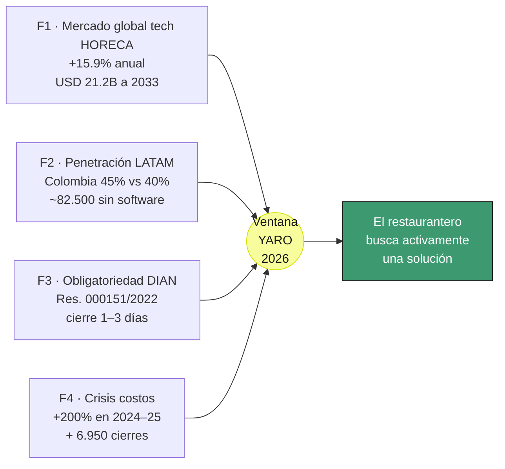

> ⚠️ **La ventana de YARO es ~24–36 meses.** Cuando Toteat o GetJusto construyan integración DIAN Colombia, el diferencial fiscal se reduce. El MOAT que sobrevive es **datos histórico de trazabilidad lote → plato + reglas IA del tenant**: ese solo se acumula con tiempo en producción. Cada mes en operación es MOAT; cada mes sin operar es ventana cediéndose.

### 2.3 Mapa del ecosistema actual

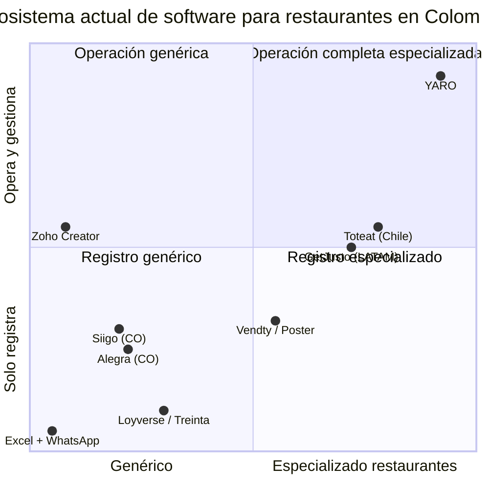

**El competidor más difícil no es Siigo ni Toteat — es la inercia de Excel + WhatsApp.** El 55% sin software no es que no exista solución: es que "ya tienen algo que funciona" (mal).

---

<a name="s3"></a>

## 3. ICP Detallado

### 3.1 Doble pista del ICP

#### ICP-A — "Formal en operación" (beachhead, 80% del foco Fase 1)

| Dimensión | Valor |
|---|---|
| **Sector** | Restaurantes independientes (no cadenas grandes) |
| **Tipo de cocina** | Hamburguesas, comida a la carta, dark kitchen, fast food, pizza, comida saludable — **no discrimina** |
| **Tamaño** | 1–4 sedes |
| **Antigüedad** | ≥ 1 año operación formal demostrable |
| **Facturación** | $30M – $500M COP/mes |
| **Régimen tributario** | Ordinario / SIMPLE / Persona Natural obligada |
| **Geografía Fase 1** | Antioquia — Medellín y Oriente Antioqueño (Guarne, La Ceja, Rionegro, Envigado, Sabaneta) |
| **Geografía Fase 2** | Bogotá |
| **Geografía Fase 3** | Cali, Barranquilla, ciudades intermedias |
| **Pago actual** | $500–700 USD/mes en stack tradicional |
| **Caso de valor** | Ahorro inmediato ~$492 USD/mes + horas del admin/contador + cumplimiento DIAN garantizado |
| **Volumen Fase 1** | 5 clientes activos al mes 8 |

#### ICP-B — "En proceso de formalización" (expansión natural, 20% del foco)

| Dimensión | Valor |
|---|---|
| **Tamaño** | 1 sede |
| **Antigüedad** | < 1 año o iniciando |
| **Facturación** | < $30M COP/mes (típico $8M–$30M) |
| **Régimen** | Persona Natural **no obligada** a FE / Régimen SIMPLE en formalización |
| **Pago actual** | Excel + WhatsApp + cuaderno. $0/mes en licencias |
| **Caso de valor** | "Empieza ordenado" — sistema funciona sin DIAN activa; el día que decida formalizarse, no migra |
| **Volumen Fase 1** | Acoger orgánicamente, no perseguir activamente |

#### Formatos soportados (D4 — multi-formato como diferenciador)

`RESTAURANTE` · `DARK_KITCHEN` · `FOOD_TRUCK` · `BAR` · `CADENA_CDP`

#### Quién está FUERA del ICP

- ❌ Restaurantes informales sin RUT ni intención de formalizarse
- ❌ Cadenas grandes con software propio (Frisby, Crepes & Waffles, El Corral, McDonald's)
- ❌ Hoteles, catering puro, banquetes — **expansión Fase 4+**
- ❌ Restaurantes con > 4 sedes en Fase 1 (entran como Enterprise Fase 2+)

### 3.2 Buyer personas — Valentina, Andrés, Carolina

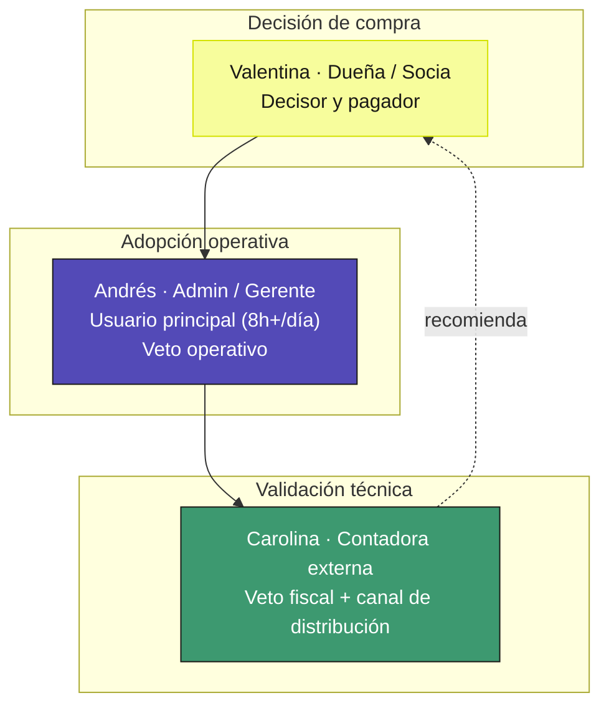

#### Persona 1 — Valentina (Dueña / Socia)

| Aspecto | Detalle |
|---|---|
| **Edad** | 28–55 |
| **Rol** | Dueña/socia 1–4 restaurantes. PN o representante legal de SAS/LTDA |
| **Perfil técnico** | Pragmática, no técnica |
| **Stack actual** | Probablemente Siigo + POS básico o cuadernos |
| **Pain principal** | *"¿Estoy ganando o perdiendo dinero este mes?"* — no sabe hasta 30 días después |

**Triggers de compra (en orden):**
1. 🚨 Visita o amenaza de la DIAN
2. 📊 Mes con pérdidas inexplicables
3. 👨‍💼 El contador le recomienda YARO
4. 🏪 Apertura de 2ª sede
5. 📈 Reforma laboral cambia recargos

**Objeciones probables:**

| Objeción | Respuesta |
|---|---|
| "Ya tengo Siigo y funciona bien" | Siigo hace contabilidad pero no opera el restaurante. Siguen siendo 2 sistemas con doble digitación |
| "Mi cajero no sabe de tecnología" | POS de 3 toques. Sin capacitación larga |
| "Es muy caro" | Suma lo que pagas hoy en Toteat + Siigo + nómina + horas del admin. Compara con $729K COP |
| "¿Y si se cae el internet?" | Modo offline 48h. La normativa lo permite |
| "Migrar es traumático" | Equipo de YARO te acompaña 1 semana de onboarding |

#### Persona 2 — Andrés (Administrador)

| Aspecto | Detalle |
|---|---|
| **Edad** | 24–40 |
| **Rol** | Operador día a día. Familiar del dueño o profesional contratado |
| **Tiempo en YARO** | **8+ horas/día** — usuario principal |
| **Autoridad** | Veto operativo. Puede hundir adopción si día 1 le parece "más trabajo" |

**Pains que YARO resuelve:**
- Arqueo 30–45 min → **< 10 min**
- Mermas sin registrar → cada merma con causa, impacto en food cost en tiempo real
- WhatsApp con CDP caótico → traslados con estados, inventario actualizado automáticamente

#### Persona 3 — Carolina (Contadora externa)

| Aspecto | Detalle |
|---|---|
| **Edad** | 30–55 |
| **Rol** | Contador público independiente. Atiende 10–50 clientes, varios restauranteros |
| **Autoridad** | **Veto fiscal absoluto + canal de distribución indirecto** |

**Pain principal — el más doloroso:**
> 🔥 **Validación + clasificación + subida manual de facturas de proveedores: 4–5 HORAS DIARIAS** (corrección directa del fundador, mayo 2026)
>
> Para un contador con 10–15 restauranteros = medio día perdido en consolidación manual. **Justifica completamente el Agente Buzón DIAN con IA** como entregable de mayor ROI.

**Objeciones (todas resueltas):**

| Objeción | Respuesta YARO |
|---|---|
| ¿XMLs DIAN válidos? | UBL 2.1 + XAdES-BES + CUFE. Operador habilitado Facture.co. Validación XSD pre-transmisión |
| ¿Impoconsumo separado del IVA en PUC? | Cuenta 2408 separada — regla técnica obligatoria |
| ¿Propinas excluidas? | Módulo separado, excluidas de todos los fiscales |
| ¿Soporta SIMPLE? | Sí — anticipos, sin IVA independiente, no agente de retención (Art. 911 E.T.) |
| ¿Acceso sin pasar por el dueño? | Rol "Contador externo" con acceso de solo lectura al módulo contable |

### 3.3 Verbatims — TBD (programa de 5 entrevistas express acordado)

---

<a name="s4"></a>

## 4. Propuesta de Valor Única (UVP) y Diferenciadores

### 4.1 Declaración de UVP

> **YARO es el único sistema diseñado desde adentro del sector HORECA colombiano que opera el día a día, mantiene el orden contable-administrativo y convierte sus datos en decisiones —todo en una sola plataforma configurable que se adapta al tipo de negocio (restaurante, food truck, bar, dark kitchen), al régimen tributario y al nivel de formalización, sin obligar a usar módulos que no se necesitan.**

### 4.2 Los 4 diferenciadores estructurales

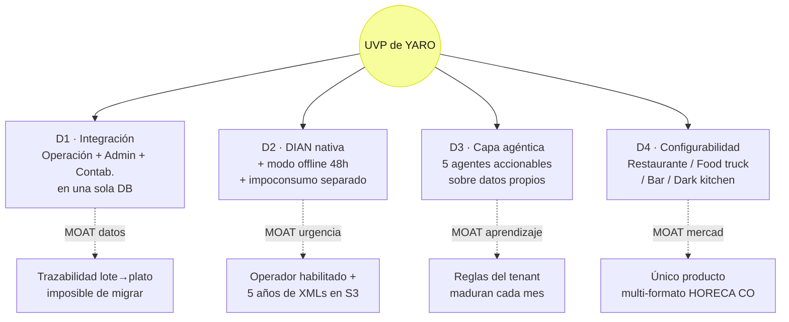

#### D1 — Integración nativa de tres mundos hoy separados

- Cobro del cajero → tiquete DIAN automático + inventario actualizado + P&G del día + lote para conciliación, **sin intervención humana**
- 911 Hot Burger pasa de $670 USD/mes (4 sistemas) a $178 USD (YARO) = **73% más barato + más completo**

#### D2 — DIAN nativa con resiliencia operativa real

- Tiquete POS (04), FE (01), Nota Crédito (91), DSCE (05), Contingencia (03), Nómina electrónica
- **Modo offline 48h** validado por evento MUISCA 9-ene-2025
- Patrón fire-and-forget: cajero responde en <100ms sin esperar Facture.co
- Impoconsumo 8% siempre en cuenta separada del IVA (lo que Carolina valida primero)
- **Mensaje al dueño:** "te quedas listo el día que necesites cumplir" — no "te cumplimos la DIAN"

#### D3 — Capa agéntica: 5 agentes accionables sobre datos propios

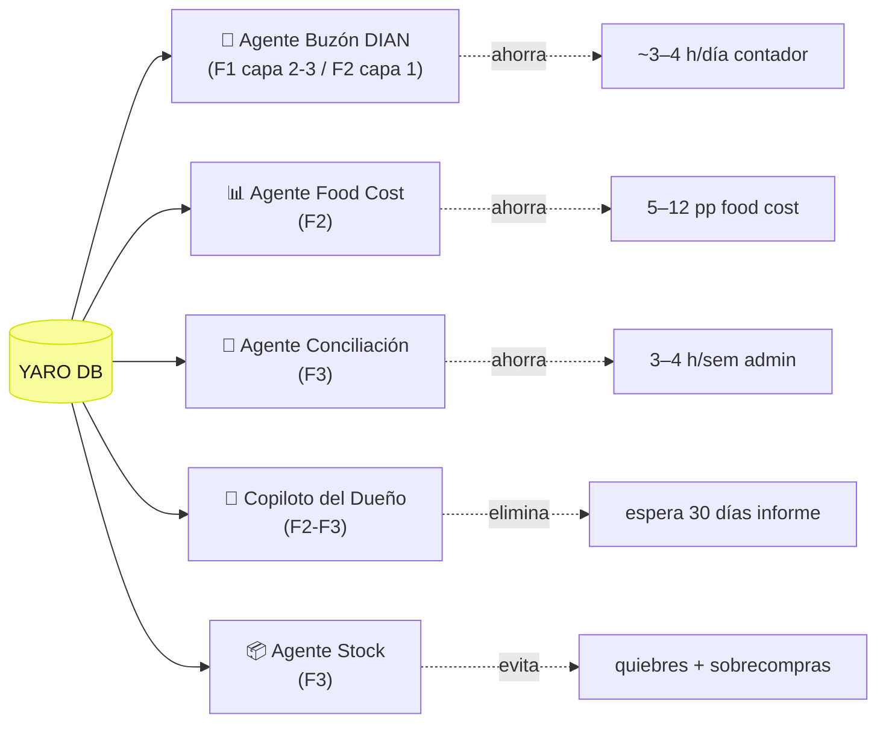

#### D4 — Configurabilidad multi-formato

| Formato | Módulos activos | Módulos desactivados |
|---|---|---|
| **Restaurante con mesa** | POS + plano mesas + KDS + inventario + DIAN | — |
| **Dark kitchen** | POS + KDS + inventario + DIAN | Plano mesas |
| **Food truck** | POS móvil + inventario simple + DIAN + **offline reforzado** | Mesas, KDS, CDP |
| **Bar nocturno sin cocina** | POS + control barra + inventario líquido + propinas reforzadas + DIAN | KDS cocina, recetas, CDP |
| **Cadena con CDP** | Todos los módulos + CDP + traslados + benchmark multi-sede | — |

### 4.3 Matriz de posicionamiento

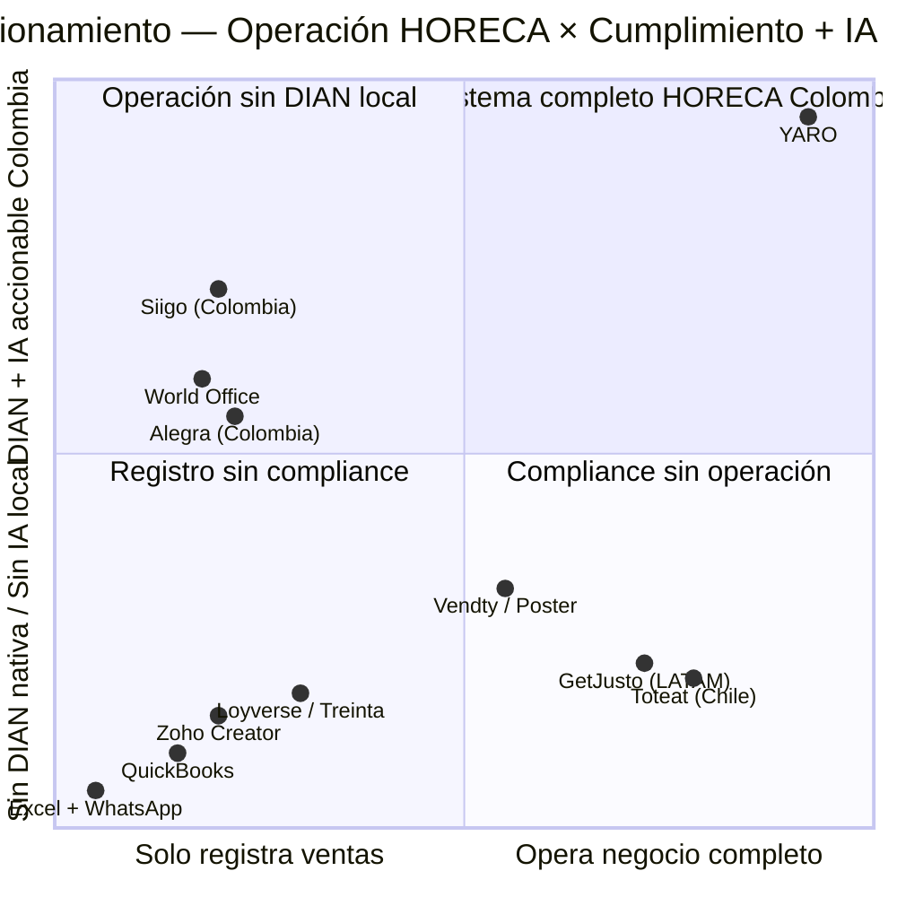

### 4.4 Resumen vendible al cliente

| Si eres... | YARO te da... | Lo que ahorras |
|---|---|---|
| **Valentina (Dueña)** | Visibilidad financiera en tiempo real + DIAN garantizada + Copiloto en lenguaje claro | $492 USD/mes + 30 días de espera |
| **Andrés (Admin)** | Arqueo en 10 min, inventario en tiempo real, sin doble digitación | 30 min/día + horas en consolidación |
| **Carolina (Contadora)** | Buzón DIAN con IA, XMLs válidos, impoconsumo separado, multi-régimen | **3–4 horas DIARIAS** |
| **Food truck** | Plataforma sin módulos que no necesitas + offline reforzado + DIAN cuando aplique | Forzarte a POS de restaurante con mesa |
| **Bar nocturno** | Control de barra + inventario líquido + propinas reforzadas + sin KDS de cocina | Configurar Siigo o Toteat para algo que no fueron diseñados |

---

<a name="s5"></a>

## 5. Casos de Uso Top 5

| # | Caso | Persona | Diferenciador | Fase |
|---|---|---|---|---|
| **UC-1** | Buzón DIAN con IA clasifica facturas en lugar del contador | Carolina | D3 + D2 | F1 básico → F2 IA |
| **UC-2** | Cobro POS con tiquete DIAN en < 100 ms, incluso sin internet | Cajero/Andrés | D2 + D1 | F1 |
| **UC-3** | Arqueo + cierre de turno en menos de 10 minutos | Andrés | D1 | F1 |
| **UC-4** | Copiloto del Dueño responde "¿estoy ganando este mes?" | Valentina | D3 | F2 |
| **UC-5** | Food truck opera 8h en evento sin conexión y cumple DIAN al volver | Operador food truck | D4 + D2 | F1 (offline) + F2 (food truck oficial) |

### UC-1 — Buzón DIAN con IA: el contador deja de clasificar 4–5h/día

**Actor:** Carolina (Contadora) + Andrés (Admin)

**Pasos:**
1. YARO descarga FE automáticamente del RADIAN
2. Clasificación en 3 capas: Claude Sonnet (✦ IA) → Motor de reglas del tenant (⚙ Regla) → Default (✋ Manual)
3. Andrés aprueba las correctas (~80%) con un clic. Las dudosas se mandan a Carolina
4. Cada aprobación refuerza el motor de reglas
5. Carolina revisa solo lo escalado + exporta al cierre del mes

**Resultado:** Carolina pasa de 4–5h/día → ~1h/día. 80%+ clasificación auto al mes 3.

**KPIs:**
| KPI | Baseline | Meta Fase 2 |
|---|---|---|
| Aceptación sugerencia IA (PUC) | 0 | **> 80% mes 3** |
| Horas/día contador en clasificación | **4–5 h** | **< 1 h** |
| Double-entry POS↔contabilidad | ~100% | **0%** |

### UC-2 — Cobro POS con tiquete DIAN en < 100 ms

**Pasos clave:**
1. Cajero selecciona mesa → ingresa cobro → confirma
2. YARO persiste en PostgreSQL local (< 50 ms) + crea fiscal_document DRAFT + encola en BullMQ → responde `{cobroId, status: 'ok'}` en < 100 ms
3. Worker async transmite a Facture.co, recibe CUFE, actualiza ACCEPTED, emite WebSocket event
4. **Sin internet:** entra a SyncQueue con `expiresAt = createdAt + 48h`, XML de contingencia (Tipo 03) generado por Service Worker

**KPIs:**
| KPI | Baseline | Meta F1 |
|---|---|---|
| Latencia `/cobros` p95 | Toteat ~300–800ms | **< 100 ms** |
| Tasa transmisión DIAN exitosa | ~70% sector | **≥ 99%** |
| Tasa sync offline → DIAN | N/A | **≥ 98%** |
| Cobros perdidos por caída internet | Variable | **0** |

### UC-3 — Arqueo + cierre en < 10 minutos

**Pasos:**
1. Andrés abre "Cerrar turno" — totales del sistema pre-cargados
2. Ingresa totales reportados por método de pago
3. Descuadre detectado → comentario obligatorio
4. Ingresa lote del datáfono (preparación conciliación)
5. Cierra caja + turno + reporte automático al dueño

**KPIs:**
| KPI | Baseline | Meta F1 |
|---|---|---|
| Tiempo arqueo + cierre | 30–45 min | **< 10 min** |
| Descuadres no documentados | TBD alto | **0%** |

### UC-4 — Copiloto del Dueño

**Pasos:**
1. Valentina pregunta en lenguaje natural: *"¿Cómo voy este mes vs el mes pasado?"*
2. Copiloto consulta DB del tenant (con guardrails de aislamiento P3)
3. Responde en lenguaje no contable con datos verificables + click-through a fuente
4. Si pregunta es prescriptiva (*"¿debería abrir 3ª sede?"*) → presenta datos pero NO recomienda. Escala a Carolina

**KPIs:**
| KPI | Baseline | Meta F2 |
|---|---|---|
| Tiempo respuesta "¿voy ganando?" | 30 días | **< 30 seg** |
| % respuestas con click-through fuente | N/A | **100%** (no negociable) |
| % respuestas con error factual | N/A | **< 2%** |
| Frecuencia uso/dueño activo | 0 | **≥ 8 sesiones/mes** |

### UC-5 — Food truck offline 8 horas

**Escenario:** Festival gastronómico, WiFi público inestable, 800+ transacciones esperadas.

**Pasos:**
1. Pre-evento: Service Worker cachea menú + config + `@yaro/xml-builder`
2. Internet cae a media operación → indicador ámbar, cajero no se entera
3. 7 horas offline: cada cobro genera tiquete Tipo 03 con `indicadorContigencia=true`, timestamp real
4. Reconexión: SyncQueue transmite lote, todos ACCEPTED en 10–15 min
5. **0 transacciones perdidas, 0 incumplimiento DIAN**

---

<a name="s6"></a>

## 6. Principios de Diseño No Negociables

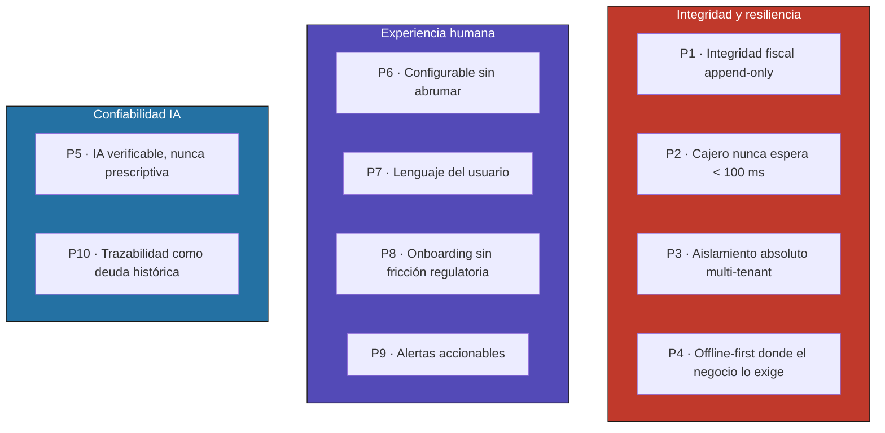

### Resumen — los 10 principios

| # | Principio | Si se rompe |
|---|---|---|
| **P1** | Integridad fiscal append-only — ningún documento DIAN se edita ni borra | Fraude fiscal → fin del producto |
| **P2** | El cajero nunca espera: `/cobros` < 100 ms incluso si DIAN, IA o BullMQ están caídos | Desinstalación a la semana |
| **P3** | Aislamiento absoluto entre tenants, garantizado por arquitectura | Violación Habeas Data → fin del producto |
| **P4** | Offline-first donde el negocio lo exige (POS, KDS, cobro, marcación) | Pérdida de ventas en caída de internet |
| **P5** | IA verificable, nunca prescriptiva | Decisiones equivocadas del dueño basadas en alucinación |
| **P6** | Configurable sin abrumar — módulos por `tipoOperacion` | ICP ampliado (food truck/bar) no encaja |
| **P7** | Lenguaje del usuario, no del sistema — cada perfil ve datos en su idioma | Adopción frustrada por jerga |
| **P8** | Onboarding sin fricción regulatoria — opción "decido después" para DIAN | ICP-B se ahuyenta |
| **P9** | Alertas accionables: nunca spam, siempre con botón de acción | Banner blindness en el admin |
| **P10** | Trazabilidad como deuda histórica — quién, cuándo, qué, por qué | MOAT de datos se diluye |

### Reglas explícitamente prohibidas (extracto)

- ❌ `await facture.transmit()` dentro de un handler HTTP del POS
- ❌ Botones "Editar tiquete" o "Eliminar factura"
- ❌ Acceso directo a `this.prisma.X.findMany()` sin pasar por `PrismaService` con middleware activo
- ❌ Tablas nuevas sin campo `tenant_id`
- ❌ Respuestas conversacionales de agentes con cifras no verificables
- ❌ Frases prescriptivas como *"deberías"*, *"te recomendamos hacer X"* en módulos financieros
- ❌ Activación automática de configuraciones fiscales sin confirmación explícita
- ❌ Forzar al food truck a configurar un plano de mesas inexistente
- ❌ Operaciones críticas sin registro de quién las hizo
- ❌ Bloquear el onboarding si el tenant no tiene NIT con dígito de verificación
- ❌ Construir cualquier pantalla nueva fuera del sistema de diseño `@yaro/ui` (ver [§14](#s14))

> **Manifestación operativa:** los principios P2 (latencia), P7 (lenguaje del usuario), P9 (alertas accionables) y P10 (trazabilidad visual) se materializan a través del **sistema de diseño YARO** documentado en [§14](#s14). La carpeta [`preparation/`](../preparation/) contiene tokens y componentes; la carpeta [`pantallas_reference/`](../pantallas_reference/) es el golden source visual de cómo debe verse cada rol.

---

<a name="s7"></a>

## 7. User Journeys

### Journey 1 — Happy Path: Carolina + Agente Buzón DIAN

**Contexto:** Lunes 8:30 AM, Carolina atiende 14 restaurantes — 6 en YARO.

**Pasos clave:**
1. Entra al Console del Contador. Ve dashboards de los 6 clientes en YARO
2. Abre 911 Hot Burger — 18 facturas del fin de semana: 15 ✦ IA, 2 ⚙ Regla, 1 ✋ Manual
3. Aprueba en batch las 15 con confianza > 90%
4. Las 2 con regla las hojea, valida, aprueba — refuerza reglas del tenant
5. La manual: nueva, ambigua. Clasifica + YARO le pregunta si crear regla automática
6. **9:25 AM** — procesó 6 clientes en < 1h. **Antes le tomaba 3–4 horas**. Ahorro ~2.5h/día
7. Al cierre de mes, descarga XMLs DIAN + libro auxiliar contable en formato compatible
8. Llama a Valentina: *"Recomendé YARO a 3 clientes más. ¿Hay descuento por referido?"* → **canal de distribución activado**

**KPI impactado:** horas/día del contador 4–5h → < 1h. NPS contador ≥ 50 al mes 6.

### Journey 2 — Happy Path: Andrés operativo (un día completo)

**Pasos clave (resumen):**
1. **6:30 AM** — dashboard desde celular: turno anterior cerrado OK, 12 DIAN ACCEPTED, 3 alertas
2. **7:15 AM** — marca entrada con bienestar 😊 + abre turno + declara base de caja
3. **7:30 AM** — atiende alerta stock lechuga con botón "Solicitar al CDP"
4. **10:30 AM** — Buzón DIAN: 3 facturas IA con confianza > 95% → aprueba batch
5. **12:30 PM hora pico** — internet cae 15 min → modo offline activado, cajero no nota, 24 cobros sincronizados al reconectar
6. **2:15 PM** — recepción traslado CDP con discrepancia (7.5 kg vs 8) → reportado con un clic, alerta automática al CDP
7. **4:00 PM** — ve dashboard de la otra sede (La Ceja) desde celular, detecta caída de ventas, llama a la admin
8. **10:30 PM** — arqueo en 8 min, descuadre $15.000 con comentario, lote datáfono ingresado
9. **10:45 PM** — sale del restaurante. Sin Excel. Sin doble digitación. Sin quedarse hasta 11:30 PM

### Edge Case 1 — Food truck offline 8h + cajero distraído

**Combina UC-5 (offline) con interrupción humana (cobro a medio confirmar):**
1. Cajero deja cobro a medio confirmar (cliente lo llama)
2. Vuelve 2 min después → indicador "Cobro en proceso 2:14 sin actividad — ¿Continuar o descartar?"
3. Continúa → YARO persiste local, responde < 100ms
4. Internet cae justo en ese momento → SyncQueue activa
5. 7 horas offline, 87 cobros más → todos tiquetes contingencia Tipo 03
6. Reconexión 6 PM → 88 documentos transmitidos en 14 min → 100% ACCEPTED
7. **Cero ventas perdidas, cero incumplimiento DIAN, cajero nunca vio errores técnicos**

### Edge Case 2 — Agente escala a humano

**Sub-escenario 2A — Buzón DIAN escala:**
- Factura ambigua: *"Sociedad de Inversiones SAS — Servicios profesionales según contrato marco"*
- Claude Sonnet: confianza 48% (< 70% umbral)
- Motor de reglas: sin match (NIT nuevo)
- Default: marca ✋ Manual + mensaje a Andrés explicando el porqué
- Andrés escala a Carolina con un clic + tag visual
- Carolina llama a Valentina para entender el contexto → clasifica como Honorarios Jurídicos (cuenta 5105)
- YARO crea regla automática para futuras facturas de ese NIT
- Episodio loggeado para eval continua

**Sub-escenario 2B — Copiloto evita prescribir:**
- Valentina pregunta: *"¿Debería abrir una tercera sede en Rionegro?"*
- Copiloto detecta pregunta prescriptiva → **NO recomienda**
- Responde con datos descriptivos: margen actual, utilización CDP, food cost estable, ventas +18% — y qué NO tiene (mercado Rionegro, financiamiento)
- Ofrece generar PDF estructurado para llevar a conversación con Carolina + asesor
- **Valentina toma la decisión con datos + criterio humano**

---

<a name="s8"></a>

## 8. MVP Scope (MoSCoW)

**MVP = Fase 1 "Opera y cumple"** (8 meses) — un restaurante puede operar todo su día con YARO + cumplir DIAN cuando aplique, sin herramientas externas.

### 8.1 MUST HAVE — Sin esto no hay MVP

#### M1 Operación de piso
- POS configurable por `tipoOperacion` (mesas / barra / lista pedidos / móvil)
- Cobro con descuento+propina+método de pago+cliente+tipo documento
- Cobro fire-and-forget < 100 ms
- Turno por sede con apertura/arqueo/cierre, target < 10 min
- KDS cocina WebSocket (desactivable en `FOOD_TRUCK / BAR`)
- Inventario básico por sede con stock mínimo

#### M2 Cumplimiento DIAN
- Tiquete POS (Tipo 04) + Factura electrónica (Tipo 01) + Tiquete Contingencia (Tipo 03)
- Operador habilitado Facture.co
- Modo offline 48h con Workbox + IndexedDB SyncQueue
- Append-only fiscal con regla SQL
- Panel de transmisiones DIAN con estados
- Impoconsumo separado del IVA, propinas excluidas de fiscales
- Multi-régimen (Ordinario / SIMPLE / PN no obligada)
- Onboarding fiscal con "decido después" (P8)

#### M3 Plataforma y seguridad
- Multi-tenancy con middleware Prisma forzando `tenant_id`
- Tests aislamiento en CI como gate de merge
- JWT + roles + permisos granulares
- Configurabilidad por `tipoOperacion`
- YARO Console interna (gestión tenants, monitor DIAN, soporte)
- Auditoría de cambios fiscales
- **MFA obligatorio para Platform Admin** (hardening)
- **AWS WAF + Dependabot + Snyk** (hardening)

#### M4 Personas y onboarding
- Marcación + bienestar
- Dashboard por rol (lenguaje no contable para Valentina, técnico para Carolina)
- Wizard onboarding 3 pasos
- Roles del sistema
- Buzón DIAN básico (recepción FE de proveedores)
- **FR-15 Bloqueo escalonado por impago** con regla horaria protegida

### 8.2 SHOULD HAVE — Si la velocidad lo permite

| # | Feature | Trade-off |
|---|---|---|
| S1 | Motor de reglas pre-cargadas del Buzón (sin Claude aún) | Carolina recibe valor desde día 1 |
| S2 | Multi-sede básico (dashboard remoto desde mobile) | 911 multi-sede lo necesita |
| S3 | Reportes básicos ventas/inventario/food cost estimado | Valentina ve "¿cómo voy hoy?" |
| S4 | Notificaciones push PWA | Andrés deja de perder alertas |
| S5 | Exportación masiva XMLs + libro auxiliar | Carolina exporta cierre mensual |
| S6 | Auditoría visible (pestaña Historial) | Transparencia al cliente |
| S7 | Reintento manual DIAN desde Console | Soporte resuelve sin escalar |
| S8 | Indicador conexión + cola pendiente siempre visible | UX modo offline |

### 8.3 COULD HAVE — Fase 2 y 3

**Fase 2 (meses 9–18):**
- C1: Buzón DIAN con IA full (Claude Sonnet + motor reglas + default)
- C2: CDP completo
- C3: Recetas con food cost real
- C4: Agente Food Cost & Márgenes
- C5: Copiloto del Dueño descriptivo
- C6: Nómina electrónica DIAN
- C7: Notas crédito (Tipo 91), DSCE (Tipo 05)
- C8: Retenciones + Régimen Simple anticipos
- C9: Conciliación bancaria asistida

**Fase 3 (meses 19–30):**
- C10: Conciliación bancaria automatizada CSV (Agente Conciliación)
- C11: Agente Predicción Stock
- C12: Copiloto conversacional con clasificación de intent
- C13: Multi-país (Perú SUNAT → Ecuador SRI → México SAT)
- C14: Benchmark entre sedes
- C15: Hardware biométrico

### 8.4 WON'T HAVE — Fuera del scope

| # | Lo que NO haremos | Por qué |
|---|---|---|
| W1 | Operador FE propio ante DIAN | 3–6 meses habilitación, Facture.co cubre |
| W2 | Open Banking / APIs bancarias | CSV cubre, ecosistema CO inmaduro |
| W3 | App móvil nativa | Angular responsive cubre 90% |
| W4 | Integración delivery (Rappi, iFood) | Descartado, no entramos a guerra de comisiones |
| W5 | Reservas de mesa | Backlog |
| W6 | Kiosco autoservicio | Mercado específico |
| W7 | Hoteles, catering puro, banquetes | **Expansión Fase 4+** |
| W8 | Declaración de renta | YARO es origen del dato, contador declara |
| W9 | Gestión avanzada de alérgenos | Backlog F3 |
| W10 | Bar especializado tipo Toast Bar | Pero sí soportamos formato `BAR` configurable |
| W11 | Soporte 24/7 humano | Hasta que MRR lo justifique |
| W12 | Customización UI por tenant (white-label) | Marca YARO única |
| W13 | Migración automática desde Siigo/Toteat | Onboarding manual asistido en F1 |
| W14 | Comisiones por transacción a YARO | Pricing es plan fijo por sede |

### 8.5 Criterios de aceptación Fase 1 (mes 8)

✅ **Operativo:** 5 tenants activos · p95 `/cobros` < 100 ms · ≥ 99% DIAN exitosa · ≥ 98% sync offline · 0 incidentes de acceso cruzado
✅ **De producto:** 5 formatos configurables · ICP-A opera sin Toteat/Siigo · ICP-B opera sin DIAN activa
✅ **Económico:** ahorro ≥ $400 USD/mes ICP-A · MRR ≥ $1.4M COP
✅ **De confianza:** 911 Hot Burger recomienda activamente · ≥ 1 contador recomienda a sus otros clientes

---

<a name="s9"></a>

## 9. Especificación Funcional: Módulos y Features

YARO se organiza en **16 módulos funcionales** en 6 bloques.

### 9.1 Arquitectura funcional de alto nivel

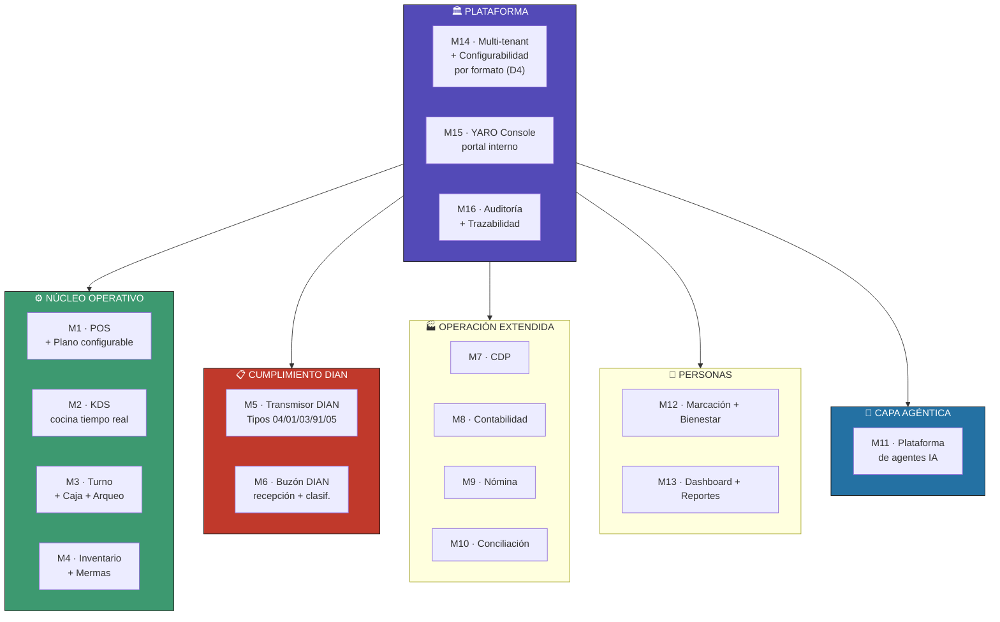

### 9.2 Matriz módulo × fase × persona × principio

| Módulo | Fase | Principios | Persona principal |
|---|---|---|---|
| M1 POS + Plano configurable | F1 | P2, P4, P6 | Cajero / Andrés |
| M2 KDS Cocina | F1 | P2, P6 | Cocina KDS |
| M3 Turno + Caja + Arqueo | F1 | P9, P10 | Cajero / Andrés |
| M4 Inventario + Mermas | F1→F2 | P9, P10 | Andrés / Jefe cocina |
| M5 Transmisor DIAN (04/01/03 F1; 91/05/nómina F2) | F1→F2 | P1, P2, P4 | (invisible) |
| M6 Buzón DIAN (recepción + clasif. manual F1; IA F2) | F1→F2 | P5, P9, P10 | Andrés / Carolina |
| M7 Centro de Producción | F2 | P10 | Jefe CDP |
| M8 Contabilidad (PUC, P&G, Balance) | F2 | P1, P7 | Carolina |
| M9 Nómina electrónica (47 campos) | F2 | P1 | Superadmin |
| M10 Conciliación bancaria (asistida F2; auto F3) | F2→F3 | P5, P10 | Carolina |
| M11 Plataforma Agentes IA (orquestación 3 capas, eval) | F1→F2→F3 | **P5, P10** | Todos |
| M12 Marcación + Bienestar | F1 | P10, P7 | Empleados |
| M13 Dashboard + Reportes por rol | F1→F2 | **P7**, P9 | Todos por rol |
| M14 Multi-tenant + Configurabilidad por formato | F1 | **P3**, P6, P8 | (plataforma) |
| M15 YARO Console (incluye gestión cobranza FR-15) | F1→F2 | P3, P10 | Equipo YARO |
| M16 Auditoría + Trazabilidad (transversal) | F1 | **P10**, P1 | (transversal) |

### 9.3 Detalle de los 5 agentes (M11)

| # | Agente | Capa 1 (IA) | Capa 2 (Determinística) | Capa 3 (Default) | Fase |
|---|---|---|---|---|---|
| **A1** | Buzón DIAN Clasificador | Claude Sonnet | Motor de reglas del tenant + base | Cuenta genérica + "Manual" | F1 cap. 2-3 / F2 cap. 1 |
| **A2** | Food Cost & Márgenes | Claude Sonnet | Cálculo determinístico de margen | Dashboard estático | F2 |
| **A3** | Conciliación Bancaria | Claude Sonnet (matching difuso) | Matching exacto valor+fecha | Sin match → excepción | F3 |
| **A4** | Copiloto del Dueño | Claude Sonnet | Dashboards preconstruidos | "No tengo el dato" | F2 desc / F3 conv |
| **A5** | Predicción de Stock | Claude Sonnet | Promedio móvil ponderado | Alertas estáticas | F3 |

### 9.4 FR catálogo principal (consolidado de v3.0 + ajustes co-creación)

- **FR-01** Gestión tenants + YARO Console + multi-tenant
- **FR-02** Onboarding wizard 3 pasos + Paso 0 `tipoOperacion`
- **FR-03** Monitor impoconsumo
- **FR-04** Soporte multi-régimen tributario
- **FR-05** Turno bloqueante + arqueo
- **FR-06** Modo offline 48h
- **FR-07** Fire-and-forget DIAN
- **FR-08** Append-only fiscal
- **FR-09** Retenciones en la fuente
- **FR-10** Nómina electrónica (F2)
- **FR-11** Conciliación bancaria
- **FR-12** Marcación + bienestar
- **FR-13** IA con fallback 3 capas
- **FR-14** Predictor de stock (F3)
- **FR-15** 🆕 **Bloqueo escalonado por impago** (detallado en S11)

### 9.5 Endpoints API principales

(Reutilizados de `prd yaro prueba.md` v3.0 §9 — sin cambios materiales, con adición de endpoints de gestión de suscripción y eval de agentes)

**Nuevos endpoints F1:**
- `POST /console/tenants/:id/subscription/override` — Platform Admin desbloquea con auditoría
- `GET /console/cobranza` — panel de tenants OVERDUE/SUSPENDED
- `GET /console/agents/health` — dashboard salud de agentes
- `GET /console/agents/evaluations?agent=&periodo=` — métricas de eval continua

---

<a name="s10"></a>

## 10. Métricas de Éxito

### 10.1 North Star — % de Operación YARO por tenant activo

**Definición:**
```
NS = (operación en YARO / operación total del negocio) × 100

Incluye: cobros, documentos DIAN, facturas proveedores clasificadas,
liquidaciones nómina, conciliaciones, marcaciones, traslados, mermas.
```

| Fase | Meta NS promedio del portafolio activo |
|---|---|
| Fase 1 (mes 8) | **≥ 70%** |
| Fase 2 (mes 18) | **≥ 85%** |
| Fase 3 (mes 30) | **≥ 92%** |

### 10.2 KPIs por categoría (resumen)

#### Activación (5 KPIs)
- **A1** Time-to-First-Cobro: **< 48 h**
- **A2** % tenants activados: **≥ 90%**
- **A3** Time-to-First-DIAN-OK: **< 72 h**
- **A4** Cobertura del onboarding: **100%** asistido por YARO en F1
- **A5** NPS onboarding: **≥ 50**

#### Retención (4 KPIs)
- **R1** Churn mensual: **< 5% F1 · < 2.5% F2 · < 2% F3**
- **R2** Adopción módulos secundarios: **≥ 60% F2 · ≥ 80% F3**
- **R3** NRR: **≥ 110% F2 · ≥ 120% F3**
- **R4** % tenants que recomiendan: **≥ 30% F1**

#### Calidad del producto (11 KPIs)
- **Q1** Latencia p95 `/cobros`: **< 100 ms**
- **Q2** Latencia p95 general API: **< 500 ms**
- **Q3** Tasa transmisión DIAN exitosa: **≥ 99%**
- **Q4** Tasa sync offline → DIAN: **≥ 98%**
- **Q5** Latencia p95 KDS WebSocket: **< 200 ms**
- **Q6** Cobros perdidos por caída internet: **0**
- **Q7** Incidentes acceso cruzado entre tenants: **0** (no negociable)
- **Q8** Disponibilidad mensual módulos fiscales: **≥ 99.5%**
- **Q9** Descuadres no documentados: **0%**
- **Q10** Tiempo arqueo + cierre: **< 10 min**
- **Q11** Tiempo respuesta dueño a "¿voy ganando?": **< 30 seg (F2)**

#### Calidad del agente (14 KPIs en 3 dimensiones)

**Factualidad:**
- **F1** Tasa respuestas con cifras verificables: **100%** (regla P5)
- **F2** Tasa alucinación detectada: **< 2%**
- **F3** Tasa "no sé" honesto: **≥ 95%**
- **F4** Precisión clasificación PUC Buzón: **≥ 80% mes 3**

**Utilidad:**
- **U1** Aceptación sugerencia: **≥ 80% A1 / ≥ 70% A2 / ≥ 75% A4**
- **U2** Frecuencia uso: **≥ 20 sesiones/mes A1 / ≥ 8 A4**
- **U3** Time-to-Value del agente: **< 7 días**
- **U4** Horas/día contador en clasificación: **4–5 h → < 1 h al mes 3**

**Seguridad:**
- **S1** Tasa respuestas prescriptivas: **< 0.5%** (toda violación = alerta)
- **S2** Escalamiento justificado: **≥ 95%**
- **S3** Escalamiento Buzón DIAN: **< 15% mes 3**
- **S4** Fallback a Capa 2/3: **< 5% estable**
- **S5** Costo Anthropic API por tenant: **< $15 USD/tenant/mes F2**
- **S6** Auditabilidad: **100%** (no negociable, P10)
- **S7** 🆕 Costo eval continua / costo IA total: **< 15% F2, < 10% F3**

#### Salud del negocio (6 KPIs)
- **B1** Tenants activos: **5 F1 · 20 F2 · 50 F3**
- **B2** MRR: **$1.4M F1 · $7.2M F2 · $18M F3** (COP)
- **B3** Gross margin infraestructura: **> 74% F1 · > 80% F2 · > 85% F3**
- **B4** CAC: **< 3× MRR F1**
- **B5** LTV/CAC: **> 3× F1 · > 5× F2 · > 7× F3**
- **B6** Reducción tiempo manual cliente: **≥ 3 h/sem F1 · ≥ 10 h/sem F3**

### 10.3 Dashboard ejecutivo — 9 métricas top

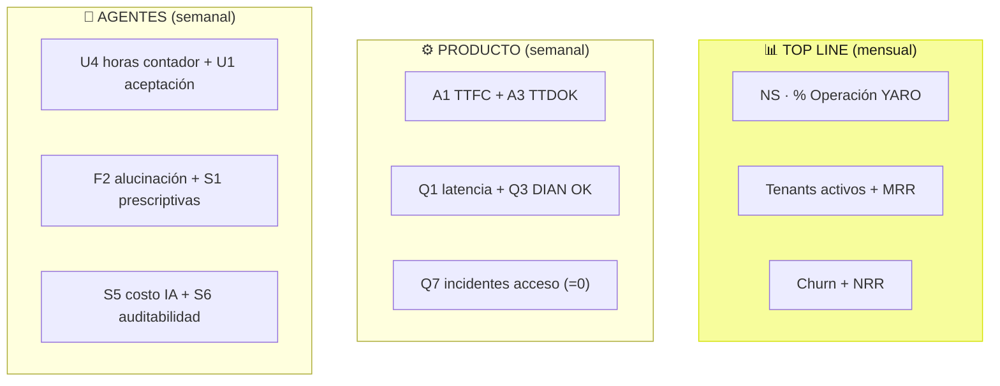

---

<a name="s11"></a>

## 11. Plan de Evaluación del Agente + Bloqueo por impago + Optimización de costo IA + Hardening

### 11.1 Plan de Evaluación del Agente

#### Filosofía — 3 principios rectores

1. Ningún agente se lanza sin pasar **eval pre-launch** con dataset acordado
2. Toda interacción se loguea + se evalúa por muestreo (P10)
3. La eval mide **adherencia a P5** (verificable, no prescriptiva), no solo accuracy

#### Datasets por agente

| Agente | Casos pre-launch | Categorías |
|---|---|---|
| **A1 Buzón DIAN** | **500** facturas etiquetadas por Carolina | Happy 300 / Proveedores nuevos 80 / Ambiguos 50 / Edge 40 / Adversariales 30 |
| **A2 Food Cost** | 200 recetas con histórico | Buen margen 80 / Problemático 60 / Dispersión 30 / Sin histórico 20 / Adversariales 10 |
| **A3 Conciliación** | 1.000 movimientos | Match exacto 500 / Tolerancia comisión 300 / Desfase fecha 100 / Sin match 70 / Adversariales 30 |
| **A4 Copiloto** | 300 preguntas | Descriptivas claras 150 / Ambiguas 60 / Prescriptivas (no responder) 50 / Fuera scope 30 / Adversariales 10 |
| **A5 Predicción Stock** | 150 productos con 90d histórico | Estable 80 / Estacional 40 / Tendencia 20 / Sin historia 10 |

#### Criterios — Factualidad + Utilidad + Seguridad (escala 1–5)

(Detallado en S10 KPIs F1-F4, U1-U4, S1-S6)

#### QA de outputs — 4 fases

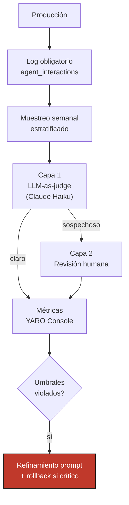

**Fases:**
- **Fase A — Pre-launch:** dataset completo, gate de aprobación, no deploy sin cumplir metas
- **Fase B — Canary (14 días):** 100% logueo, 100% eval, 20% revisión humana, daily standup
- **Fase C — Producción estable:** muestreo 50/agente/semana, revisión humana 10%
- **Fase D — Re-evaluación:** ante cambios de prompt/modelo/dataset/drift > 5%

#### Red-teaming — escenarios adversariales

**Tipos de ataque:**

| Ataque | Probabilidad | Impacto | Agentes |
|---|---|---|---|
| Prompt injection en factura | Alta | Alto | A1 |
| Pregunta prescriptiva disfrazada | Media | Alto | A4 |
| Jailbreak típico | Media | Medio | Todos |
| Inducción de alucinación | Media | Alto | A4 |
| Datos contaminados | Baja | Alto | A2, A5 |
| Extracción datos otro tenant | Baja | **Catastrófico (P3)** | Todos |
| DoS por costo | Media | Medio | Todos |

**Cadencia red-team:** quarterly + post-cambio significativo. 4h × 5 personas (incluyendo Carolina).

### 11.2 🆕 FR-15 — Bloqueo escalonado por impago

#### Modelo de 4 niveles


| Nivel | Días | `subscription_status` | Qué se bloquea | Qué sigue funcionando |
|---|---|---|---|---|
| 🟢 L0 | 0 a +2h | ACTIVE | Nada | Todo |
| 🟡 L1 | +3 a +10 | OVERDUE_REPORTS_LOCKED | Reportes, P&G, exportaciones | POS, KDS, cobro, DIAN, inventario |
| 🟠 L2 | +11 a +17 | OVERDUE_ACCOUNTING_LOCKED | + Buzón DIAN, contabilidad, conciliación, nómina, agentes IA | POS, KDS, cobro DIAN, inventario, marcación |
| 🔴 L3 | +18 a +47 | OVERDUE_OPERATION_LOCKED | + POS, KDS — **no puede cobrar** | Solo pantalla "regularizar suscripción" |
| ⚫ L4 | +48 | SUSPENDED | Todo. Acceso 60d a "exportar mis datos" | Export-only |

#### Reglas críticas

✅ **Garantizadas incluso en L3/L4:**
1. Documentos DIAN transmitidos nunca se borran (P1, 5 años)
2. Cliente puede exportar datos durante 60 días post-suspensión
3. Auditoría completa del bloqueo
4. Pantalla "regularizar" siempre accesible

❌ **Prohibido:**
1. Bloquear sin ≥ 3 comunicaciones documentadas (email + SMS + llamada)
2. Bloquear automáticamente sin grace period de 2 días hábiles
3. **Bloquear en hora pico** (11–15h / 18–22h) → cron pospone al cierre del turno
4. Borrar datos al suspender

### 11.3 🆕 Optimización de costo de eval continua

**Costo base sin optimización:** ~$710 USD/mes (F2 con 3 agentes, 20 tenants)

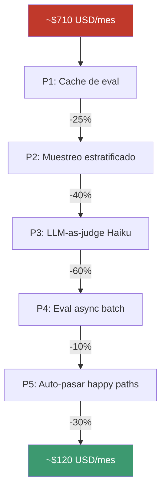

**6 palancas:**
1. **Cache de eval** (mismo input → cache 30 días) — sin trade-off
2. **Muestreo estratificado** post-canary (50/agente/semana, no 100%) — trade-off bajo
3. **LLM-as-judge con Claude Haiku** (10–15% del costo de Sonnet) — trade-off medio
4. **Eval async batch overnight** (Anthropic Batch API 50% descuento) — trade-off bajo
5. **Auto-pasar happy paths** por reglas determinísticas — trade-off medio
6. Reducir revisión humana (5h → 2h/sem) — trade-off alto, solo si necesario

### 11.4 🆕 Hardening contra ciberseguridad

#### Modelo de amenazas

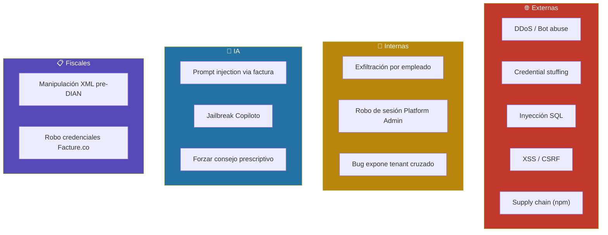

#### Quick wins de Fase 1 (primeros 3 meses, en orden de impacto)

| # | Acción | Esfuerzo |
|---|---|---|
| 1 | **MFA obligatorio Platform Admin** + opcional Superadmin | 1 sem |
| 2 | **AWS WAF + reglas OWASP Top 10 + rate limiting** | 1 sem |
| 3 | **Dependabot + Snyk como gate de CI** | 3 días |
| 4 | **Registro ante SIC + política privacidad publicada** | 2 sem |
| 5 | **Runbook de incidente de seguridad** + encargado datos | 1 sem |
| 6 | Lockout tras 5 intentos fallidos | 2 días |
| 7 | Backups encriptados + restore-test mensual | 1 sem |

#### Acciones Fase 2

- Pen-testing externo anual ($5–8k USD)
- Anomaly detection (login geo, exfiltración)
- CSP estricto + CSRF tokens formalizados
- Rotación automática de secretos cada 90 días
- Input sanitization anti prompt injection
- AWS Shield Advanced (si MRR justifica)

#### Acciones Fase 3

- Bug bounty program
- WebAuthn / passkeys
- SOC2 Type II audit
- Certificación ISO 27001

---

<a name="s12"></a>

## 12. Riesgos y Mitigaciones

### 12.1 Matriz de riesgos

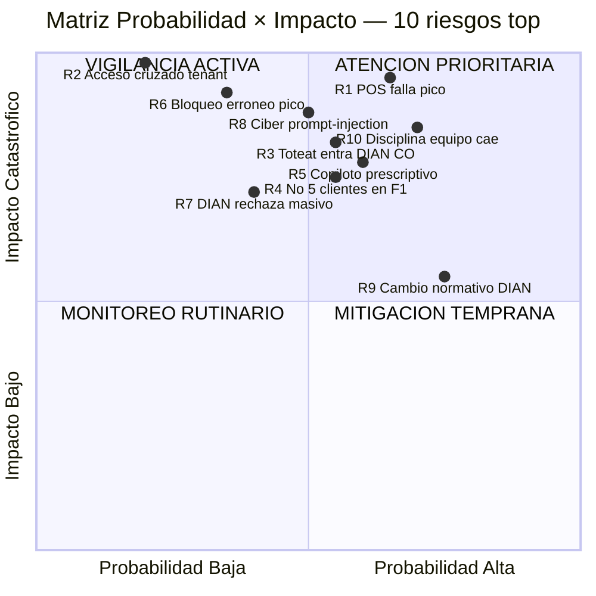

### 12.2 Tabla maestra

| # | Riesgo | Cat. | Prob. | Impacto | Mitigación primaria | Owner |
|---|---|:-:|:-:|:-:|---|:-:|
| **R1** | POS falla en hora pico | Téc | 🟡 | 🔴 | Fire-and-forget + offline + Multi-AZ + smoke test | CTO |
| **R2** | Acceso cruzado tenant (P3) | Téc/Legal | 🟢 | 🔴 | Middleware Prisma + tests CI + MFA + auditoría | CTO |
| **R3** | Toteat/GetJusto entran a DIAN CO | Mercado | 🟡 | 🔴 | MOAT de datos + velocidad captura + pricing | CEO |
| **R4** | No alcanzar 5 clientes F1 | Mercado | 🟡 | 🔴 | Foco Antioquia + Carolina embajadora + migración gratis | CEO + Sales |
| **R5** | Copiloto prescriptivo / alucinaciones | Producto/IA | 🟡 | 🔴 | Dataset robusto + guardrails técnicos + eval diaria | PM + AI lead |
| **R6** | 🆕 Bloqueo erróneo en hora pico | Operacional | 🟢 | 🔴 | Regla horaria + 3 comunicaciones + verificación pago | Ops |
| **R7** | Rechazo DIAN masivo | Téc/Legal | 🟢 | 🔴 | Validación pre-trans + sandbox + monitoreo anexo | Backend |
| **R8** | 🆕 Ataque cibernético | Seg/Legal | 🟡 | 🔴 | AWS WAF + MFA + Dependabot + pen-test + runbook | CTO + Legal |
| **R9** | Cambio normativo DIAN | Legal | 🔴 | 🟡 | `country_config` + alertas + Facture.co | CFO + Backend |
| **R10** | Disciplina de equipo cae | Operacional | 🔴 | 🔴 | Enforcement automático + métricas + auditorías | CTO + Lead Eng |

### 12.3 Los 4 riesgos más subestimados

1. **R10 — Disciplina de equipo:** el más probable. Inversión: enforcement automático desde día 1
2. **R3 — Toteat entra a DIAN CO:** parece futuro pero puede decidirse mañana. Inversión: velocidad de captura
3. **R5 — Copiloto prescriptivo:** confiamos en que "el prompt funcionará". Inversión: eval continua + guardrails
4. **R6 — Bloqueo erróneo:** probabilidad baja pero impacto reputacional desproporcionado. Inversión mayor a su prob cruda

### 12.4 Triggers de respuesta

- **R1**: p95 `/cobros` > 500ms durante 5 min consecutivos → page al on-call
- **R2**: cualquier reporte de "vi datos de otro tenant" → incidente crítico + notificación SIC < 72h
- **R5**: primera viralización en redes → comunicado público + pause del agente
- **R6**: cualquier bloqueo erróneo → desbloqueo + post-mortem + 1 mes de crédito al cliente
- **R7**: > 5 documentos REJECTED en 5 min → alarma crítica
- **R8**: cualquier alerta de seguridad → runbook + notificación legal < 72h
- **R10**: % PRs sin tests > 10% durante 3 semanas → revisión de proceso

---

<a name="s13"></a>

## 13. Plan de Entrega 30/60/90 Días

> Cubre el **primer trimestre de los 8 meses de Fase 1**.

### 13.0 Supuestos

| Variable | Valor |
|---|---|
| Equipo F1 | 5–7 personas (1 CTO, 1–2 BE, 1–2 FE, 1 QA, 1 PM + Valentina) |
| Cliente piloto | 911 Hot Burger (Guarne + La Ceja) |
| Geografía | Antioquia exclusiva |
| Cadencia | Sprints 2 semanas + demo |

### 13.1 Vista panorámica

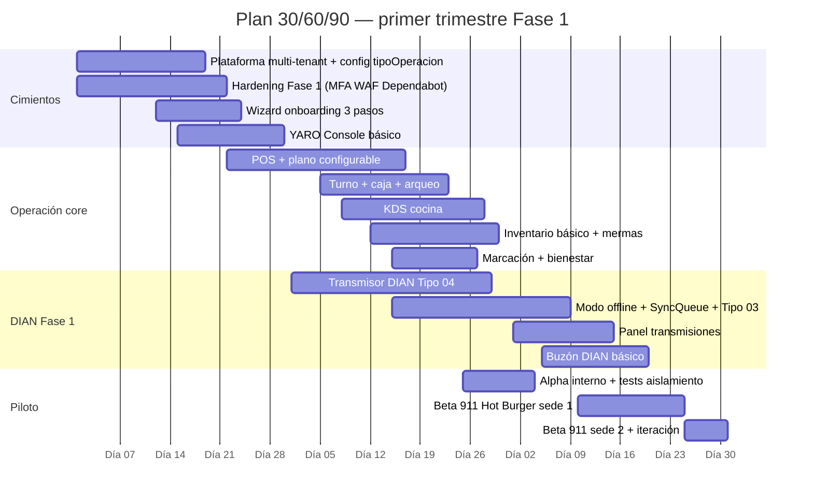

### 13.2 Días 1–30 — Cimientos + Hardening

**Objetivo:** Plataforma multi-tenant aislada, securizada, configurable por formato, con onboarding funcional. **Aún no opera un restaurante.**

**Bloques:**
- Schema Prisma 14 tablas + middleware con `tenant_id` forzado
- Configuración tenant + `tipoOperacion` (5 formatos)
- Hardening 7 quick wins (MFA, WAF, Dependabot, SIC, runbook, lockout, backups)
- Wizard onboarding 3 pasos (Paso 0 `tipoOperacion`)
- Estados de suscripción L0–L4 (cron NO ejecuta bloqueos en horario pico)
- YARO Console MVP
- Tests aislamiento como gate CI

**Demo día 30:** crear 2 tenants ficticios con formatos distintos, validar aislamiento total, simular ataque SQL bloqueado por WAF, simular cron de bloqueo escalonado.

### 13.3 Días 31–60 — Operación Core + DIAN Fase 1

**Objetivo:** Alpha interno cobra con tiquete DIAN ACCEPTED, KDS, turno, modo offline funcional.

**Bloques:**
- POS configurable (mesas / barra / lista pedidos / móvil)
- Cobro fire-and-forget < 100 ms
- Turno + caja + arqueo
- KDS WebSocket + Valkey adapter
- Transmisor DIAN Tipo 04 con `@yaro/xml-builder` compartido
- Modo offline + SyncQueue + Contingencia Tipo 03
- Validación pre-transmisión + cálculos en enteros COP
- BullMQ + dead letter queue + cron reconciliación
- Inventario básico + mermas con causa
- Marcación + bienestar

**Demo día 60:** Valentina abre turno, cajero cobra 5 mesas con distintos métodos, cada cobro responde < 100ms con DIAN ACCEPTED, se desconecta internet, POS sigue cobrando, reconecta, sync completa < 5 min.

### 13.4 Días 61–90 — Beta con piloto + Métricas iniciales

**Objetivo:** 911 Hot Burger sede Guarne opera 15 días con clientes reales.

**Bloques:**
- Dashboard por rol (Valentina lenguaje no contable, Andrés operativo, Carolina técnico)
- Notificaciones push PWA
- Buzón DIAN básico + motor de reglas pre-cargadas (12+ reglas base)
- Migración asistida 911 Hot Burger
- Capacitación in-situ + soporte presencial primer turno
- Eval continua infraestructura (sin Claude activo aún)
- Dataset inicial A1 — 100 facturas etiquetadas con Carolina
- Red-team pre-launch día 80

**Demo día 90:** 15 días de operación real sin caídas, 0 documentos DIAN rechazados de ~600 emitidos, arqueo promedio < 12 min, Carolina valida XMLs, Valentina valida dashboard, 50%+ facturas auto-clasificadas.

### 13.5 Vista ampliada — meses 4–8 (post-90 días)

| Mes | Foco | Meta |
|---|---|---|
| Mes 4 | Sede La Ceja en operación + iteración | 911 completo + onboarding cliente 2 (referido) |
| Mes 5 | 2 clientes activos. Estabilización bugs | NS ≥ 50% piloto |
| Mes 6 | **Checkpoint estratégico**: si < 4 clientes → cortar Should | Validar ahorro $492 USD/mes |
| Mes 7 | 4 clientes activos + preparación Fase 2 | Buzón motor reglas > 70% auto |
| Mes 8 | **5 clientes activos** + lanzamiento Fase 2 | KPIs F1 cumplidos |

### 13.6 Go/no-go gates

| Checkpoint | Criterio GO | Acción NO-GO |
|---|---|---|
| **Día 30** | Tests aislamiento 100% + MFA operativo + onboarding crea tenants con formatos distintos | Refuerzo 2–4 sem, postergar POS |
| **Día 60** | Alpha cobra DIAN ACCEPTED + KDS < 200ms + offline funciona + Q7=0 | Extender 4 sem, cortar nice-to-have |
| **Día 90** | 911 Guarne 15 días sin caída + 0 docs rechazados + arqueo < 12 min + Valentina usa dashboard | Iterar piloto 4–8 sem antes de captar cliente 2 |

### 13.7 Presupuesto estimado primer trimestre

| Concepto | Estimado mensual |
|---|---|
| AWS Fase 1 (Fargate + RDS Multi-AZ + ElastiCache + S3 + CloudFront + SES) | $1.500–2.500 USD |
| Facture.co | $200–500 USD |
| Anthropic API | $0 (motor determinístico solamente en F1) |
| Hardening (WAF, Snyk paid, etc.) | $200–400 USD |
| Legal (SIC + Habeas Data) | $500–1.500 USD one-time |
| Carolina etiquetado A1 | $500–800 USD one-time |
| **Infraestructura + servicios** | **~$2.500–4.500 USD/mes** |

---

<a name="s14"></a>

## 14. Sistema de Diseño YARO (`@yaro/ui`)

> **Fuente única de verdad visual y de interacción de toda la plataforma YARO.**
> No es una recomendación: es **el** sistema de diseño obligatorio. Cualquier interfaz YARO (POS, KDS, dashboards, Admin Sede, Contabilidad, CDP, YARO Console) **debe** construirse consumiendo `@yaro/ui`. Cero CSS arbitrario, cero hexadecimales hardcodeados, cero `px` fuera de la escala de espaciado.

### 14.1 Documentación canónica

| Documento | Ubicación | Cubre |
|---|---|---|
| **README sistema de diseño** | [`preparation/README.md`](../preparation/README.md) | Índice general · principios técnicos `@yaro/ui` |
| **Tokens de diseño** | [`preparation/tokens.md`](../preparation/tokens.md) | Colores · sombras · radios · tipografía · espaciado · transiciones · tema oscuro |
| **Instalación e integración** | [`preparation/instalacion.md`](../preparation/instalacion.md) | PAT GitHub · `.npmrc` · `angular.json` · monorepo Nx · publicación |
| **Átomos (7 componentes)** | [`preparation/atoms.md`](../preparation/atoms.md) | `YaroButton` · `YaroBadge` · `YaroInput` · `YaroToggle` · `YaroAvatar` · `YaroDelta` · `YaroQuantityControl` |
| **Moléculas (11 componentes)** | [`preparation/molecules.md`](../preparation/molecules.md) | `YaroCard` · `YaroKpi` · `YaroStatBar` · `YaroStockBar` · `YaroNavItem` · `YaroFormRow` · `YaroInfoBox` · `YaroTableCard` · `YaroMenuItemCard` · `YaroOrderLine` · `YaroOrderCard` |
| **Organismos (9 componentes)** | [`preparation/organisms.md`](../preparation/organisms.md) | `YaroModal` · `YaroDataTable` · `YaroSidenav` · `YaroTopbar` · `YaroBienestarPicker` · `YaroConnectionBadge` · `YaroCategoryNav` · `YaroFloorMap` · `YaroOrderPanel` |
| **Pantallas de referencia** | [`pantallas_reference/`](../pantallas_reference/) | 9 prototipos HTML que **demuestran cómo deben verse y comportarse** las pantallas reales |

### 14.2 Metodología — Atomic Design

```
[Tokens de Diseño] ──> [Átomos] ──> [Moléculas] ──> [Organismos] ──> [Pantallas]
```

Cualquier pantalla nueva se construye **siempre de derecha a izquierda en el grafo de consumo**: la pantalla usa organismos, los organismos importan moléculas, las moléculas importan átomos, los átomos consumen tokens. **Está prohibido saltarse niveles** (ej: una pantalla no puede usar tokens directamente para "salir del paso" — debe ir a través de un átomo).

### 14.3 Principios técnicos no negociables `@yaro/ui`

| # | Principio | Implementación |
|---|---|---|
| **DS-1** | **Standalone Components** | Todos los componentes Angular son `standalone: true`. Cero `NgModule`. |
| **DS-2** | **OnPush Change Detection** | `ChangeDetectionStrategy.OnPush` en todos. Actualización depende de signals o `@Input` por referencia. |
| **DS-3** | **`:host { display: contents }`** | Componentes no interfieren en layouts Grid/Flex del padre. |
| **DS-4** | **Variables CSS nativas** | Cero TailwindCSS en el core. Todo es `var(--*)` para soportar temas y hot-swap. |
| **DS-5** | **Tokens son la única fuente de verdad** | Prohibido hardcodear hex, rem, px fuera de escala. Lint rule obligatoria. |
| **DS-6** | **Tipografía única** | `Outfit` (UI) + `JetBrains Mono` (importes, cantidades, códigos, YARO Console). |

### 14.4 Tokens — resumen ejecutivo

Detalle completo en [`preparation/tokens.md`](../preparation/tokens.md). Los **9 ejes de tokens** son:

1. **Superficies** (`--color-bg`, `--color-bg2`, `--color-surface`, `--color-white`) — 4 niveles de profundidad
2. **Texto** (`--color-text`, `--color-text2`, `--color-text3`) — 3 niveles de jerarquía
3. **Acento YARO** (`--color-accent` `#f7fd9c` · `--color-accent-dk` `#d4e200` · `--color-accent-txt` `#6b7200`)
4. **Semánticos** — 5 estados (verde · rojo · ámbar · azul · púrpura) cada uno con `-bg` y `-border`
5. **Sombras** — 3 niveles (`--shadow-sm`, `-md`, `-lg`)
6. **Radios** — 3 escalas (`--radius` 14px · `--radius-sm` 9px · `--radius-xs` 5px)
7. **Tipografía** — Outfit (UI) + JetBrains Mono (numérico); escala `--text-xs` (10px) a `--text-3xl` (32px)
8. **Espaciado** — múltiplos de 4px estrictos (`--space-1` a `--space-16`). **Prohibido 7px, 15px o cualquier valor arbitrario.**
9. **Transiciones** — fast (0.12s), base (0.20s), spring (0.40s cubic-bezier) — esta última es la **curva característica YARO**.

### 14.5 Temas

- **Tema claro (default):** todos los módulos operativos de tenant (POS, KDS, Admin Sede, Contabilidad, Inventario, CDP, Plano de Mesas, Dashboard).
- **Tema oscuro (`[data-theme="console"]`):** **YARO Console** (back-office de la plataforma — soporte, cobranza, auditoría, observabilidad). El acento cambia a púrpura `#7c6af7`.

### 14.6 Pantallas de referencia (`pantallas_reference/`)

Son **9 prototipos HTML funcionales** que materializan el sistema de diseño. Sirven de **golden source visual** — si una pantalla nueva del producto se ve distinta a estos prototipos sin justificación, está mal.

| Prototipo | Rol / módulo | Vincula a feature PRD |
|---|---|---|
| `yaro-dashboard-v2.html` | Dueño · home con KPIs | §9 Dashboard + §10 Métricas |
| `yaro-cajero.html` | Cajero · POS principal | §9 Operaciones · CU-1 §5 |
| `yaro-kds-v2.html` | Cocina · KDS de comandas | §9 Operaciones · CU-2 §5 |
| `yaro-mesas.html` | Mesero · plano de mesas | §9 Operaciones |
| `yaro-jefe-cocina.html` | Jefe de cocina | §9 Operaciones · CDP |
| `yaro-cdp_1.html` | Centro de Producción | §9 Inventario + CDP |
| `yaro-inventario.html` | Admin · inventario | §9 Inventario · CU-3 §5 |
| `yaro-admin-sede.html` | Andrés · admin de sede | §9 Multi-sede |
| `yaro-contabilidad.html` | Carolina · contabilidad | §9 Fiscal · CU-4/5 §5 |

> **Uso correcto:** cuando se diseñe una pantalla nueva en Figma, abrir primero el prototipo HTML del rol correspondiente y replicar layout + tokens + componentes. Si la pantalla nueva no encaja en ningún prototipo existente, **se discute con la fundadora antes de implementarla** — puede requerir un nuevo organismo en `@yaro/ui`.

### 14.7 Reglas explícitamente prohibidas (extensión de §6)

- ❌ Usar TailwindCSS, Bootstrap, Material o cualquier framework utility-first en código de producto YARO
- ❌ Hardcodear hex (`#f7fd9c`) en componentes — debe ir vía `var(--color-accent)`
- ❌ Usar `px` arbitrarios — solo múltiplos de 4 vía `var(--space-*)`
- ❌ Crear un componente nuevo en una app sin antes evaluar si debe nacer en `@yaro/ui`
- ❌ Importar componentes en `NgModule` (todos son `standalone`)
- ❌ Cambiar la fuente tipográfica (`Outfit` + `JetBrains Mono` son innegociables)
- ❌ Inventar un nivel de sombra/radio/espaciado fuera de los tokens
- ❌ Usar emojis decorativos en pantallas operativas (solo los semánticos definidos: ✓ ⚠ ✕)
- ❌ Aplicar el tema oscuro Console a módulos de tenant (Console es solo plataforma YARO)

### 14.8 Gobernanza del sistema de diseño

| Pregunta | Respuesta |
|---|---|
| **¿Quién aprueba un token nuevo?** | Fundadora (Valentina). Cambios a tokens = bump **major** en `@yaro/ui`. |
| **¿Quién aprueba un átomo nuevo?** | Fundadora + ingeniería frontend. Documentación en `atoms.md` es requisito para merge. |
| **¿Quién aprueba una molécula/organismo?** | Ingeniería frontend con review obligatorio de fundadora si afecta UX crítica (POS, Cobro, Cierre). |
| **¿Quién aprueba una pantalla de referencia nueva?** | Fundadora. Va a `pantallas_reference/` y luego se replica como `feature` Angular. |
| **¿Dónde vive el código?** | Repo privado `ValentinaX63/yaro-ui` · publicado en GitHub Packages como `@yaro/ui`. |
| **¿Versionado?** | Semver estricto. Patch = fix · Minor = componentes nuevos retrocompat · Major = breaking de tokens o API. |

### 14.9 Implicaciones para el backlog

- **Sprint 0** debe incluir setup de `@yaro/ui` (PAT, `.npmrc`, estilos en `angular.json`, fuentes Google Fonts) **antes** de cualquier feature visual.
- Toda historia de UI debe declarar en su Definition of Done: *"usa exclusivamente componentes `@yaro/ui` o, si requiere uno nuevo, está propuesto en PR a la librería y aprobado"*.
- Tests visuales (Chromatic / Percy en F2) usan los prototipos de `pantallas_reference/` como baseline.

---

## Apéndice — Stack técnico (heredado de prd v3.0)

### Backend
- **NestJS** (Node.js 22) · API REST + WebSocket (Socket.io)
- **PostgreSQL** (AWS RDS Multi-AZ) · ORM **Prisma** · multi-tenancy row-level
- **BullMQ** sobre **ElastiCache Valkey**
- **AWS ECS Fargate** + Fargate Spot para workers

### Frontend
- **Angular 17+** SPA · Signals + RxJS · standalone components
- **AWS S3 + CloudFront** + **AWS WAF**
- **Workbox** + **idb** (IndexedDB)
- **`@yaro/ui`** librería propia · sistema de diseño oficial · atoms (7) / molecules (11) / organisms (9) — ver [§14 Sistema de Diseño YARO](#s14) y carpetas [`preparation/`](../preparation/) + [`pantallas_reference/`](../pantallas_reference/)

### Infraestructura
- **AWS RDS PostgreSQL Multi-AZ** · failover < 60s
- **AWS ElastiCache Valkey** · Pub/Sub + BullMQ + sesiones
- **AWS S3** versionado activado · retención 5 años XMLs DIAN
- **AWS SES** · email transaccional
- **Terraform** IaC + **GitHub Actions** CI/CD
- Ambientes: `development` (Docker Compose), `staging` (AWS reducido), `production`

### IA y Fiscal
- **Facture.co** operador DIAN habilitado
- **Anthropic API** — Claude Sonnet (capa IA) + **Claude Haiku** (LLM-as-judge eval)
- **`@yaro/xml-builder`** librería compartida frontend/backend

### Normativa por país
- `country_config` con todos los valores fiscales — NO hardcodeados
- Ruta expansión: Perú (Fase 3) → Ecuador → México

---

## Cambios vs `prd yaro prueba.md` v3.0 (resumen)

1. **Fase 1 = 8 meses** consistente en todo el documento (v3.0 mezclaba 6 y 8)
2. **ICP acotado** ($30–500M, 1–4 sedes, ≥1 año) + **ICP-B** explícito (PN no obligada, < 1 año)
3. **Multi-formato D4** como diferenciador estructural — `tipoOperacion` en onboarding Fase 1
4. **5 agentes ampliados** (decisión C1) — no solo el clasificador PUC
5. **6.950 cierres 2024** (no 2.700)
6. **Caso piloto real** 911 Hot Burger: $670 USD stack vs $178 USD YARO = $492 ahorro
7. **3 perfiles modelados con nombre** (Valentina, Andrés, Carolina)
8. **Pain del contador = 4–5 horas DIARIAS** (no semanales)
9. **10 principios no negociables** formalizados (P1–P10)
10. **Mermaid diagrams** en lugar de ASCII art
11. **FR-15 Bloqueo escalonado por impago** con regla horaria protegida
12. **Hardening de ciberseguridad** con 17 acciones priorizadas
13. **Plan de evaluación del agente** completo con datasets, criterios, QA, red-teaming
14. **41 métricas** organizadas en 6 categorías (North Star, Activación, Retención, Calidad producto, Calidad agente, Salud negocio)
15. **10 riesgos top** con prob/impacto/owner/trigger explícitos
16. **Plan 30/60/90** detallado con checkpoints go/no-go

---

*YARO PRD · v1.0 consolidado · Mayo 2026*
*Co-creado entre la fundadora-operadora (911 Hot Burger) y un Head of Product + AI/Agent Architect.*
*Documento base: `docs/overview.md`, `docs/icp.md`, `docs/mercado.md`, `docs/critica.md`, `docs/pvb.md`.*
*Output guardado en: `specs/prd.md`.*
